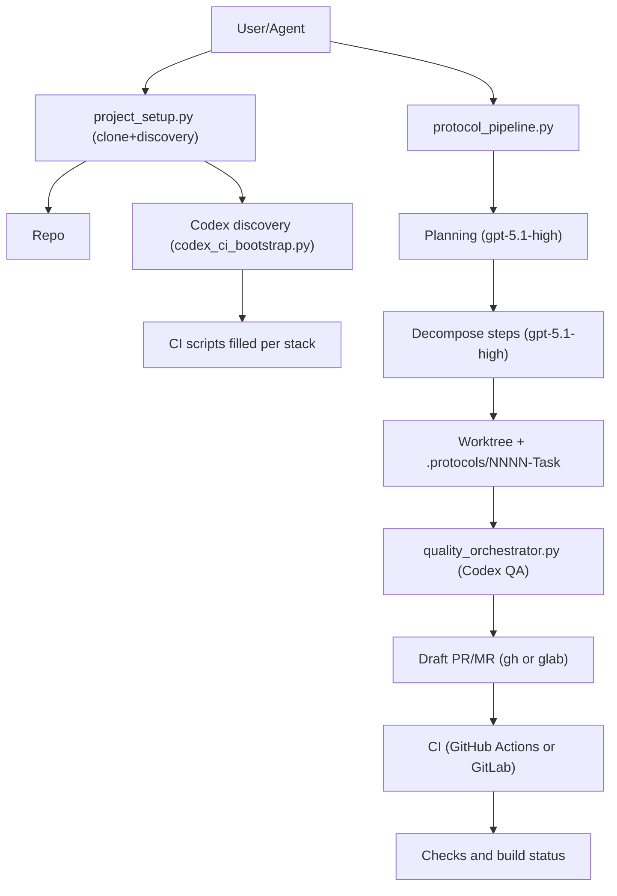
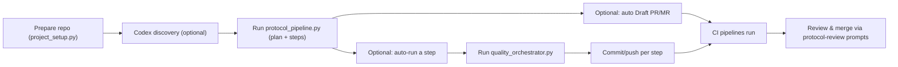

# DeksdenFlow_Ilyas_Edition_1.0 Project Starter

This repo is a lightweight starter kit for agent-driven development using the DeksdenFlow_Ilyas_Edition_1.0 protocols. It includes:

- Generic folder layout and documentation to keep parallel workstreams organized.
- Ready-to-use prompts (new/resume/review) adapted from the published gists.
- Dual CI templates for GitHub Actions and GitLab CI that call the same `scripts/ci/*` hooks.
- An interactive protocol pipeline script that talks to Codex CLI to generate plans, decompose steps, and optionally open PRs/MRs or auto-run a specific step.

## Quick start

1. Prep a repo (existing or new):
   ```bash
   python3 scripts/project_setup.py --base-branch main --init-if-needed
   # Optional: --clone-url <git-url> --run-discovery
   ```
   This adds docs/prompts/CI/schema/pipeline scripts and can auto-fill CI commands via Codex discovery.
2. Fill CI commands in `scripts/ci/*.sh` for your stack (Node, Python, Java, Go, etc.). Workflows already call these scripts.
3. Generate a protocol for your next task:
   ```bash
   python3 scripts/protocol_pipeline.py --base-branch main --short-name "<task>" --description "<desc>"
   # Optional: --pr-platform github|gitlab, --run-step 01-some-step.md
   ```
   This creates a worktree/branch `NNNN-<task>`, `.protocols/NNNN-<task>/plan.md` + step files, and can open a Draft PR/MR.
4. Execute steps with Codex:
   ```bash
   codex --model codex-5.1-max-xhigh --cd ../worktrees/NNNN-<task> \
     --sandbox workspace-write --ask-for-approval on-request \
     "Follow .protocols/NNNN-<task>/plan.md and the current step file to implement the next step."
   ```
5. Validate a step (optional QA gate):
   ```bash
   python3 scripts/quality_orchestrator.py \
     --protocol-root ../worktrees/NNNN-<task>/.protocols/NNNN-<task> \
     --step-file 01-some-step.md \
     --model codex-5.1-max
   ```

## Folder map

- `docs/` — overview of DeksdenFlow_Ilyas_Edition_1.0 and CI notes. New: `docs/solution-design.md` (target architecture + risks) and `docs/implementation-plan.md` (phased plan).
- `prompts/` — ready prompts: project bootstrap, new/resume protocols, review/merge flows.
- `.github/workflows/ci.yml` — GitHub Actions using the shared CI scripts.
- `.gitlab-ci.yml` — GitLab CI mirror of the same jobs.
- `scripts/ci/` — editable hooks (`bootstrap.sh`, `lint.sh`, `typecheck.sh`, `test.sh`, `build.sh`).
- `scripts/protocol_pipeline.py` — interactive orchestrator for DeksdenFlow_Ilyas_Edition_1.0 protocols using Codex CLI.
- `schemas/protocol-planning.schema.json` — JSON Schema for the planning agent’s output.
- `scripts/project_setup.py` — prepares a repo with starter docs/prompts/CI/schema/pipeline if they’re missing.
- `prompts/repo-discovery.prompt.md` — Codex prompt to auto-discover stack and fill CI scripts.
- `scripts/codex_ci_bootstrap.py` — helper to run Codex (codex-5.1-max by default) with the discovery prompt to fill CI scripts.
- `scripts/quality_orchestrator.py` — Codex QA validator that checks a protocol step and writes a report.
- `Makefile` — helper targets: `deps` (install orchestrator deps in `.venv`), `migrate` (alembic upgrade), `orchestrator-setup` (deps + migrate).

## How to use the prompts

- Start a project: feed `prompts/project-init.prompt.md` to your agent. It sets expectations for creating the structure, wiring CI for GitHub/GitLab, and preparing protocol artifacts.
- Run day-to-day work: use `prompts/protocol-new.prompt.md` to open a fresh protocol, `prompts/protocol-resume.prompt.md` to resume, and `prompts/protocol-review-merge*.prompt.md` to drive review/merge.

## DeksdenFlow_Ilyas_Edition_1.0 at a glance

1. Git workflow
2. Context collection
3. Protocol discussion
4. Protocol plan lock-in
5. Protocol execution
6. Review and merge
7. Organizational wrap-up

The core idea: ship improvements in parallel streams with strict, explicit protocols. Use the prompts and CI hooks here as the default spine; swap in your stack-specific commands without changing the flow.

## Architecture (Mermaid)



## Workflow overview (Mermaid)



## Protocol pipeline (Codex CLI)

Prerequisites:

- `codex` CLI installed and logged in.
- Git repo with a remote `origin` and base branch (default `main`).
- Optional: `gh` for GitHub PRs, `glab` for GitLab MRs.

Run from the repo root:

```bash
python scripts/protocol_pipeline.py
```

The script will:

- Ask for base branch, short task name, and description.
- Compute the next protocol number `NNNN` and create a worktree/branch `NNNN-[Task-short-name]`.
- Call Codex (default models `gpt-5.1-high` for planning, `gpt-5.1-high` for decomposition) to:
  - Generate `.protocols/NNNN-[Task-short-name]/plan.md`, `context.md`, `log.md`, and step files.
  - Decompose each step into smaller Sub-tasks.

Environment overrides:

- `PROTOCOL_PLANNING_MODEL` (default `gpt-5.1-high`)
- `PROTOCOL_DECOMPOSE_MODEL` (default `gpt-5.1-high`)
- `PROTOCOL_EXEC_MODEL` (default `codex-5.1-max-xhigh`)

### Auto-running a specific step

You can ask the pipeline to auto-run a single step (non-interactively) with a strong coding model:

```bash
python scripts/protocol_pipeline.py --run-step 01-some-step.md
```

This will:

- Run planning and decomposition as above.
- Then call Codex CLI with `PROTOCOL_EXEC_MODEL` from the worktree root, instructing it to execute the Sub-tasks from that step file, following the protocol workflow.

### Auto-opening Draft PR/MR

To automatically create a Draft PR/MR after planning & decomposition:

```bash
python scripts/protocol_pipeline.py --pr-platform github
# or
python scripts/protocol_pipeline.py --pr-platform gitlab
```

The script will:

- Commit the protocol artifacts in the worktree.
- Push branch `NNNN-[Task-short-name]` to `origin`.
- GitHub: use `gh pr create --draft ...` to open a Draft PR.
- GitLab: if `glab` is installed, use `glab mr create --draft ...` to open a Draft MR; otherwise it prints manual instructions.

You can still skip `--pr-platform` to review and commit manually before opening a PR/MR yourself.

## Bootstrap an existing project

If you want to drop this starter into an existing repo (or ensure required files exist), run:

```bash
python3 scripts/project_setup.py --base-branch main --init-if-needed
```

The script will:

- Verify git repo (optionally `git init -b <base>` if missing with `--init-if-needed`).
- Warn if `origin` is not configured or base branch is missing locally.
- Ensure directories/files exist (docs, prompts, CI configs, schema, pipeline); it copies from this starter when available or writes placeholders otherwise.
- Make CI scripts executable.
- Optional: `--clone-url <git-url>` to clone a repo before prep (use `--clone-dir` to set the folder name).
- Optional: `--run-discovery` to call Codex (default `codex-5.1-max`) with `prompts/repo-discovery.prompt.md` to auto-fill CI scripts based on detected stack.

You can also run Codex CI bootstrap directly later:

```bash
python3 scripts/codex_ci_bootstrap.py --model codex-5.1-max
```

## QA orchestrator (Codex CLI)

Validate a protocol step with Codex and stop on failure:

```bash
python3 scripts/quality_orchestrator.py \
  --protocol-root ../worktrees/NNNN-[Task-short-name]/.protocols/NNNN-[Task-short-name] \
  --step-file 01-some-step.md \
  --model codex-5.1-max
```

Behavior:
- Collects plan/context/log, the step file, git status, latest commit message.
- Calls Codex with `prompts/quality-validator.prompt.md`.
- Writes `quality-report.md` in the protocol folder.
- Exits 1 if the verdict is FAIL, halting any pipeline that wraps it.
