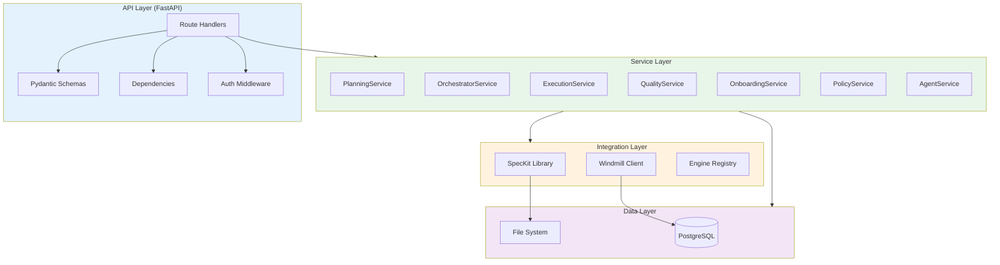
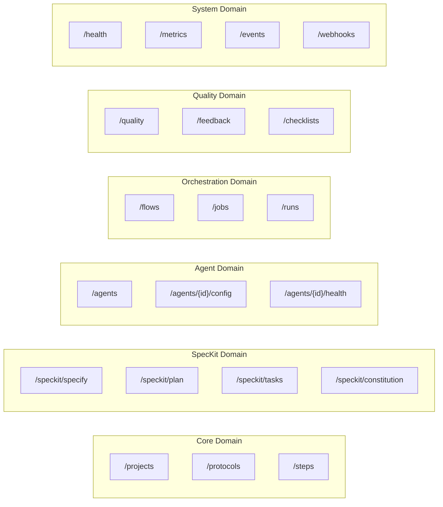
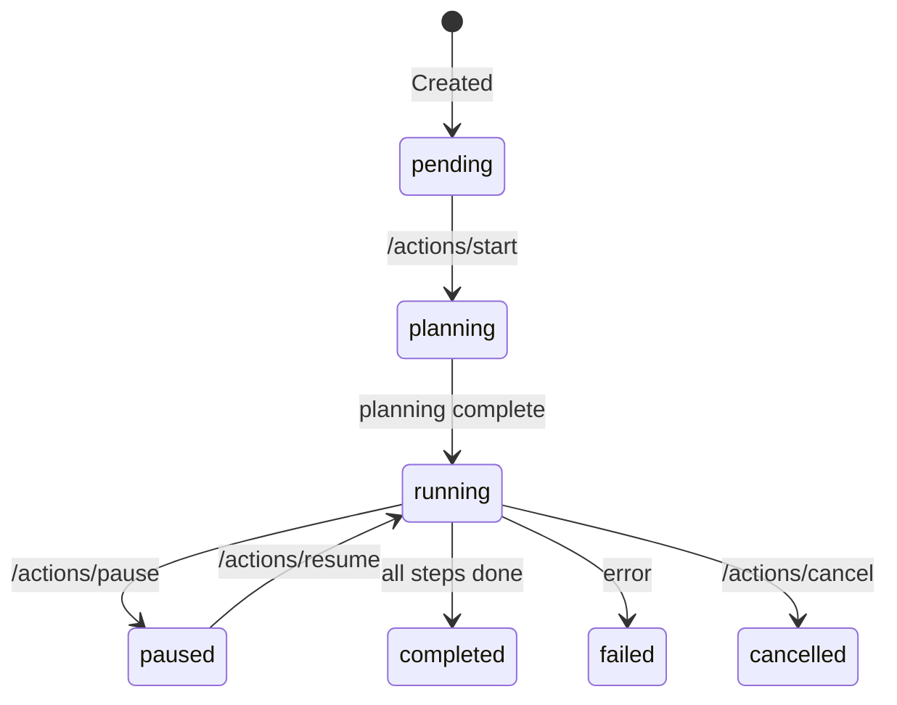

# DevGodzilla API Architecture

> Detailed API specification for the integrated SpecKit + Windmill + TasksGodzilla platform.

---

## Overview

The DevGodzilla API provides a unified interface for:
- **Project management** and onboarding
- **Specification-driven development** via SpecKit integration
- **Workflow orchestration** via Windmill
- **Multi-agent execution** with 18+ AI coding agents
- **Quality assurance** with constitutional gates
- **Feedback loops** for self-healing workflows

**Base URL**: `http://localhost:8080` (nginx reverse proxy, Docker Compose) or `http://localhost:8000` (direct API)

**Source of truth**: `GET /openapi.json`. This document mixes “current API” details with subsystem/roadmap notes; prefer OpenAPI for exact request/response shapes.

---

## Architecture Principles



### Design Principles

1. **Service-First**: All business logic lives in services, not route handlers
2. **Typed Contracts**: Pydantic schemas for all request/response bodies
3. **Dependency Injection**: FastAPI `Depends()` for service instantiation
4. **No Direct DB in Routes**: Routes call services, services access database

---

## Authentication

```yaml
# Environment Variables
DEVGODZILLA_API_TOKEN: "your-bearer-token"       # Optional API bearer token (future)
DEVGODZILLA_WEBHOOK_TOKEN: "webhook-secret"      # Optional webhook signature verification (future)
DEVGODZILLA_SESSION_SECRET: "session-key"        # Optional session management secret (future)
DEVGODZILLA_JWT_SECRET: "jwt-signing-secret"     # Optional JWT signing secret (future)
```

### Authentication Methods

| Method | Header | Use Case |
|--------|--------|----------|
| **Bearer Token** | `Authorization: Bearer <token>` | API clients, CLI |
| **Project Token** | `X-Project-Token: <token>` | Per-project access |
| **Webhook Signature** | `X-Hub-Signature-256` | GitHub/GitLab webhooks |
| **Session Cookie** | `session=<jwt>` | Web console |

```python
# Route protection example
@app.get("/projects/{id}")
async def get_project(
    id: int,
    principal: AuthPrincipal = Depends(require_auth),
    db: Database = Depends(get_db)
):
    require_project_access(id, principal, db)
    return ProjectService(db).get_project(id)
```

---

## API Domains

### Domain Overview



---

## Core Domain

### Projects

| Endpoint | Method | Description | Service |
|----------|--------|-------------|---------|
| `/projects` | POST | Create project | Direct DB |
| `/projects` | GET | List projects | Direct DB |
| `/projects/{id}` | GET | Get project | Direct DB |
| `/projects/{id}` | PUT | Update project | Direct DB |
| `/projects/{id}/archive` | POST | Archive project | Direct DB |
| `/projects/{id}/unarchive` | POST | Unarchive project | Direct DB |
| `/projects/{id}` | DELETE | Delete project | Direct DB |
| `/projects/{id}/actions/onboard` | POST | Clone repo + init `.specify/` | `GitService` + `SpecificationService` |

#### Create Project

```http
POST /projects
Content-Type: application/json
Authorization: Bearer <token>

{
  "name": "my-project",
  "git_url": "https://github.com/user/repo",
  "base_branch": "main",
  "local_path": "/optional/path",
  "project_classification": "default"
}
```

**Response:**
```json
{
  "id": 1,
  "name": "my-project",
  "git_url": "https://github.com/user/repo",
  "base_branch": "main",
  "local_path": "/projects/1/repo",
  "constitution_version": "1.0.0",
  "constitution_hash": "abc123...",
  "created_at": "2024-12-15T09:00:00Z",
  "updated_at": "2024-12-15T09:00:00Z"
}
```

**Side Effects:**
Creating a project record does not clone repositories. Repository cloning and SpecKit initialization are typically handled by Windmill scripts (e.g. `u/devgodzilla/project_setup`) which call the API.

---

### Protocols

| Endpoint | Method | Description | Service |
|----------|--------|-------------|---------|
| `/projects/{id}/protocols` | POST | Create protocol | `OrchestratorService.create_protocol()` |
| `/projects/{id}/protocols` | GET | List protocols | Direct DB |
| `/protocols` | GET | List protocols | Direct DB |
| `/protocols` | POST | Create protocol | Direct DB |
| `/protocols/{id}` | GET | Get protocol | Direct DB |
| `/protocols/{id}/events` | GET | List events | Direct DB |
| `/protocols/{id}/quality` | GET | Protocol QA summary | Aggregated |
| `/protocols/{id}/feedback` | GET | Feedback feed | Derived from clarifications |
| `/protocols/{id}/artifacts` | GET | Protocol artifacts | File system |

#### Protocol Actions

| Endpoint | Method | Description | Service |
|----------|--------|-------------|---------|
| `/protocols/{id}/actions/start` | POST | Start protocol | `OrchestratorService.start_protocol()` |
| `/protocols/{id}/actions/pause` | POST | Pause execution | `OrchestratorService.pause_protocol()` |
| `/protocols/{id}/actions/resume` | POST | Resume execution | `OrchestratorService.resume_protocol()` |
| `/protocols/{id}/actions/cancel` | POST | Cancel protocol | `OrchestratorService.cancel_protocol()` |
| `/protocols/{id}/actions/run_next_step` | POST | Execute next step | `OrchestratorService.enqueue_next_step()` |
| `/protocols/{id}/flow` | GET | Get protocol flow | `OrchestratorService.get_windmill_flow()` |
| `/protocols/{id}/flow` | POST | Create protocol flow | `OrchestratorService.create_windmill_flow()` |

#### Protocol Status State Machine



---

### Steps

| Endpoint | Method | Description | Service |
|----------|--------|-------------|---------|
| `/steps` | GET | List steps for protocol | Direct DB |
| `/steps/{id}` | GET | Get step | Direct DB |
| `/steps/{id}/quality` | GET | Step QA summary | Aggregated |
| `/steps/{id}/artifacts` | GET | List step artifacts | File system |
| `/steps/{id}/artifacts/{artifact_id}/content` | GET | Artifact content | File system |

#### Step Actions

| Endpoint | Method | Description | Service |
|----------|--------|-------------|---------|
| `/steps/{id}/actions/assign_agent` | POST | Assign agent | Direct DB |
| `/steps/{id}/actions/execute` | POST | Execute step | `ExecutionService.execute_step()` |
| `/steps/{id}/actions/qa` | POST | Run QA | `QualityService.run_for_step()` |

#### Assign Agent to Step

```http
POST /steps/{id}/actions/assign_agent
Content-Type: application/json

{
  "agent_id": "claude-code"
}
```

---

## SpecKit Domain

### NEW: SpecKit Integration Endpoints

| Endpoint | Method | Description | Service |
|----------|--------|-------------|---------|
| `/projects/{id}/speckit/init` | POST | Initialize .specify/ | `PlanningService.init_speckit()` |
| `/projects/{id}/speckit/specify` | POST | Generate specification | `PlanningService.generate_spec()` |
| `/projects/{id}/speckit/plan` | POST | Generate plan | `PlanningService.generate_plan()` |
| `/projects/{id}/speckit/tasks` | POST | Generate tasks | `PlanningService.generate_tasks()` |
| `/projects/{id}/speckit/constitution` | GET | Get constitution | `PolicyService.get_constitution()` |
| `/projects/{id}/speckit/constitution` | PUT | Update constitution | `PolicyService.update_constitution()` |
| `/speckit/*` | Various | Legacy SpecKit endpoints | Back-compat |

#### Generate Specification

```http
POST /projects/{id}/speckit/specify
Content-Type: application/json

{
  "description": "Add user authentication with JWT tokens",
  "branch_name": "feature/auth",
  "clarifications": {
    "auth_provider": "custom",
    "session_duration": "24h"
  }
}
```

**Response:**
```json
{
  "spec_id": "spec-123",
  "feature_name": "User Authentication",
  "branch_name": "feature/auth",
  "spec_path": "specs/feature-auth/spec.md",
  "user_stories": [
    {
      "id": "US1",
      "title": "User Login",
      "priority": "P1",
      "description": "As a user, I can log in with email/password"
    },
    {
      "id": "US2", 
      "title": "JWT Token Management",
      "priority": "P1",
      "description": "As a user, I receive a JWT token on login"
    }
  ],
  "created_at": "2024-12-15T09:00:00Z"
}
```

#### Generate Tasks

```http
POST /projects/{id}/speckit/tasks
Content-Type: application/json

{
  "spec_id": "spec-123",
  "plan_id": "plan-456"
}
```

**Response:**
```json
{
  "tasks_id": "tasks-789",
  "tasks_path": "specs/feature-auth/tasks.md",
  "phases": [
    {
      "phase": 1,
      "name": "Setup",
      "tasks": [
        {"id": "T001", "description": "Create project structure", "parallel": false}
      ]
    },
    {
      "phase": 2,
      "name": "Foundational",
      "tasks": [
        {"id": "T002", "description": "Setup database schema", "parallel": false},
        {"id": "T003", "description": "Setup auth middleware", "parallel": true}
      ]
    },
    {
      "phase": 3,
      "name": "User Story 1 - User Login",
      "story_id": "US1",
      "mvp": true,
      "tasks": [
        {"id": "T004", "description": "Create User model", "parallel": true, "story": "US1"},
        {"id": "T005", "description": "Implement login endpoint", "parallel": false, "story": "US1", "depends_on": ["T004"]}
      ]
    }
  ],
  "dag": {
    "nodes": ["T001", "T002", "T003", "T004", "T005"],
    "edges": [
      ["T001", "T002"],
      ["T001", "T003"],
      ["T002", "T004"],
      ["T003", "T004"],
      ["T004", "T005"]
    ]
  },
  "parallel_groups": {
    "group_1": ["T001"],
    "group_2": ["T002", "T003"],
    "group_3": ["T004"],
    "group_4": ["T005"]
  }
}
```

---

## Agent Domain

### NEW: Agent Management Endpoints

| Endpoint | Method | Description | Service |
|----------|--------|-------------|---------|
| `/agents` | GET | List available agents | `AgentService.list_agents()` |
| `/agents/{id}` | GET | Get agent details | `AgentService.get_agent()` |
| `/agents/{id}/config` | GET | Get agent config | `AgentService.get_config()` |
| `/agents/{id}/config` | PUT | Update config | `AgentService.update_config()` |
| `/agents/{id}/health` | GET | Check agent health | `AgentService.check_health()` |

#### List Agents

```http
GET /agents
```

**Response:**
```json
{
  "agents": [
    {
      "id": "codex",
      "name": "OpenAI Codex",
      "kind": "cli",
      "status": "available",
      "default_model": "gpt-4.1",
      "capabilities": ["code_generation", "code_review", "refactoring"]
    },
    {
      "id": "claude-code",
      "name": "Claude Code",
      "kind": "cli",
      "status": "available",
      "default_model": "claude-sonnet-4-20250514",
      "command_dir": ".claude/commands/",
      "capabilities": ["code_generation", "code_review", "refactoring", "testing"]
    },
    {
      "id": "cursor",
      "name": "Cursor",
      "kind": "ide",
      "status": "unavailable",
      "command_dir": ".cursor/commands/",
      "capabilities": ["code_generation"]
    }
  ]
}
```

#### Agent Configuration Schema

```json
{
  "agent_id": "claude-code",
  "config": {
    "kind": "cli",
    "command_dir": ".claude/commands/",
    "default_model": "claude-sonnet-4-20250514",
    "sandbox": "workspace-write",
    "timeout_seconds": 300,
    "max_retries": 3,
    "environment": {
      "ANTHROPIC_API_KEY": "${ANTHROPIC_API_KEY}"
    }
  }
}
```

---

## Orchestration Domain (Windmill Integration)

### NEW: Flow Management Endpoints

| Endpoint | Method | Description | Service |
|----------|--------|-------------|---------|
| `/flows` | GET | List flows | `WindmillService.list_flows()` |
| `/flows/{flow_path}` | GET | Get flow | `WindmillService.get_flow()` |
| `/flows/{flow_path}/runs` | GET | List flow runs | `WindmillService.list_runs()` |
| `/protocols/{id}/flow` | GET | Get protocol flow | `OrchestratorService.get_windmill_flow()` |
| `/protocols/{id}/flow` | POST | Create flow from tasks | `OrchestratorService.create_windmill_flow()` |

`flow_path` is the full Windmill flow path (e.g. `f/devgodzilla/full_protocol`) and is treated as a “path” parameter, so it may contain slashes.

#### Create Windmill Flow from Tasks

```http
POST /protocols/{id}/flow
Content-Type: application/json

{
  "tasks_path": "specs/feature-auth/tasks.md"
}
```

**Response:**
```json
{
  "windmill_flow_id": "uuid-flow-123",
  "flow_path": "f/devgodzilla/feature-auth",
  "flow_definition": {
    "summary": "Feature: User Authentication",
    "value": {
      "modules": [
        {
          "id": "T001",
          "value": {
            "type": "script",
            "path": "u/devgodzilla/execute_step",
            "input_transforms": {
              "step_id": {"type": "static", "value": "T001"},
              "agent_id": {"type": "static", "value": "opencode"}
            }
          }
        }
      ],
      "branches": {
        "parallel_group_2": {
          "type": "branchall",
          "branches": [
            {"id": "T002", "parallel": true},
            {"id": "T003", "parallel": true}
          ]
        }
      }
    }
  },
  "dag_visualization": "digraph { T001 -> T002; T001 -> T003; T002 -> T004; T003 -> T004; T004 -> T005; }"
}
```

### Jobs & Runs

| Endpoint | Method | Description | Service |
|----------|--------|-------------|---------|
| `/jobs` | GET | List jobs | `WindmillService.list_jobs()` |
| `/jobs/{id}` | GET | Get job | `WindmillService.get_job()` |
| `/jobs/{id}/logs` | GET | Get job logs | `WindmillService.get_logs()` |
| `/runs` | GET | List runs | `RunRegistry.list()` |
| `/runs/{id}` | GET | Get run | `RunRegistry.get()` |
| `/runs/{id}/logs` | GET | Get run logs | File system |
| `/runs/{id}/artifacts` | GET | List artifacts | `RunRegistry.list_artifacts()` |
| `/runs/{id}/artifacts/{artifact_id}/content` | GET | Get artifact content | File system |

---

## Quality Domain

### NEW: Quality & Feedback Endpoints

| Endpoint | Method | Description | Service |
|----------|--------|-------------|---------|
| `/protocols/{id}/quality` | GET | Get QA summary | `QualityService.get_summary()` |
| `/protocols/{id}/quality/gates` | GET | Get gate results | `QualityService.get_gate_results()` |
| `/steps/{id}/quality` | GET | Get step QA | `QualityService.get_step_quality()` |
| `/protocols/{id}/feedback` | GET | List feedback events | `PlanningService.list_feedback()` |
| `/clarifications` | GET | List clarifications | Direct DB |
| `/clarifications/{id}/answer` | POST | Answer clarification | Direct DB |

#### Feedback Loop API

```http
POST /protocols/{id}/feedback
Content-Type: application/json

{
  "error_type": "specification_error",
  "step_id": "T005",
  "action": "clarify",
  "context": {
    "error_message": "Cannot implement login without password hashing strategy",
    "suggestions": ["bcrypt", "argon2", "scrypt"]
  }
}
```

**Response:**
```json
{
  "feedback_id": "fb-123",
  "action_taken": "clarification_created",
  "clarification": {
    "id": 42,
    "key": "password_hashing",
    "question": "Which password hashing strategy should be used?",
    "options": ["bcrypt", "argon2", "scrypt"],
    "recommended": {"value": "bcrypt", "reason": "Most widely supported"},
    "blocking": true
  },
  "protocol_status": "blocked"
}
```

#### Constitutional Gate Results

```http
GET /protocols/{id}/quality/gates
```

**Response:**
```json
{
  "protocol_run_id": 1,
  "constitution_version": "1.0.0",
  "gates": [
    {
      "article": "I",
      "name": "Library-First",
      "status": "passed",
      "findings": []
    },
    {
      "article": "III",
      "name": "Test-First",
      "status": "warning",
      "findings": [
        {
          "code": "CONST_III_001",
          "severity": "warning",
          "message": "Test file created after implementation",
          "step_id": "T005",
          "suggested_fix": "Create test file before implementing login endpoint"
        }
      ]
    },
    {
      "article": "VII",
      "name": "Simplicity",
      "status": "passed",
      "findings": []
    }
  ],
  "overall_status": "warning",
  "blocking_issues": 0,
  "warnings": 1
}
```

---

## System Domain

### Health & Metrics

| Endpoint | Method | Description |
|----------|--------|-------------|
| `/health` | GET | Health check |
| `/health/ready` | GET | Readiness check |
| `/health/live` | GET | Liveness check |
| `/metrics` | GET | Prometheus metrics |

#### Health Response

```json
{
  "status": "ok",
  "version": "1.0.0",
  "components": {
    "database": "ok",
    "windmill": "ok",
    "redis": "ok"
  },
  "agents": {
    "codex": "available",
    "claude-code": "available",
    "opencode": "available"
  }
}
```

### Events & Webhooks

| Endpoint | Method | Description |
|----------|--------|-------------|
| `/events` | GET | SSE event stream |
| `/events/recent` | GET | Recent events (placeholder) |
| `/webhooks/windmill/job` | POST | Windmill job updates |
| `/webhooks/windmill/flow` | POST | Windmill flow updates |
| `/webhooks/github` | POST | GitHub webhook |
| `/webhooks/gitlab` | POST | GitLab webhook |

---

## Pydantic Schemas (NEW)

### SpecKit Schemas

```python
# schemas/speckit.py

class SpecifyRequest(BaseModel):
    description: str
    branch_name: str
    clarifications: Optional[dict] = None

class SpecifyResponse(BaseModel):
    spec_id: str
    feature_name: str
    branch_name: str
    spec_path: str
    user_stories: list[UserStory]
    created_at: datetime

class UserStory(BaseModel):
    id: str  # US1, US2, etc.
    title: str
    priority: str  # P1, P2, P3
    description: str

class TasksResponse(BaseModel):
    tasks_id: str
    tasks_path: str
    phases: list[Phase]
    dag: DAGDefinition
    parallel_groups: dict[str, list[str]]

class Phase(BaseModel):
    phase: int
    name: str
    story_id: Optional[str] = None
    mvp: bool = False
    tasks: list[Task]

class Task(BaseModel):
    id: str  # T001, T002, etc.
    description: str
    parallel: bool = False
    story: Optional[str] = None
    depends_on: list[str] = []

class DAGDefinition(BaseModel):
    nodes: list[str]
    edges: list[tuple[str, str]]
```

### Agent Schemas

```python
# schemas/agents.py

class AgentOut(BaseModel):
    id: str
    name: str
    kind: Literal["cli", "ide"]
    status: Literal["available", "unavailable", "error"]
    default_model: Optional[str] = None
    command_dir: Optional[str] = None
    capabilities: list[str] = []

class AgentConfigUpdate(BaseModel):
    default_model: Optional[str] = None
    sandbox: Optional[str] = None
    timeout_seconds: Optional[int] = None
    max_retries: Optional[int] = None
    environment: Optional[dict[str, str]] = None

class AgentAssignRequest(BaseModel):
    agent_id: str
    config_override: Optional[dict] = None
```

### Feedback Schemas

```python
# schemas/feedback.py

class FeedbackRequest(BaseModel):
    error_type: Literal["specification_error", "task_graph_error", "execution_error"]
    step_id: Optional[str] = None
    action: Literal["clarify", "re_plan", "re_specify", "retry"]
    context: dict

class FeedbackResponse(BaseModel):
    feedback_id: str
    action_taken: str
    clarification: Optional[ClarificationOut] = None
    protocol_status: str
```

---

## Error Responses

### Standard Error Format

```json
{
  "error": {
    "code": "VALIDATION_ERROR",
    "message": "Invalid request body",
    "details": [
      {"field": "description", "message": "Field is required"}
    ]
  },
  "request_id": "req-123-456"
}
```

### Error Codes

| Code | HTTP Status | Description |
|------|-------------|-------------|
| `VALIDATION_ERROR` | 400 | Invalid request body |
| `UNAUTHORIZED` | 401 | Missing or invalid auth |
| `FORBIDDEN` | 403 | Insufficient permissions |
| `NOT_FOUND` | 404 | Resource not found |
| `CONFLICT` | 409 | State conflict (e.g., starting running protocol) |
| `AGENT_UNAVAILABLE` | 503 | Requested agent not available |
| `WINDMILL_ERROR` | 502 | Windmill service error |

---

## Rate Limiting

```yaml
# Rate limits per endpoint category
limits:
  default: 100/minute
  speckit: 10/minute     # LLM-heavy operations
  agents: 50/minute
  webhooks: 200/minute
```

---

## OpenAPI Specification

The full OpenAPI spec is available at:
- **JSON**: `/openapi.json`
- **Swagger UI**: `/docs`
- **ReDoc**: `/redoc`

---

## SDK & Client Examples

### Python SDK

```python
from devgodzilla import DevGodzillaClient

client = DevGodzillaClient(
    base_url="http://localhost:8011",
    api_token="your-token"
)

# Create project
project = client.projects.create(
    name="my-app",
    git_url="https://github.com/user/repo"
)

# Generate specification
spec = client.speckit.specify(
    project_id=project.id,
    description="Add user authentication",
    branch_name="feature/auth"
)

# Generate tasks
tasks = client.speckit.tasks(
    project_id=project.id,
    spec_id=spec.spec_id
)

# Create protocol with agent assignments
protocol = client.protocols.create(
    project_id=project.id,
    tasks_id=tasks.tasks_id,
    agent_assignments={
        "T001": "opencode",
        "T002": "claude-code",
        "T003": "claude-code"
    }
)

# Start execution
client.protocols.start(protocol.id)
```

### CLI Usage

```bash
# Initialize project
devgodzilla project create --name my-app --git-url https://github.com/user/repo

# SpecKit workflow
devgodzilla speckit specify "Add user authentication" --branch feature/auth
devgodzilla speckit plan
devgodzilla speckit tasks

# Assign agents
devgodzilla step assign T001 --agent opencode
devgodzilla step assign T002 T003 --agent claude-code

# Execute
devgodzilla protocol start
devgodzilla protocol watch  # Stream execution logs
```

---

## Summary

This API architecture provides:

1. **Unified interface** for SpecKit specification workflow
2. **Agent management** with per-step assignment
3. **Windmill integration** for DAG-based workflow execution
4. **Feedback loops** for self-healing development workflows
5. **Constitutional QA** with gate-based quality checks

All endpoints follow RESTful conventions and delegate to the service layer for business logic.
