# DevGodzilla: Integrated Architecture Design

> **Speckit + Windmill + DevGodzilla**
> 
> A unified AI-driven development platform combining specification-driven development, industrial-grade workflow orchestration, and multi-agent code execution.
>
> **Open Source • Python Library • CLI**

---

## Design Principles

> [!IMPORTANT]
> **Core Design Decisions**
> - **Open Source**: Fully open source solution
> - **Distribution**: Available as both Python library and CLI
> - **Agent Assignment**: Users can assign specific agents to specific steps
> - **No Offline Mode**: System requires online AI agent access
> - **No Fallbacks**: Clean-cut implementation, no backward compatibility layers
> - **Gitignore Runtime**: `_runtime/runs/` is gitignored (ephemeral execution data)
> - **Frontend**: Extend existing Windmill frontend (Svelte) with DevGodzilla-specific features

**Current-state reference (what actually runs today):** `docs/DevGodzilla/CURRENT_STATE.md`

## Executive Summary

This document defines the architecture for **DevGodzilla**, a new integrated platform combining:

| Component | Role | Source |
|-----------|------|--------|
| **Speckit** | Spec-style artifacts (`.specify/`) + API/CLI surface | `devgodzilla/services/specification.py` |
| **Windmill** | Workflow engine + UI (flows/scripts execute DevGodzilla jobs) | `Origins/Windmill/`, `windmill/` |
| **DevGodzilla** | FastAPI API + services + agent execution | `devgodzilla/` |

> Notes:
> - The upstream SpecKit project is vendored under `Origins/spec-kit/` for reference, but the current implementation generates `.specify/` artifacts directly (no external `specify` CLI/library dependency).
> - The legacy TasksGodzilla stack lives under `archive/` and is not part of the main DevGodzilla runtime.

## 0. Current Runtime Workflow (Headless SWE-agent)

DevGodzilla’s primary workflow is **agent-driven**: a headless SWE-agent runs prompt(s), writes artifacts into the repo/worktree, and DevGodzilla validates/records those artifacts.

High-level flow:
1. **Onboard repo**: ensure repo exists locally and initialize `.specify/` (`POST /projects/{id}/actions/onboard`).
2. **Discovery (optional)**: run headless discovery agent (writes `tasksgodzilla/*`).
3. **Plan protocol**: ensure a git worktree, then read `.protocols/<protocol_name>/step-*.md` to create `StepRun` rows.
   - If protocol files are missing and `DEVGODZILLA_AUTO_GENERATE_PROTOCOL=true` (default), generate `.protocols/<protocol_name>/plan.md` + `step-*.md` via headless agent.
4. **Execute step**: engine runs inside the protocol worktree; DevGodzilla writes execution artifacts (“git report”) under `.protocols/<protocol_name>/.devgodzilla/steps/<step_run_id>/artifacts/*`.
5. **QA**: QA gates run on step output; `"gates": []` skips QA and still completes the step (useful for E2E/system tests). After QA, DevGodzilla best-effort updates protocol status to `completed` / `failed` when all steps are terminal.

Default engine/model for headless workflows:
- Engine: `opencode` (`DEVGODZILLA_DEFAULT_ENGINE_ID`)
- Model: `zai-coding-plan/glm-4.6` (`DEVGODZILLA_OPENCODE_MODEL`)

---

## 1. High-Level Architecture

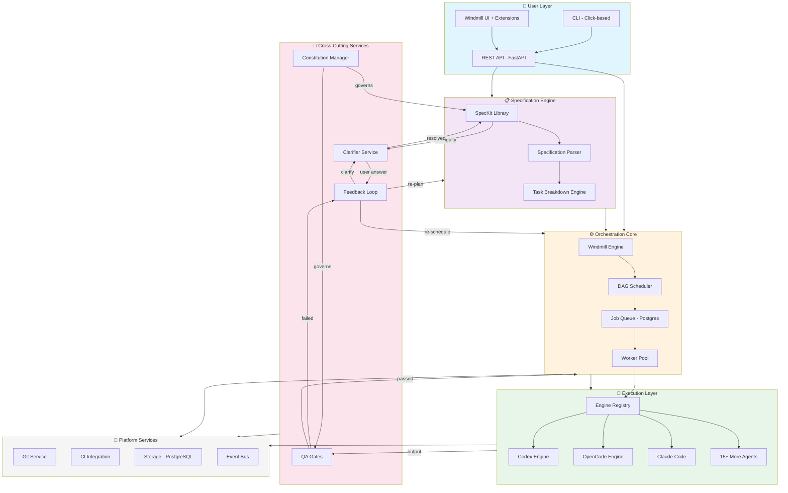

---

## 2. Subsystem Architecture

> [!TIP]
> **Detailed Documentation Available**
> Each subsystem has its own detailed architecture document in [subsystems/](./subsystems/):
> - [01-SPECIFICATION-ENGINE.md](./subsystems/01-SPECIFICATION-ENGINE.md) - SpecKit integration, typed models
> - [02-ORCHESTRATION-CORE.md](./subsystems/02-ORCHESTRATION-CORE.md) - Windmill DAG execution
> - [03-EXECUTION-LAYER.md](./subsystems/03-EXECUTION-LAYER.md) - Multi-agent execution (18+ agents)
> - [04-QUALITY-ASSURANCE.md](./subsystems/04-QUALITY-ASSURANCE.md) - Constitutional QA gates
> - [05-PLATFORM-SERVICES.md](./subsystems/05-PLATFORM-SERVICES.md) - Database, Git, Events
> - [06-USER-INTERFACE.md](./subsystems/06-USER-INTERFACE.md) - Svelte extensions, CLI

### 2.1 Specification Engine (SpecKit Integration)

The Specification Engine manages the spec-driven development workflow, providing structured planning before code execution.

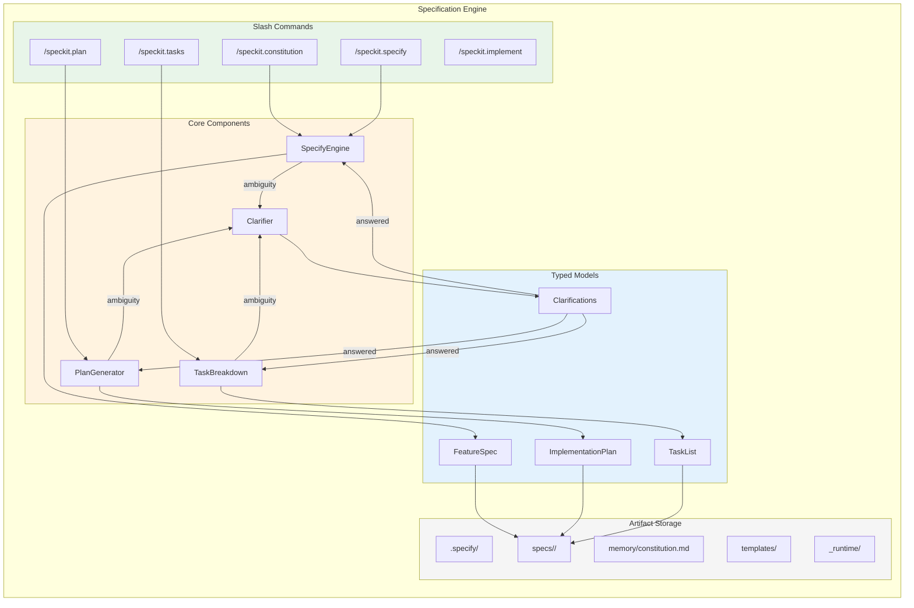

**Key Responsibilities:**
- **Constitution Management**: Project governance principles that guide all development
- **Specification Generation**: Structured feature specs with user stories
- **Planning**: Technical implementation plans with tech stack decisions
- **Task Decomposition**: Parallel-aware task breakdown with dependencies

**Directory Structure:**
```
.specify/
├── memory/
│   └── constitution.md          # Governance principles
├── templates/
│   ├── spec-template.md
│   ├── plan-template.md
│   └── tasks-template.md
└── specs/<feature-branch>/
    ├── spec.md          # Requirements
    ├── plan.md                  # Architecture
    ├── tasks.md                 # Task breakdown
    └── _runtime/                # Execution artifacts
        ├── context.md
        ├── log.md
        ├── quality-report.md
        └── runs/<run-id>/       # ⚠️ GITIGNORED
```

**Gitignore Entry:**
```gitignore
# DevGodzilla runtime artifacts (ephemeral)
specs/*/_runtime/runs/
```

---

### 2.2 Orchestration Core (WindMill-Based)

The Orchestration Core replaces Redis/RQ with Windmill's industrial-grade workflow engine.

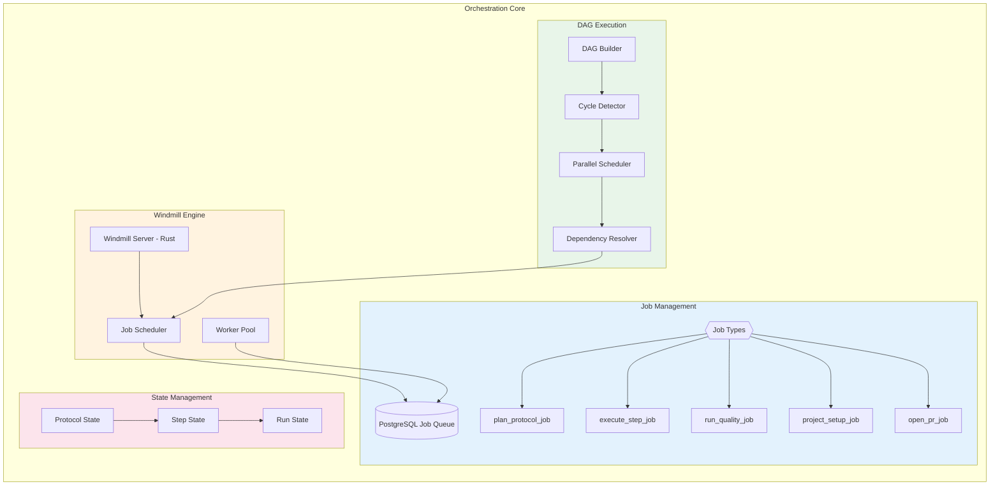

**Key Improvements over Redis/RQ:**
| Aspect | Redis/RQ (Current) | Windmill (New) |
|--------|-------------------|----------------|
| **Job Queue** | Redis-based | PostgreSQL-native |
| **Scalability** | Manual worker scaling | Horizontal auto-scaling |
| **Visibility** | Limited job inspection | Full job history + logs |
| **Language Support** | Python-only workers | Multi-language (Python, TS, Go, Bash) |
| **DAG Support** | Manual implementation | Native flow DAG support |
| **UI** | None (CLI only) | Built-in web UI |

**Job Status Transitions:**
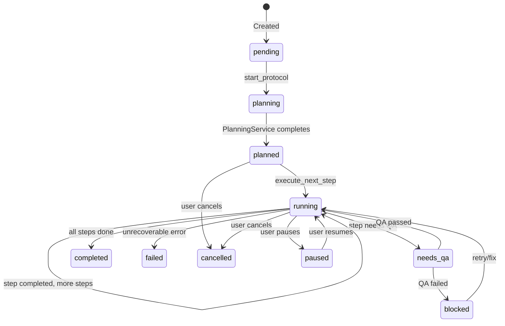

---

### 2.3 Execution Layer (Multi-Agent Engine)

The Execution Layer manages 18+ AI coding agents with unified interface.

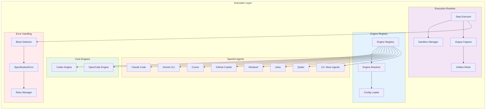

**Engine Interface:**
```python
class EngineInterface(Protocol):
    """Unified interface for all AI coding agents."""
    
    @property
    def metadata(self) -> EngineMetadata:
        """Engine identification and capabilities."""
        ...
    
    def execute(self, request: EngineRequest) -> EngineResult:
        """Execute a coding task."""
        ...
    
    def check_availability(self) -> bool:
        """Check if engine is available."""
        ...
```

**Supported Agents Configuration:**
```yaml
# config/agents.yaml
agents:
  codex:
    kind: cli
    default_model: gpt-4.1
    sandbox: workspace-write
    
  opencode:
    kind: cli
    default_model: zai-coding-plan/glm-4.6
    sandbox: workspace-write
    
  claude-code:
    kind: cli
    command_dir: .claude/commands/
    default_model: claude-sonnet-4-20250514
    
  gemini-cli:
    kind: cli
    command_dir: .gemini/commands/
    format: toml
    
  cursor:
    kind: ide
    command_dir: .cursor/commands/
```

**Per-Step Agent Assignment:**
```yaml
# tasks.md or protocol config
steps:
  - name: "Create data models"
    agent: opencode        # User assigns agent
    
  - name: "Implement API routes"
    agent: claude-code     # Different agent for this step
    
  - name: "Write unit tests"
    agent: opencode        # User choice per step
```

---

### 2.4 Quality Assurance Subsystem

Constitutional QA with spec-kit checklist integration.

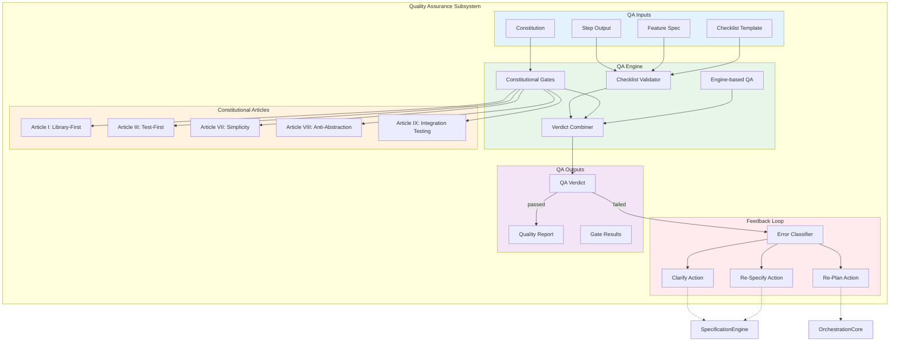

**Feedback Loop Flow:**
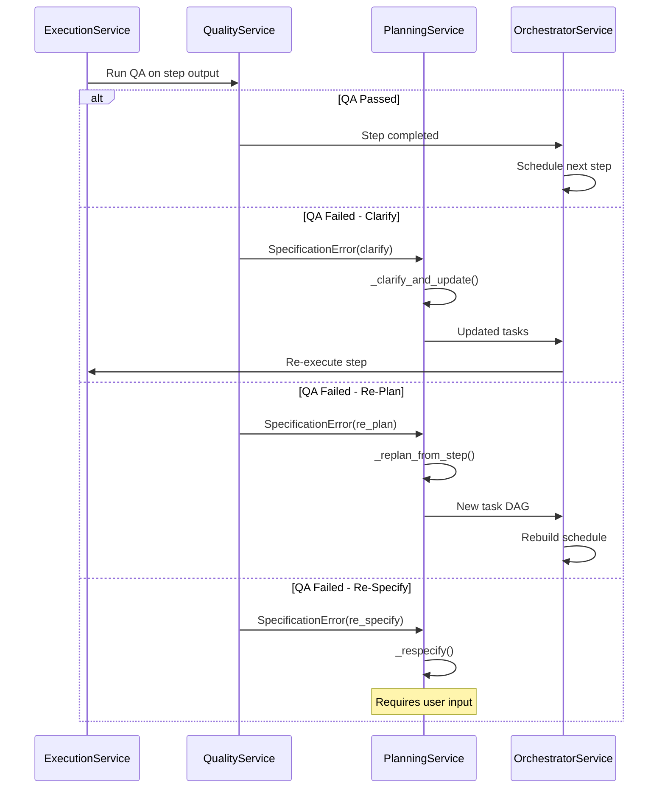

---

### 2.5 Platform Services

Core infrastructure services for storage, Git, CI/CD, and events.

```mermaid
graph TB
    subgraph PlatformServices["Platform Services"]
        direction TB

        subgraph Storage["Storage Layer"]
            PostgreSQL[(PostgreSQL)]
            FileStorage[File Storage]
            ArtifactStore[Artifact Store]
        end

        subgraph GitIntegration["Git Integration"]
            GitService[Git Service]
            WorktreeManager[Worktree Manager]
            BranchManager[Branch Manager]
            PRService[PR Service]
        end

        subgraph CIIntegration["CI/CD Integration"]
            GitHubWebhook[GitHub Webhooks]
            GitLabWebhook[GitLab Webhooks]
            CIReporter[CI Reporter]
            AutoQA[Auto-QA Trigger]
        end

        subgraph EventSystem["Event System"]
            EventBus[Event Bus]
            EventStore[Event Store]
            Subscribers[Event Subscribers]
        end

        subgraph Observability["Observability"]
            Metrics[Prometheus Metrics]
            Logging[Structured Logging]
            Tracing[Distributed Tracing]
        end
    end

    PostgreSQL --> FileStorage
    FileStorage --> ArtifactStore

    GitService --> WorktreeManager
    GitService --> BranchManager
    BranchManager --> PRService

    GitHubWebhook --> CIReporter
    GitLabWebhook --> CIReporter
    CIReporter --> AutoQA

    EventBus --> EventStore
    EventBus --> Subscribers

    Metrics --> Logging
    Logging --> Tracing

    style Storage fill:#e3f2fd
    style GitIntegration fill:#e8f5e9
    style CIIntegration fill:#fff3e0
    style EventSystem fill:#f3e5f5
    style Observability fill:#fce4ec
```

**Database Schema Extensions:**
```sql
-- Extended for Windmill integration
ALTER TABLE protocol_runs ADD COLUMN windmill_flow_id UUID;
ALTER TABLE protocol_runs ADD COLUMN speckit_metadata JSONB;

-- DAG support for steps
ALTER TABLE step_runs ADD COLUMN depends_on JSONB DEFAULT '[]';
ALTER TABLE step_runs ADD COLUMN parallel_group VARCHAR(100);

-- Constitution tracking
ALTER TABLE projects ADD COLUMN constitution_version VARCHAR(50);
ALTER TABLE projects ADD COLUMN constitution_hash VARCHAR(64);

-- Feedback tracking
CREATE TABLE feedback_events (
    id SERIAL PRIMARY KEY,
    protocol_run_id INTEGER REFERENCES protocol_runs(id),
    step_run_id INTEGER REFERENCES step_runs(id),
    error_type VARCHAR(50),
    action_taken VARCHAR(50),
    attempt_number INTEGER,
    context JSONB,
    created_at TIMESTAMP DEFAULT NOW()
);
```

---

### 2.6 User Interface Layer

Extends Windmill's existing Svelte frontend with DevGodzilla-specific features.

```mermaid
graph TB
    subgraph UILayer["User Interface Layer"]
        direction TB

        subgraph WindmillBase["Windmill Frontend (Base)"]
            WMDashboard[Dashboard]
            WMFlows[Flow Editor]
            WMScripts[Script Editor]
            WMJobs[Job Viewer]
            WMLogs[Log Viewer]
        end

        subgraph CoreExtensions["Core DevGodzilla Extensions"]
            SpecEditor[Specification Editor]
            ConstitutionEditor[Constitution Editor]
            DAGViewer[Task DAG Viewer]
            QADashboard[QA Dashboard]
        end

        subgraph WorkflowExtensions["Workflow Extensions"]
            AgentSelector[Agent Selector]
            FeedbackPanel[Feedback Panel]
            UserStoryTracker[User Story Tracker]
            ClarificationChat[Clarification Chat]
            ChecklistViewer[Checklist Viewer]
            RunArtifactViewer[Run Artifact Viewer]
        end

        subgraph ConfigExtensions["Config & Setup Extensions"]
            ProjectOnboarding[Project Onboarding]
            AgentConfigMgr[Agent Config Manager]
            TemplateManager[Template Manager]
        end

        subgraph CLI["CLI (Click-based)"]
            MainCLI[Main CLI Entry]
            ProjectCmds[Project Commands]
            ProtocolCmds[Protocol Commands]
            SpecKitCmds[SpecKit Commands]
        end

        subgraph RESTAPI["REST API (FastAPI)"]
            ProjectsAPI["/projects"]
            ProtocolsAPI["/protocols"]
            StepsAPI["/steps"]
            SpecKitAPI["/speckit"]
            AgentsAPI["/agents"]
        end
    end

    WindmillBase --> CoreExtensions
    WindmillBase --> WorkflowExtensions
    
    WMFlows --> DAGViewer
    WMFlows --> AgentSelector
    WMScripts --> SpecEditor
    WMScripts --> TemplateManager
    WMJobs --> QADashboard
    WMJobs --> RunArtifactViewer
    WMLogs --> FeedbackPanel
    WMDashboard --> ProjectOnboarding
    WMDashboard --> UserStoryTracker

    MainCLI --> ProjectCmds
    MainCLI --> ProtocolCmds
    MainCLI --> SpecKitCmds

    style WindmillBase fill:#fff3e0
    style CoreExtensions fill:#e8f5e9
    style WorkflowExtensions fill:#e3f2fd
    style ConfigExtensions fill:#f3e5f5
    style CLI fill:#fce4ec
    style RESTAPI fill:#fffde7
```

**Windmill Frontend Extensions:**

| Extension | Purpose | Integrates With |
|-----------|---------|----------------|
| **Specification Editor** | Edit spec.md, plan.md, tasks.md | Script Editor |
| **Constitution Editor** | Manage project governance rules | Settings |
| **Agent Selector** | Assign AI agents per step | Flow Editor |
| **Task DAG Viewer** | Visualize step dependencies | Flow Editor |
| **QA Dashboard** | View constitutional gate results | Job Viewer |
| **Feedback Panel** | Handle SpecificationError loops | Job Viewer |

**Additional Extensions (from codebase analysis):**

| Extension | Purpose | Source |
|-----------|---------|--------|
| **User Story Tracker** | Track [US1], [US2] phases from tasks.md template | SpecKit tasks-template.md |
| **Clarification Chat** | Protocol Q&A interface | Existing TasksGodzilla |
| **Project Onboarding** | Wizard for project setup + .specify/ init | Existing OnboardingService |
| **Agent Config Manager** | Configure 18+ agent integrations | SpecKit AGENTS.md |
| **Checklist Viewer** | Display /speckit.checklist results | SpecKit checklist-template.md |
| **Run Artifact Viewer** | View step run logs, outputs, diffs | Existing runs/steps features |
| **Template Manager** | Manage spec-template.md, plan-template.md | SpecKit templates/ |

**Extension Architecture:**
```
windmill/frontend/src/
├── lib/
│   └── devgodzilla/                    # DevGodzilla extension modules
│       ├── SpecificationEditor.svelte
│       ├── ConstitutionEditor.svelte
│       ├── AgentSelector.svelte
│       ├── TaskDAGViewer.svelte
│       ├── QADashboard.svelte
│       ├── FeedbackPanel.svelte
│       ├── UserStoryTracker.svelte  # NEW: Phase/story progress
│       ├── ClarificationChat.svelte  # NEW: Q&A interface
│       ├── ProjectOnboarding.svelte  # NEW: Setup wizard
│       ├── AgentConfigManager.svelte # NEW: 18+ agents config
│       ├── ChecklistViewer.svelte    # NEW: QA checklists
│       ├── RunArtifactViewer.svelte  # NEW: Logs/outputs/diffs
│       └── TemplateManager.svelte    # NEW: Template editing
├── routes/
│   └── devgodzilla/                    # DevGodzilla routes
│       ├── +page.svelte             # DevGodzilla dashboard
│       ├── specifications/
│       ├── protocols/
│       ├── quality/
│       ├── onboarding/              # NEW: /devgodzilla/onboarding
│       └── agents/                  # NEW: /devgodzilla/agents
└── stores/
    └── devgodzilla.ts                  # DevGodzilla state management
```

**UI Feature Mapping (Existing → New):**

| Existing React Feature | New Svelte Extension |
|------------------------|---------------------|
| `ProtocolDetailPage.tsx` tabs (Steps, Events, Runs, Spec, Policy, Clarifications) | Integrated into Windmill Flow Viewer with DevGodzilla tabs |
| `StepDetailPage.tsx` (Run Step, Run QA, Approve) | AgentSelector + QADashboard actions |
| `ProtocolsNewPage.tsx` (create protocol) | ProjectOnboarding + SpecificationEditor |
| Steps list with dependencies | TaskDAGViewer |
| Policy findings | ConstitutionEditor + QADashboard |

---

## 3. End-to-End Workflow

### 3.1 Complete Development Workflow

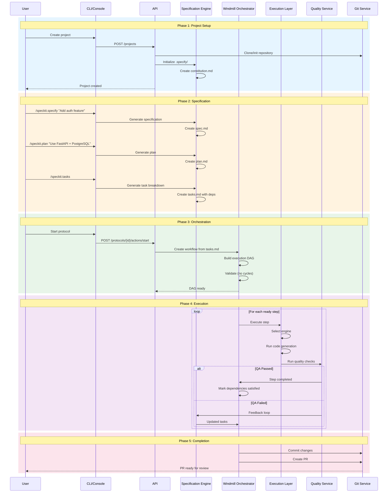

### 3.2 DAG Execution Flow

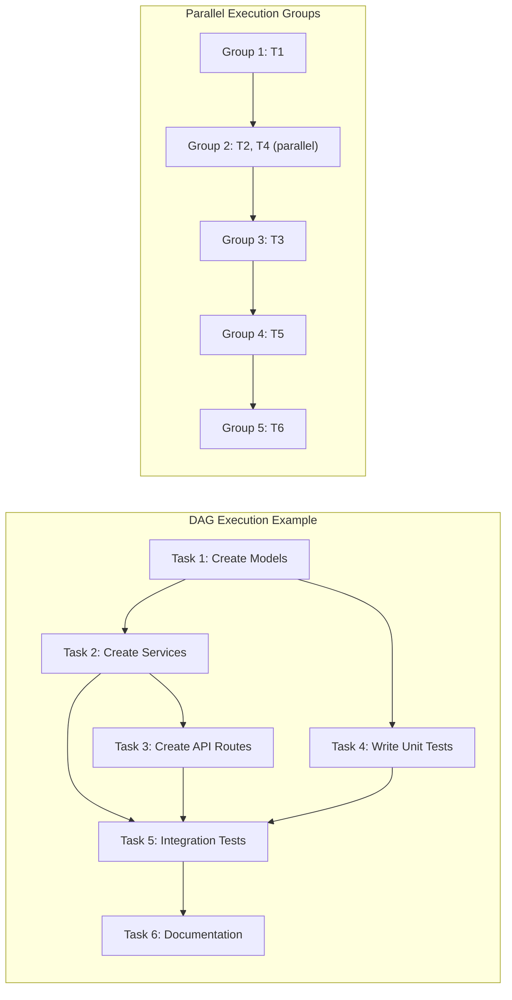

### 3.3 Cross-Cutting Services Integration

The Constitution Manager, Clarifier Service, and QA Gates form an integrated loop that operates across all phases:

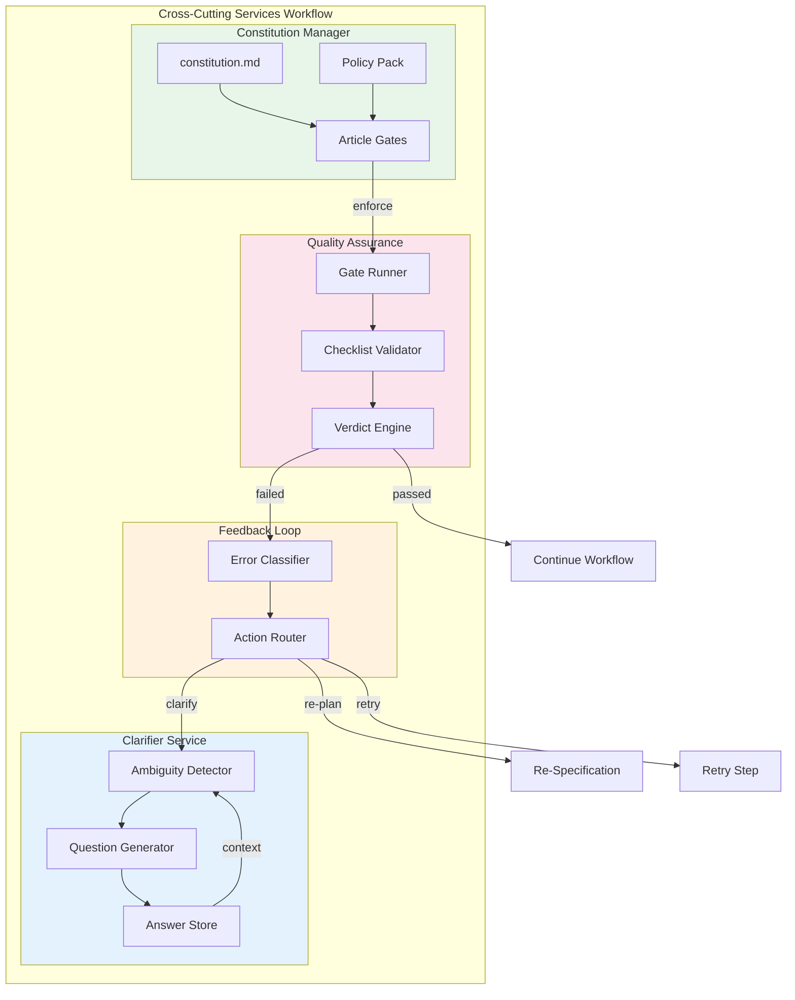

**Integration Points by Phase:**

| Phase | Constitution | Clarifier | QA |
|-------|--------------|-----------|-----|
| **Specify** | Validates spec against articles | Resolves ambiguous requirements | Pre-validates spec structure |
| **Plan** | Checks tech decisions against policies | Resolves technical choices | Validates plan completeness |
| **Tasks** | Ensures task structure compliance | Resolves scope questions | Validates task dependencies |
| **Execute** | N/A (already validated) | N/A (execution phase) | Validates step output |
| **QA** | Enforces constitutional gates | Generates clarification for failures | Full quality assessment |
| **Feedback** | Guides re-planning constraints | Handles user clarification answers | Triggers based on QA verdict |

**Detailed Workflow:**

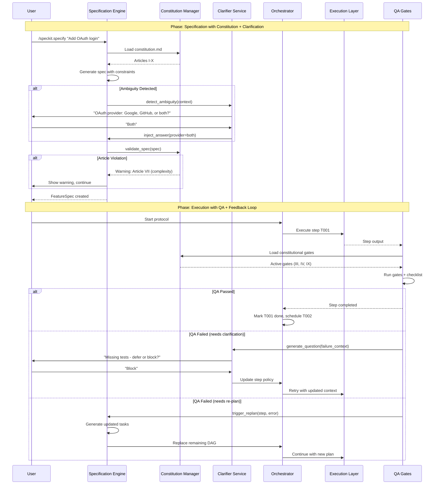

---

## 4. Integration Points

### 4.1 SpecKit ↔ Windmill Integration

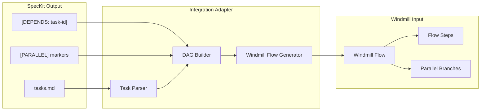

### 4.2 Service Layer Mapping

| Current Service | Role (current) | Integration |
|-----------------|----------|-------------|
| `SpecificationService` | Speckit-style artifacts | Writes `.specify/` (constitution, templates, spec/plan/tasks markdown) |
| `PlanningService` | Protocol planning | Parses protocol specs and creates step DAG; can generate Windmill flows |
| `ExecutionService` | Uses Engine Registry | Multi-agent dispatch |
| `QualityService` | Constitutional QA | Constitution + gates (lint/type/tests today; checklist integration is planned) |
| `OrchestratorService` | Windmill adapter | DAG → Flow conversion |
| `OnboardingService` | Project setup | `.specify/` initialization (when onboarding is enabled) |
| `PolicyService` | Constitution reader | Bidirectional sync |

---

## 5. Technology Stack

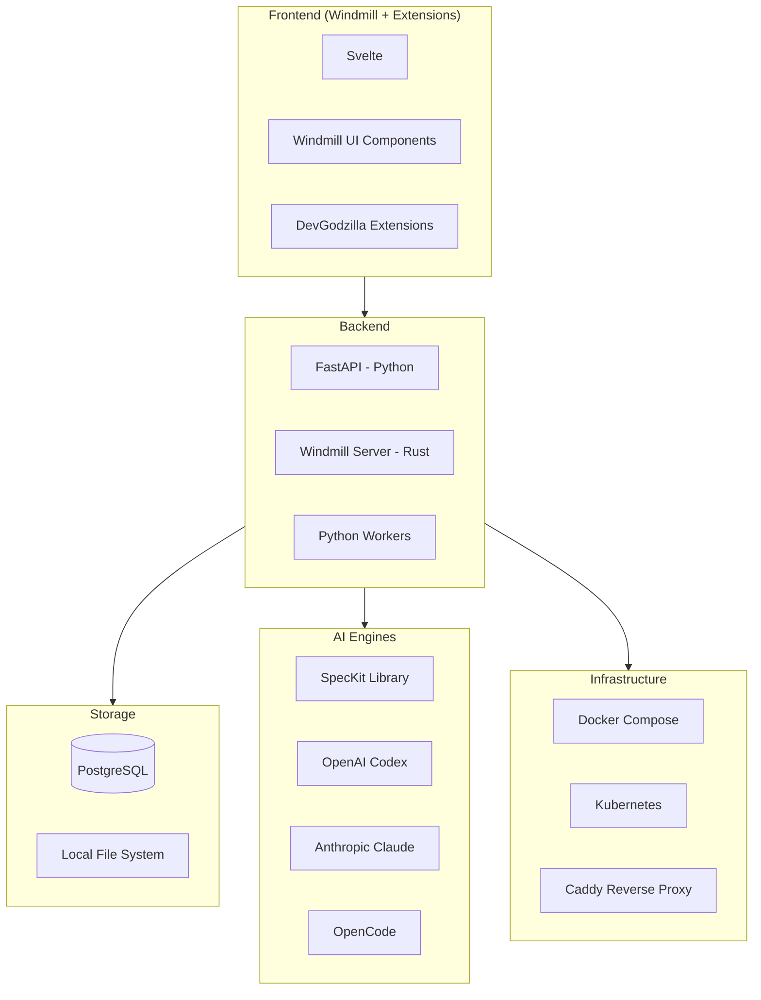

---

## 6. Migration Strategy

### Phase 1: Foundation (Week 1-2)
- [ ] Add SpecKit as Python library dependency
- [ ] Verify library imports and typed models
- [ ] Set up Windmill infrastructure

### Phase 2: Planning Refactoring (Week 3-4)
- [ ] Rewrite `PlanningService` with SpecKit library
- [ ] Delete `DecompositionService` (merged)
- [ ] Delete `SpecService` (merged)

### Phase 3: Orchestration Migration (Week 5-6)
- [ ] Implement Windmill adapter in `OrchestratorService`
- [ ] Migrate from Redis/RQ to Windmill job queue
- [ ] Implement DAG execution with cycle detection

### Phase 4: Execution & QA (Week 7-8)
- [ ] Extend Engine Registry with SpecKit agents
- [ ] Implement Constitutional QA gates
- [ ] Add feedback loop handlers

### Phase 5: UI & Polish (Week 9-10)
- [ ] Update Web Console for new workflow
- [ ] Add DAG visualization
- [ ] Create integrated documentation

---

## 7. Verification Plan

### Automated Tests
```bash
# Unit tests
pytest tests/services/test_planning.py -v
pytest tests/services/test_orchestrator.py -v
pytest tests/services/test_quality.py -v

# Integration tests
pytest tests/integration/test_speckit_workflow.py -v
pytest tests/integration/test_windmill_dag.py -v

# E2E tests
./scripts/test_e2e.sh
```

### Manual Verification
1. Create new project via CLI
2. Run `/speckit.specify`, `/speckit.plan`, `/speckit.tasks`
3. Start protocol and observe DAG execution
4. Verify feedback loops work on intentional failures
5. Check Windmill UI for job visibility

---

## Open Questions

~~1. WindMill's AGPLv3 license - any concerns for your use case?~~
   **RESOLVED**: Open source solution, license compatible.

~~2. Is SpecKit available as a Python library, or CLI only?~~
   **RESOLVED**: DevGodzilla will be available as both Python library AND CLI.

~~3. Preferred agent selection priority when multiple are available?~~
   **RESOLVED**: User explicitly assigns agent per step. No auto-selection priority.

~~4. Should `_runtime/runs/` be gitignored?~~
   **RESOLVED**: Yes, `_runtime/runs/` is gitignored (ephemeral execution data).

~~5. Offline mode / fallbacks?~~
   **RESOLVED**: No offline mode. No fallbacks. No backward compatibility.

---

## Summary

This architecture combines:

- **SpecKit's specification-driven methodology** for structured, AI-assisted planning
- **Windmill's industrial workflow engine** for scalable, observable job execution
- **TasksGodzilla's multi-agent execution layer** with feedback loops

The result is **DevGodzilla**: a unified platform for AI-driven software development with proper orchestration, quality gates, and self-healing capabilities through specification feedback loops.

---

## Related Documentation

| Document | Description |
|----------|-------------|
| [API-ARCHITECTURE.md](./API-ARCHITECTURE.md) | Detailed REST API specification |
| [subsystems/README.md](./subsystems/README.md) | Subsystem documentation index |
| [subsystems/01-SPECIFICATION-ENGINE.md](./subsystems/01-SPECIFICATION-ENGINE.md) | SpecKit integration details |
| [subsystems/02-ORCHESTRATION-CORE.md](./subsystems/02-ORCHESTRATION-CORE.md) | Windmill workflow engine |
| [subsystems/03-EXECUTION-LAYER.md](./subsystems/03-EXECUTION-LAYER.md) | Multi-agent execution (18+ agents) |
| [subsystems/04-QUALITY-ASSURANCE.md](./subsystems/04-QUALITY-ASSURANCE.md) | Constitutional QA gates |
| [subsystems/05-PLATFORM-SERVICES.md](./subsystems/05-PLATFORM-SERVICES.md) | Database, Git, Events |
| [subsystems/06-USER-INTERFACE.md](./subsystems/06-USER-INTERFACE.md) | Svelte UI + CLI |
