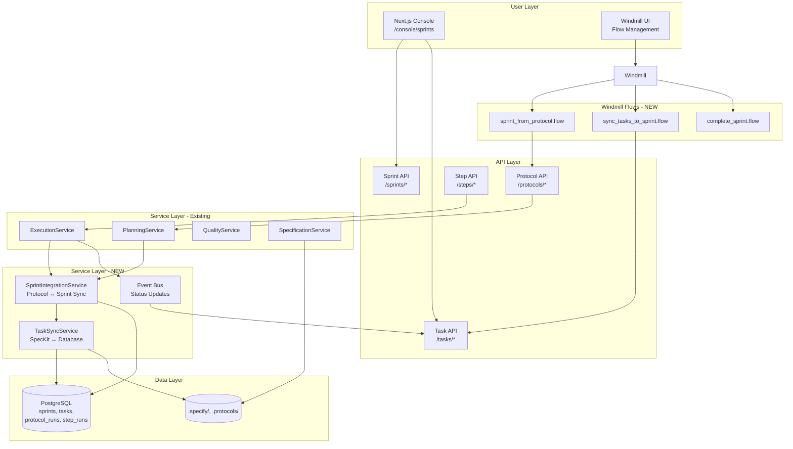
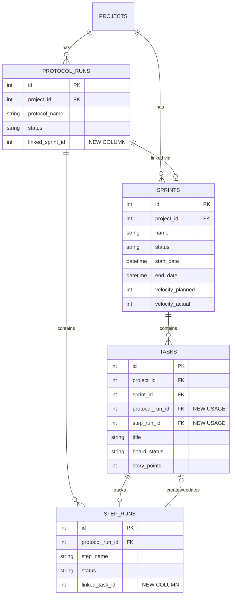

# Sprint Integration Architecture

> **Status**: Implementation Design
> **Created**: 2025-12-18
> **Affects**: DevGodzilla API, Windmill Flows, SpecKit Integration

## Executive Summary

This document defines the architecture for integrating Sprint Management with DevGodzilla's protocol execution workflow, Windmill orchestration, and SpecKit artifacts. The solution creates a unified task tracking system where:

- Protocol steps automatically create and update sprint tasks
- SpecKit task breakdowns sync to database-backed agile tasks
- Windmill flows orchestrate sprint lifecycle operations
- Frontend sprint board reflects real-time workflow execution status

## Problem Statement

### Current State Gaps

1. **Disconnected Task Generation**: Windmill flows generate `specs/<spec>/tasks.md` files but don't create `AgileTask` database records
2. **No Sprint-Workflow Linkage**: Protocol execution and sprint management operate independently
3. **Missing Windmill Integration**: No flows for sprint lifecycle (create, sync, complete)
4. **No Bidirectional Sync**: Frontend task changes don't affect protocol execution
5. **Unused Database Relationships**: `tasks.protocol_run_id` and `tasks.step_run_id` exist but aren't populated

### Requirements

**Must Have**:
- Protocol steps automatically create sprint tasks
- Step execution completion updates task status
- SpecKit task markdown syncs to database
- API endpoints for sprint-protocol operations
- Windmill flows for sprint lifecycle

**Should Have**:
- Automatic sprint creation from protocol runs
- Sprint velocity tracking based on completed steps
- Task dependency mapping from protocol dependencies

**Nice to Have**:
- Bidirectional sync (task → protocol updates)
- Sprint forecasting based on historical velocity
- Burndown chart generation

## Architecture Design

### Component Overview



### Data Model Integration



### Service Layer Architecture

#### 1. SprintIntegrationService

**Purpose**: Manages bidirectional integration between protocol execution and sprint management.

**Responsibilities**:
- Create sprint from protocol run
- Sync protocol steps → sprint tasks
- Update task status when step completes
- Calculate sprint velocity from completed steps
- Manage task-step linkage

**Interface**:
```python
class SprintIntegrationService:
    async def create_sprint_from_protocol(
        self,
        protocol_run_id: int,
        sprint_name: Optional[str] = None,
        start_date: Optional[datetime] = None,
        end_date: Optional[datetime] = None
    ) -> Sprint

    async def sync_protocol_to_sprint(
        self,
        protocol_run_id: int,
        sprint_id: int,
        create_missing_tasks: bool = True
    ) -> List[AgileTask]

    async def update_task_from_step(
        self,
        step_run_id: int,
        step_status: str
    ) -> Optional[AgileTask]

    async def calculate_sprint_velocity(
        self,
        sprint_id: int
    ) -> int

    async def link_protocol_to_sprint(
        self,
        protocol_run_id: int,
        sprint_id: int
    ) -> ProtocolRun
```

#### 2. TaskSyncService

**Purpose**: Synchronizes SpecKit markdown task files with database AgileTask records.

**Responsibilities**:
- Parse `specs/<spec>/tasks.md` → database tasks
- Export database tasks → markdown format
- Handle task dependencies from markdown
- Preserve task metadata during sync

**Interface**:
```python
class TaskSyncService:
    async def import_speckit_tasks(
        self,
        project_id: int,
        spec_path: str,
        sprint_id: int,
        overwrite_existing: bool = False
    ) -> List[AgileTask]

    async def export_sprint_to_speckit(
        self,
        sprint_id: int,
        output_path: str
    ) -> str

    async def parse_task_markdown(
        self,
        content: str
    ) -> List[Dict[str, Any]]

    async def generate_task_markdown(
        self,
        tasks: List[AgileTask]
    ) -> str
```

### API Endpoints

#### Sprint-Protocol Integration

```
POST   /sprints/{sprint_id}/actions/link-protocol
POST   /sprints/{sprint_id}/actions/sync-from-protocol
POST   /sprints/{sprint_id}/actions/import-tasks
GET    /sprints/{sprint_id}/velocity
POST   /sprints/{sprint_id}/actions/complete

POST   /protocols/{protocol_id}/actions/create-sprint
GET    /protocols/{protocol_id}/sprint
POST   /protocols/{protocol_id}/actions/sync-to-sprint
```

#### Request/Response Schemas

```python
class LinkProtocolRequest(BaseModel):
    protocol_run_id: int
    auto_sync: bool = True

class ImportTasksRequest(BaseModel):
    spec_path: str
    overwrite_existing: bool = False

class CreateSprintFromProtocolRequest(BaseModel):
    sprint_name: Optional[str] = None
    start_date: Optional[datetime] = None
    end_date: Optional[datetime] = None
    auto_sync: bool = True

class SprintVelocityOut(BaseModel):
    sprint_id: int
    velocity_actual: int
    total_points: int
    completed_points: int
    completion_rate: float
```

### Windmill Flow Integration

#### 1. Sprint Creation Flow

**Flow**: `f/devgodzilla/sprint_from_protocol`

**Steps**:
1. Get protocol run details
2. Call `POST /protocols/{id}/actions/create-sprint`
3. Wait for sprint creation
4. Sync tasks from protocol steps
5. Return sprint details

#### 2. Task Sync Flow

**Flow**: `f/devgodzilla/sync_tasks_to_sprint`

**Steps**:
1. Read SpecKit tasks.md
2. Call `POST /sprints/{id}/actions/import-tasks`
3. Validate task import
4. Update sprint metrics
5. Return sync summary

#### 3. Extended SpecKit Flow

**Flow**: `f/devgodzilla/spec_to_tasks` (MODIFIED)

**New Steps**:
- After task generation, check if sprint exists
- If sprint exists, sync tasks to database
- Update sprint board in frontend

### Event-Driven Updates

#### Event Types

```python
class SprintEvent(str, Enum):
    STEP_STARTED = "step.started"
    STEP_COMPLETED = "step.completed"
    STEP_FAILED = "step.failed"
    TASK_STATUS_CHANGED = "task.status_changed"
    SPRINT_VELOCITY_UPDATED = "sprint.velocity_updated"
```

#### Event Handlers

**StepExecutionHandler**:
```python
@event_handler("step.completed")
async def on_step_completed(event: Event):
    step_run = await db.get_step_run(event.step_run_id)
    if step_run.linked_task_id:
        await sprint_integration.update_task_from_step(
            step_run_id=event.step_run_id,
            step_status=step_run.status
        )
```

**SprintVelocityHandler**:
```python
@event_handler("task.status_changed")
async def on_task_status_changed(event: Event):
    task = await db.get_task(event.task_id)
    if task.sprint_id:
        velocity = await sprint_integration.calculate_sprint_velocity(
            task.sprint_id
        )
        await db.update_sprint(
            task.sprint_id,
            velocity_actual=velocity
        )
```

## Implementation Plan

### Phase 1: Core Service Layer (Week 1)

**Files to Create**:
- `devgodzilla/services/sprint_integration.py`
- `devgodzilla/services/task_sync.py`
- `devgodzilla/services/events.py` (event bus)

**Database Migrations**:
```sql
-- Add sprint linkage to protocol_runs
ALTER TABLE protocol_runs ADD COLUMN linked_sprint_id INTEGER REFERENCES sprints(id);

-- Add task linkage to step_runs
ALTER TABLE step_runs ADD COLUMN linked_task_id INTEGER REFERENCES tasks(id);

-- Add indexes for performance
CREATE INDEX idx_tasks_protocol_run ON tasks(protocol_run_id);
CREATE INDEX idx_tasks_step_run ON tasks(step_run_id);
CREATE INDEX idx_protocol_runs_sprint ON protocol_runs(linked_sprint_id);
CREATE INDEX idx_step_runs_task ON step_runs(linked_task_id);
```

**Tests**:
- `tests/test_sprint_integration_service.py`
- `tests/test_task_sync_service.py`

### Phase 2: API Endpoints (Week 1-2)

**Files to Create/Modify**:
- Modify `devgodzilla/api/routes/sprints.py` (add new endpoints)
- Modify `devgodzilla/api/routes/protocols.py` (add sprint actions)
- Add schemas to `devgodzilla/api/schemas.py`

**Tests**:
- `tests/test_sprint_protocol_api.py`

### Phase 3: Event Handlers (Week 2)

**Files to Modify**:
- `devgodzilla/services/execution.py` (emit events)
- `devgodzilla/services/quality.py` (emit events)

**Tests**:
- `tests/test_sprint_events.py`

### Phase 4: Windmill Integration (Week 2-3)

**Files to Create**:
- `windmill/flows/devgodzilla/sprint_from_protocol.flow.json`
- `windmill/flows/devgodzilla/sync_tasks_to_sprint.flow.json`
- `windmill/flows/devgodzilla/complete_sprint.flow.json`
- `windmill/scripts/devgodzilla/sprint_from_protocol_api.py`
- `windmill/scripts/devgodzilla/sync_tasks_api.py`

**Modify**:
- `windmill/flows/devgodzilla/spec_to_tasks.flow.json` (add sync step)

**Tests**:
- `tests/test_windmill_sprint_flows.py`

### Phase 5: E2E Testing (Week 3)

**Files to Create**:
- `tests/e2e/test_sprint_protocol_integration.py`
- `tests/e2e/test_speckit_sprint_workflow.py`

### Phase 6: Documentation (Week 3)

**Files to Update**:
- `docs/APP_ARCHITECTURE.md` (add sprint integration section)
- `docs/DevGodzilla/CURRENT_STATE.md` (update workflow description)
- `README.md` (add sprint management examples)

## Success Metrics

1. **Integration Coverage**: 100% of protocol steps linked to tasks
2. **Sync Latency**: Task status updates < 2 seconds after step completion
3. **Data Consistency**: 0 orphaned tasks (task without protocol or sprint)
4. **User Experience**: Single source of truth visible in both Windmill and Next.js console
5. **Performance**: Sprint velocity calculation < 500ms for sprints with 100+ tasks

## Rollout Strategy

### Stage 1: Opt-In (Week 4)
- Feature flag: `DEVGODZILLA_ENABLE_SPRINT_INTEGRATION=false` (default)
- Users enable via environment variable
- Monitor for issues

### Stage 2: Opt-Out (Week 5)
- Change default to `true`
- Add UI toggle in settings
- Provide migration tool for existing sprints

### Stage 3: Always On (Week 6)
- Remove feature flag
- Sprint integration becomes core behavior
- Archive legacy task-only workflows

## Risk Mitigation

### Risk: Performance Degradation
- **Mitigation**: Implement async task updates, use database indexes, add caching
- **Monitoring**: Track API response times, add alerts for > 2s latency

### Risk: Data Conflicts
- **Mitigation**: Implement conflict resolution strategy (protocol takes precedence)
- **Monitoring**: Log all sync conflicts, provide admin UI for manual resolution

### Risk: Backward Compatibility
- **Mitigation**: Maintain existing API endpoints, add new ones for integration
- **Monitoring**: Track usage of legacy endpoints, plan deprecation timeline

## Open Questions

1. **Sprint Archival**: Should completed sprints be read-only or allow task updates?
   - **Decision**: Read-only after sprint completion, allow admin override

2. **Task Deletion**: What happens to sprint task when protocol step is deleted?
   - **Decision**: Soft delete with `board_status = "archived"`

3. **Multi-Sprint Protocols**: Can one protocol link to multiple sprints?
   - **Decision**: No, 1:1 relationship initially, evaluate later

4. **Task Priority**: Should task priority derive from step order or be manual?
   - **Decision**: Default to step order, allow manual override

## Appendix

### Example Workflow: Spec → Sprint → Execution

1. User creates specification via SpecKit (`/speckit/specify`)
2. User generates plan (`/speckit/plan`)
3. User generates tasks (`/speckit/tasks`) → creates `specs/<spec>/tasks.md`
4. Windmill flow triggers `sync_tasks_to_sprint` → creates database tasks
5. User creates protocol run from specification
6. System auto-creates sprint via `sprint_from_protocol` flow
7. System syncs protocol steps to sprint tasks
8. User views sprint board in Next.js console (`/console/sprints`)
9. User triggers protocol execution via Windmill
10. As steps complete, task status updates automatically
11. Sprint velocity updates in real-time
12. User reviews completed sprint with execution artifacts linked

### Code References

- Database schema: `devgodzilla/db/schema.py:176-216` (sprints/tasks tables)
- Existing sprint API: `devgodzilla/api/routes/sprints.py:1-94`
- Existing task API: `devgodzilla/api/routes/tasks.py:1-85`
- Frontend hooks: `frontend/lib/api/hooks/use-sprints.ts:1-80`
- Windmill task flow: `windmill/flows/devgodzilla/spec_to_tasks.flow.json:1-66`
