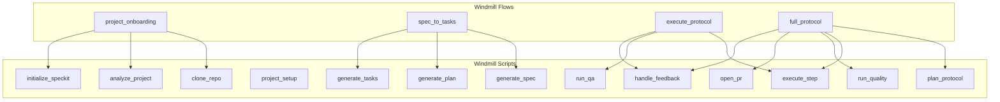
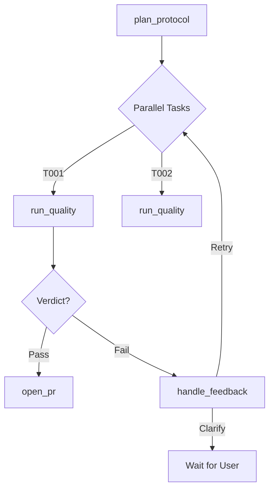

# DevGodzilla Windmill Workflows

> Detailed documentation for Windmill scripts, flows, and integration patterns

---

## Overview

DevGodzilla uses Windmill as its workflow orchestration engine, replacing the previous Redis/RQ implementation. This document describes the available scripts, flows, and how to use them for AI-driven development.



---

## Scripts Reference

All scripts are located at `u/devgodzilla/` in Windmill.

### Foundation Scripts

#### clone_repo
Clone a GitHub repository to a local workspace.

#### analyze_project
Analyze a project's structure, detecting language, framework, and key files.

#### initialize_speckit
Initialize the `.specify/` directory structure with constitution and templates.

#### project_setup
**[NEW]** Full project initialization combining clone, analyze, SpecKit initialization, and database record creation.
- **Args**: `git_url`, `project_name`, `branch`, `constitution_template`
- **Output**: Project ID, path, analysis results

### Planning Scripts

#### generate_spec
Generate a feature specification from a user request.

#### generate_plan
Generate an implementation plan from a feature specification.

#### generate_tasks
Generate a task breakdown with dependencies from the plan.

#### plan_protocol
**[NEW]** Complete planning workflow: Spec → Plan → Tasks + DAG generation + Flow creation.
- **Args**: `project_id`, `feature_request`, `protocol_name`, `branch_name`
- **Output**: Protocol run ID, task DAG, created Windmill flow ID

### Execution Scripts

#### execute_step
Execute a single task step using an AI agent (Codex, Claude, OpenCode, Gemini).

#### run_qa
Basic QA checks.

#### run_quality
**[NEW]** Enhanced QA with constitutional gates, checklist validation, and code analysis.
- **Args**: `step_run_id`, `step_output`, `constitution_path`
- **Output**: Verdict (pass/fail/warn), gate results, score

#### handle_feedback
Handle feedback loop actions when QA fails (clarify, re-plan, retry).

#### open_pr
**[NEW]** Create GitHub/GitLab Pull Request for completed protocol.
- **Args**: `protocol_run_id`, `title`, `description`, `draft`
- **Output**: PR URL, PR number

---

## Flows Reference

All flows are located at `f/devgodzilla/` in Windmill.

### Note: JavaScript `input_transforms` require `deno_core`

The `protocol_start`, `run_next_step`, and `step_execute_with_qa` flows use `input_transforms` of type `javascript` (e.g. `flow_input.protocol_run_id`, `results.select_next_step.step_run_id`). That requires Windmill to be built with the `deno_core` feature enabled.

If your Windmill build is `python`-only (like the default `docker-compose.devgodzilla.yml`), run the Python scripts directly instead:
- `u/devgodzilla/protocol_plan_and_wait`
- `u/devgodzilla/protocol_select_next_step`
- `u/devgodzilla/step_execute_api`
- `u/devgodzilla/step_run_qa_api`

### protocol_start
Plan a protocol in DevGodzilla (via API) and wait until it reaches a stable status (`planned`, `running`, `blocked`, etc).

### run_next_step
Select the next runnable step for a protocol (via API) and execute it with QA.

### step_execute_with_qa
Execute a specific `step_run_id` (via API) and run QA.

### project_onboarding
Complete project setup: clone, analyze, and initialize SpecKit.

### spec_to_tasks
Generate spec → plan → tasks from a feature request.

### execute_protocol
Execute a step with QA checks.

### full_protocol
**[NEW]** Complete protocol execution with DAG-based parallel tasks, QA checks, and feedback loops.



**Inputs:**
```json
{
  "project_id": 1,
  "feature_request": "Add feature X",
  "protocol_name": "Protocol 1",
  "branch_name": "feature-x",
  "agent_id": "codex"
}
```

---

## Resources Reference

Resources are located at `windmill/resources/devgodzilla/`.

### database.resource.yaml
PostgreSQL connection for DevGodzilla database.
- Port: 5432
- Database: devgodzilla

### agents.resource.yaml
Configuration for 7 AI agents:
- `codex` (OpenAI)
- `claude-code` (Anthropic)
- `opencode` (DeepSeek/Llama)
- `gemini-cli` (Google)
- `cursor` (IDE)
- `copilot` (GitHub)
- `qoder` (Experimental)

---

## Import Script

Use the import script to sync local changes to Windmill:

```bash
# Import everything
python3 windmill/import_to_windmill.py --url http://192.168.1.227 --token <YOUR_TOKEN>
```

---

## File Structure

```
windmill/
├── scripts/devgodzilla/           # 13 Scripts
│   ├── project_setup.py
│   ├── plan_protocol.py
│   ├── run_quality.py
│   ├── open_pr.py
│   └── ... (9 others)
│
├── flows/devgodzilla/             # 4 Flows
│   ├── full_protocol.flow.json
│   └── ... (3 others)
│
└── resources/devgodzilla/         # 2 Resources
    ├── database.resource.yaml
    └── agents.resource.yaml
```
