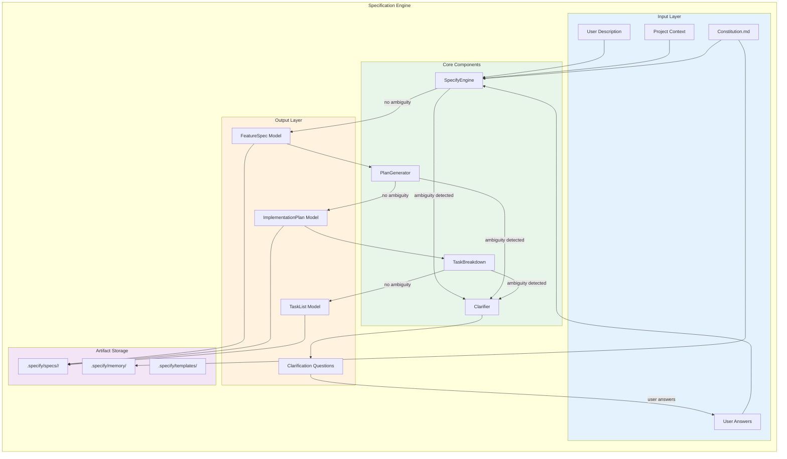
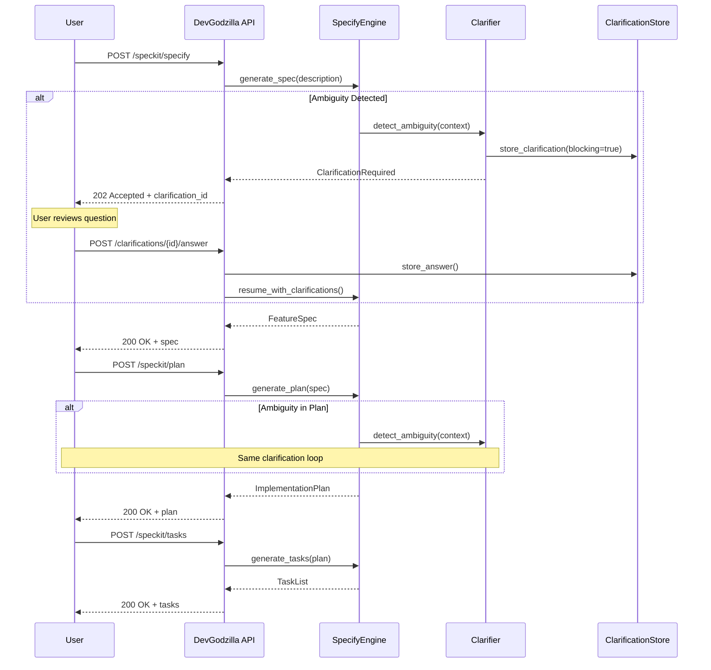
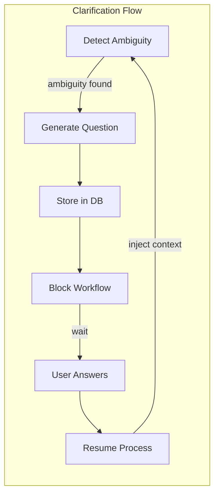

# Specification Engine Architecture

> SpecKit integration for spec-driven development in DevGodzilla

---

## Overview

The Specification Engine is the foundation of DevGodzilla's spec-driven development approach. It integrates the SpecKit library to transform natural language requirements into structured, executable specifications.



---

## Specification Workflow

The specification process includes clarification loops at each stage:



## Components

### 1. SpecifyEngine

The core engine that transforms user descriptions into structured specifications.

```python
from specify import SpecifyEngine
from specify.models import FeatureSpec

class PlanningService:
    def __init__(self, db: Database):
        self.db = db
        self._engine = SpecifyEngine(
            templates_dir=".specify/templates",
            constitution_path=".specify/memory/constitution.md"
        )
    
    def generate_spec(
        self,
        project_id: int,
        description: str,
        branch_name: str
    ) -> FeatureSpec:
        """Generate feature specification from natural language."""
        project = self.db.get_project(project_id)
        repo_root = Path(project.local_path)
        
        return self._engine.specify(
            description=description,
            branch=branch_name,
            project_root=repo_root
        )
```

**Responsibilities:**
- Parse natural language descriptions
- Analyze project context (existing code, architecture)
- Apply constitutional constraints
- Generate structured FeatureSpec output

### 2. PlanGenerator

Transforms feature specifications into technical implementation plans.

```python
from specify import PlanGenerator
from specify.models import ImplementationPlan

class PlanningService:
    def __init__(self, db: Database):
        self._planner = PlanGenerator(engine=self._engine)
    
    def generate_plan(
        self,
        spec: FeatureSpec,
        project_root: Path
    ) -> ImplementationPlan:
        """Generate implementation plan from specification."""
        return self._planner.generate(
            spec=spec,
            project_root=project_root
        )
```

**Output includes:**
- Technology stack decisions
- Architecture changes
- File structure modifications
- Integration approach

### 3. TaskBreakdown

Decomposes implementation plans into executable tasks with dependencies.

```python
from specify import TaskBreakdown
from specify.models import TaskList

class PlanningService:
    def __init__(self, db: Database):
        self._tasker = TaskBreakdown(engine=self._engine)
    
    def generate_tasks(
        self,
        plan: ImplementationPlan,
        project_root: Path
    ) -> TaskList:
        """Break down plan into executable tasks."""
        return self._tasker.breakdown(
            plan=plan,
            project_root=project_root
        )
```

**Task Structure:**
```yaml
phases:
  - phase: 1
    name: "Setup"
    tasks:
      - id: T001
        description: "Create project structure"
        parallel: false
        
  - phase: 2
    name: "Foundational"
    tasks:
      - id: T002
        description: "Setup database schema"
        parallel: true
      - id: T003
        description: "Setup auth middleware"
        parallel: true
        
  - phase: 3
    name: "User Story 1 - Login"
    story_id: US1
    mvp: true
    tasks:
      - id: T004
        description: "Create User model"
        parallel: true
        story: US1
        depends_on: [T002]
```

### 4. Clarifier

The Clarifier is integrated at every stage of the specification workflow, detecting ambiguity and generating structured questions.



**Integration Points:**
- Called by `SpecifyEngine` when requirements are unclear
- Called by `PlanGenerator` when technical decisions are needed
- Called by `TaskBreakdown` when task scope is ambiguous

```python
from specify import Clarifier
from specify.models import Clarification, ClarificationStatus

class ClarificationService:
    """Manages clarification workflow."""
    
    def __init__(self, db: Database):
        self.db = db
        self._clarifier = Clarifier()
    
    def detect_and_create(
        self,
        context: dict,
        stage: Literal["specify", "plan", "tasks"],
        protocol_run_id: int
    ) -> Clarification | None:
        """Detect ambiguity and create clarification if needed."""
        
        # Use LLM to detect ambiguity
        ambiguity = self._clarifier.detect_ambiguity(context)
        
        if not ambiguity:
            return None
        
        # Generate structured question
        clarification = self._clarifier.generate(
            context=context,
            ambiguity=ambiguity
        )
        
        # Store in database
        return self.db.create_clarification(
            scope="protocol",
            protocol_run_id=protocol_run_id,
            key=f"{stage}_{clarification.key}",
            question=clarification.question,
            options=clarification.options,
            recommended=clarification.recommended,
            blocking=True,
            status=ClarificationStatus.OPEN
        )
    
    def get_pending(self, protocol_run_id: int) -> list[Clarification]:
        """Get all pending clarifications for a protocol."""
        return self.db.get_clarifications(
            protocol_run_id=protocol_run_id,
            status=ClarificationStatus.OPEN
        )
    
    def answer(
        self,
        clarification_id: int,
        answer: Any,
        answered_by: str
    ) -> Clarification:
        """Record user answer and unblock workflow."""
        return self.db.update_clarification(
            clarification_id,
            answer=answer,
            answered_by=answered_by,
            answered_at=datetime.utcnow(),
            status=ClarificationStatus.ANSWERED
        )
    
    def inject_answers(self, context: dict, clarifications: list[Clarification]) -> dict:
        """Inject answered clarifications into context."""
        for c in clarifications:
            if c.status == ClarificationStatus.ANSWERED:
                context[c.key] = c.answer
        return context
```

**Clarification Model:**
```python
class Clarification(BaseModel):
    """Structured clarification question."""
    
    id: int
    scope: Literal["project", "protocol", "step"]
    protocol_run_id: int | None
    step_run_id: int | None
    
    key: str                          # Unique identifier
    question: str                     # Human-readable question
    options: list[str] | None         # Possible answers
    recommended: dict | None          # Suggested answer with reason
    blocking: bool                    # Blocks workflow if True
    
    answer: Any | None                # User's answer
    status: Literal["open", "answered", "skipped"]
    
    created_at: datetime
    answered_at: datetime | None
    answered_by: str | None
```

**Clarification Types:**

| Stage | Example Key | Example Question |
|-------|-------------|------------------|
| `specify` | `scope_boundary` | "Should user registration include email verification?" |
| `specify` | `auth_method` | "Which authentication method: JWT, session, or OAuth?" |
| `plan` | `database_choice` | "PostgreSQL or MongoDB for this use case?" |
| `plan` | `api_style` | "REST or GraphQL for the API?" |
| `tasks` | `test_framework` | "pytest or unittest for tests?" |
| `tasks` | `parallel_limit` | "How many tasks can run in parallel?" |

---

## Typed Models

### FeatureSpec

```python
class FeatureSpec(BaseModel):
    """Structured feature specification."""
    
    feature_name: str
    branch_name: str
    description: str
    
    user_stories: list[UserStory]
    acceptance_criteria: list[str]
    constraints: list[str]
    assumptions: list[str]
    
    out_of_scope: list[str]
    dependencies: list[str]
    
    metadata: dict
    created_at: datetime

class UserStory(BaseModel):
    """User story within a feature."""
    
    id: str  # US1, US2, etc.
    title: str
    priority: Literal["P1", "P2", "P3"]
    description: str
    as_a: str
    i_want: str
    so_that: str
    acceptance_criteria: list[str]
```

### ImplementationPlan

```python
class ImplementationPlan(BaseModel):
    """Technical implementation plan."""
    
    spec_id: str
    summary: str
    
    tech_stack: TechStack
    architecture_changes: list[ArchitectureChange]
    file_changes: list[FileChange]
    
    risks: list[Risk]
    alternatives_considered: list[Alternative]
    
    estimated_complexity: Literal["low", "medium", "high"]
    estimated_effort_hours: int

class TechStack(BaseModel):
    """Technology decisions."""
    
    languages: list[str]
    frameworks: list[str]
    databases: list[str]
    libraries: list[str]
    reasoning: dict[str, str]
```

### TaskList

```python
class TaskList(BaseModel):
    """Executable task breakdown."""
    
    plan_id: str
    phases: list[Phase]
    
    dag: DAGDefinition
    parallel_groups: dict[str, list[str]]
    
    total_tasks: int
    estimated_total_hours: int

class Phase(BaseModel):
    """Implementation phase."""
    
    phase: int
    name: str
    story_id: Optional[str]
    mvp: bool
    tasks: list[Task]

class Task(BaseModel):
    """Individual executable task."""
    
    id: str  # T001, T002, etc.
    description: str
    file_path: Optional[str]
    
    parallel: bool
    story: Optional[str]
    depends_on: list[str]
    
    estimated_complexity: Literal["trivial", "simple", "moderate", "complex"]
    estimated_minutes: int
```

---

## Directory Structure

```
.specify/
├── memory/
│   └── constitution.md              # Project governance principles
│
├── templates/
│   ├── spec-template.md             # Feature spec template
│   ├── plan-template.md             # Implementation plan template
│   ├── tasks-template.md            # Task breakdown template
│   └── checklist-template.md        # QA checklist template
│
└── specs/<feature-branch>/
    ├── feature-spec.md              # Generated specification
    ├── plan.md                      # Generated plan
    ├── tasks.md                     # Generated tasks
    │
    └── _runtime/                    # Execution artifacts (GITIGNORED)
        ├── context.md               # Execution context
        ├── log.md                   # Execution log
        ├── quality-report.md        # QA results
        └── runs/<run-id>/           # Per-run artifacts
```

---

## Constitution Integration

The constitution defines project governance principles that guide all specifications.

### Constitution Structure

```markdown
# Project Constitution

## Article I: Library-First Development
Prefer well-tested libraries over custom implementations.

## Article III: Test-First Development  
Write tests before implementation code.

## Article VII: Simplicity
Prefer simple solutions over complex ones.

## Article VIII: Anti-Abstraction
Avoid premature abstraction. Duplicate code 3x before abstracting.

## Article IX: Integration Testing
Every feature must have integration tests.
```

### Constitutional Gates

Each article can block or warn during specification:

| Article | Gate Type | Enforcement |
|---------|-----------|-------------|
| I | Warning | Suggest library alternatives |
| III | Blocking | Require test tasks before impl |
| VII | Warning | Flag complex solutions |
| VIII | Warning | Flag premature abstractions |
| IX | Blocking | Require integration test tasks |

---

## Slash Command Mapping

| SpecKit Command | DevGodzilla API | Service Method |
|-----------------|-----------------|----------------|
| `/speckit.constitution` | GET `/speckit/constitution` | `PolicyService.get_constitution()` |
| `/speckit.specify` | POST `/speckit/specify` | `PlanningService.generate_spec()` |
| `/speckit.plan` | POST `/speckit/plan` | `PlanningService.generate_plan()` |
| `/speckit.tasks` | POST `/speckit/tasks` | `PlanningService.generate_tasks()` |
| `/speckit.checklist` | POST `/speckit/checklist` | `QualityService.generate_checklist()` |
| `/speckit.clarify` | POST `/feedback` | `PlanningService.handle_feedback()` |

---

## Error Handling

### SpecificationError

Raised when specification cannot proceed:

```python
class SpecificationError(Exception):
    """Error during specification generation."""
    
    def __init__(
        self,
        message: str,
        error_type: Literal["context_window", "template", "api", "validation"],
        suggested_action: Literal["clarify", "re_plan", "re_specify"],
        context: dict
    ):
        self.message = message
        self.error_type = error_type
        self.suggested_action = suggested_action
        self.context = context
```

### Error Types

| Error Type | Description | Suggested Action |
|------------|-------------|------------------|
| `context_window` | Input too large for LLM | `clarify` (reduce scope) |
| `template` | Template parsing failed | `re_specify` |
| `api` | LLM API error | Retry or `re_specify` |
| `validation` | Output validation failed | `clarify` or `re_plan` |

---

## Integration with Other Subsystems

### → Orchestration Core

```python
# TaskList is converted to Windmill DAG
dag = windmill_client.create_flow_from_tasks(task_list)
```

### → Execution Layer

```python
# Tasks include agent assignment hints
task.suggested_agent = "claude-code"  # Based on task type
```

### → Quality Assurance

```python
# Specification feeds constitutional QA gates
qa_service.validate_against_constitution(spec, constitution)
```

---

## Configuration

```yaml
# config/speckit.yaml
speckit:
  templates_dir: ".specify/templates"
  constitution_path: ".specify/memory/constitution.md"
  
  llm:
    provider: "anthropic"
    model: "claude-sonnet-4-20250514"
    max_tokens: 8192
    temperature: 0.3
  
  validation:
    require_user_stories: true
    require_acceptance_criteria: true
    max_tasks_per_phase: 10
    
  clarification:
    auto_generate: true
    blocking_timeout_hours: 24
```

---

## Summary

The Specification Engine provides:

1. **Structured specification** from natural language
2. **Constitutional governance** for consistent development practices
3. **DAG-ready task breakdown** for orchestration
4. **Clarification workflow** for ambiguity resolution
5. **Typed models** for reliable downstream processing

All outputs are stored in `.specify/` and feed directly into the Orchestration Core.
