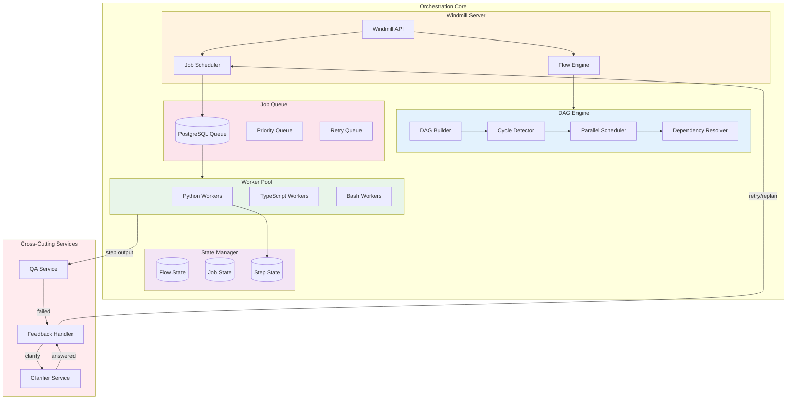
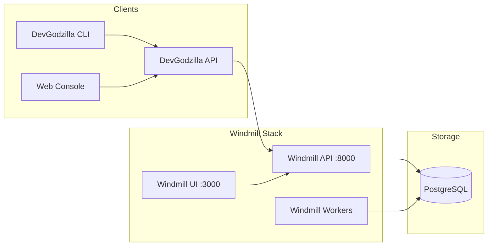
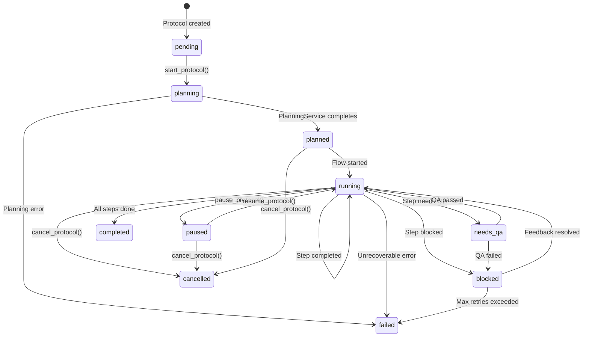
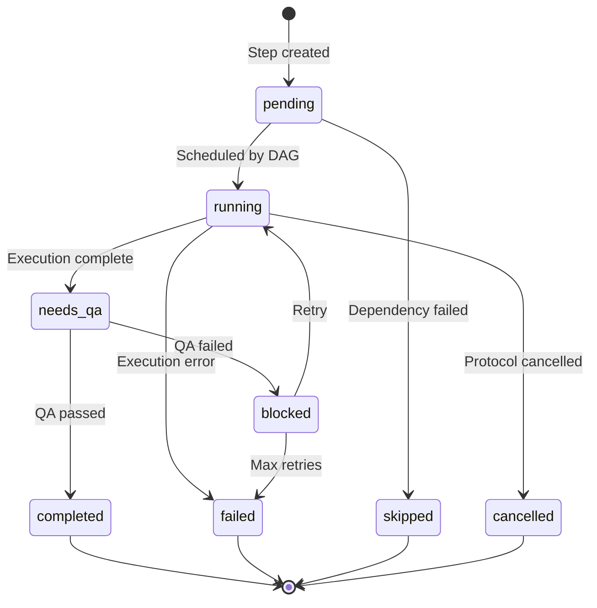

# Orchestration Core Architecture

> Windmill-based workflow engine for DevGodzilla

---

## Overview

The Orchestration Core replaces Redis/RQ with Windmill's industrial-grade workflow engine, providing DAG-based execution, job queuing, and comprehensive observability.



---

## Windmill Integration

### Why Windmill?

| Feature | Redis/RQ (Old) | Windmill (New) |
|---------|----------------|----------------|
| **Queue Backend** | Redis (in-memory) | PostgreSQL (durable) |
| **DAG Support** | Manual implementation | Native flows |
| **Worker Scaling** | Manual | Auto-scaling |
| **Multi-language** | Python only | Python, TS, Go, Bash, SQL |
| **Observability** | Limited | Full UI, logs, metrics |
| **Retry Logic** | Basic | Configurable per-step |
| **Parallelism** | Manual branching | Native `branchall` |

### Windmill Architecture



---

## DAG Execution

### Task-to-Flow Conversion

```python
from windmill import WindmillClient
from tasksgodzilla.models import TaskList

class OrchestratorService:
    def __init__(self, db: Database):
        self.db = db
        self.windmill = WindmillClient(
            base_url=os.environ["WINDMILL_BASE_URL"],
            token=os.environ["WINDMILL_TOKEN"]
        )
    
    def create_flow_from_tasks(
        self,
        protocol_run_id: int,
        task_list: TaskList
    ) -> str:
        """Convert TaskList to Windmill Flow."""
        
        # Build DAG from task dependencies
        dag = self._build_dag(task_list)
        
        # Detect cycles (fail if found)
        if self._has_cycles(dag):
            raise TaskGraphError("Cycle detected in task dependencies")
        
        # Convert to Windmill flow definition
        flow_def = self._to_windmill_flow(dag, task_list)
        
        # Create flow in Windmill
        flow_path = f"f/devgodzilla/protocol-{protocol_run_id}"
        self.windmill.create_flow(path=flow_path, definition=flow_def)
        
        # Store flow ID
        self.db.update_protocol_run(
            protocol_run_id,
            windmill_flow_id=flow_path
        )
        
        return flow_path
```

### DAG Building

```python
class DAGBuilder:
    """Builds execution DAG from task dependencies."""
    
    def build(self, task_list: TaskList) -> DAG:
        nodes = {}
        edges = []
        
        for phase in task_list.phases:
            for task in phase.tasks:
                nodes[task.id] = DAGNode(
                    id=task.id,
                    description=task.description,
                    parallel=task.parallel,
                    agent=task.suggested_agent
                )
                
                for dep in task.depends_on:
                    edges.append((dep, task.id))
        
        return DAG(nodes=nodes, edges=edges)
    
    def detect_cycles(self, dag: DAG) -> list[list[str]]:
        """Detect cycles using Tarjan's algorithm."""
        # Returns list of cycles if any found
        ...
    
    def compute_parallel_groups(self, dag: DAG) -> dict[str, list[str]]:
        """Compute which tasks can run in parallel."""
        groups = {}
        levels = self._topological_levels(dag)
        
        for level, tasks in enumerate(levels):
            groups[f"group_{level}"] = [t.id for t in tasks]
        
        return groups
```

### Windmill Flow Definition

```python
def _to_windmill_flow(self, dag: DAG, task_list: TaskList) -> dict:
    """Convert DAG to Windmill flow definition."""
    
    modules = []
    
    for group_id, task_ids in dag.parallel_groups.items():
        if len(task_ids) == 1:
            # Single task - simple module
            task = task_list.get_task(task_ids[0])
            modules.append({
                "id": task.id,
                "value": {
                    "type": "script",
                    "path": "u/devgodzilla/execute_step",
                    "input_transforms": {
                        "step_id": {"type": "static", "value": task.id},
                        "agent_id": {"type": "static", "value": task.agent or "codex"},
                        "protocol_run_id": {"type": "flow_input", "key": "protocol_run_id"}
                    }
                }
            })
        else:
            # Multiple tasks - parallel branch
            modules.append({
                "id": group_id,
                "value": {
                    "type": "branchall",
                    "branches": [
                        {
                            "modules": [{
                                "id": task_id,
                                "value": {
                                    "type": "script",
                                    "path": "u/devgodzilla/execute_step",
                                    "input_transforms": {
                                        "step_id": {"type": "static", "value": task_id},
                                        "agent_id": {"type": "static", "value": task_list.get_task(task_id).agent or "codex"}
                                    }
                                }
                            }]
                        }
                        for task_id in task_ids
                    ]
                }
            })
    
    return {
        "summary": f"Protocol: {task_list.plan_id}",
        "description": "Generated by DevGodzilla",
        "value": {
            "modules": modules
        },
        "schema": {
            "properties": {
                "protocol_run_id": {"type": "integer"}
            },
            "required": ["protocol_run_id"]
        }
    }
```

---

## Job Types

### DevGodzilla Jobs

| Job Type | Script Path | Description |
|----------|-------------|-------------|
| `project_setup_job` | `u/devgodzilla/project_setup` | Initialize project + .specify/ |
| `plan_protocol_job` | `u/devgodzilla/plan_protocol` | Generate spec → plan → tasks |
| `execute_step_job` | `u/devgodzilla/execute_step` | Execute single step with agent |
| `run_quality_job` | `u/devgodzilla/run_quality` | Run QA checks on step output |
| `open_pr_job` | `u/devgodzilla/open_pr` | Create GitHub/GitLab PR |
| `feedback_job` | `u/devgodzilla/handle_feedback` | Process feedback loop |

### Execute Step Script

```python
# u/devgodzilla/execute_step.py

import os
from devgodzilla.services import ExecutionService, get_db

def main(
    step_id: str,
    agent_id: str,
    protocol_run_id: int,
    config_override: dict = None
):
    """Execute a single step using specified agent."""
    
    db = get_db()
    execution_service = ExecutionService(db)
    
    result = execution_service.execute_step(
        step_id=step_id,
        agent_id=agent_id,
        protocol_run_id=protocol_run_id,
        config_override=config_override
    )
    
    return {
        "step_id": step_id,
        "status": result.status,
        "output": result.output,
        "artifacts": result.artifacts
    }
```

---

## State Management

### Protocol State Machine



### Step State Machine



### State Persistence

```sql
-- Protocol state in PostgreSQL
CREATE TABLE protocol_runs (
    id SERIAL PRIMARY KEY,
    project_id INTEGER REFERENCES projects(id),
    status VARCHAR(50) NOT NULL DEFAULT 'pending',
    windmill_flow_id VARCHAR(255),
    windmill_job_id VARCHAR(255),
    speckit_metadata JSONB,
    created_at TIMESTAMP DEFAULT NOW(),
    updated_at TIMESTAMP DEFAULT NOW()
);

-- Step state with DAG fields
CREATE TABLE step_runs (
    id SERIAL PRIMARY KEY,
    protocol_run_id INTEGER REFERENCES protocol_runs(id),
    step_id VARCHAR(50) NOT NULL,
    status VARCHAR(50) NOT NULL DEFAULT 'pending',
    agent_id VARCHAR(50),
    depends_on JSONB DEFAULT '[]',
    parallel_group VARCHAR(100),
    windmill_job_id VARCHAR(255),
    retries INTEGER DEFAULT 0,
    runtime_state JSONB,
    created_at TIMESTAMP DEFAULT NOW(),
    updated_at TIMESTAMP DEFAULT NOW()
);
```

---

## Scheduling & Priorities

### Priority Levels

| Priority | Value | Use Case |
|----------|-------|----------|
| `critical` | 100 | Feedback loops, blocking issues |
| `high` | 75 | User-initiated actions |
| `normal` | 50 | Regular step execution |
| `low` | 25 | Background tasks (QA, reports) |
| `idle` | 0 | Cleanup, maintenance |

### Scheduling Algorithm

```python
class ParallelScheduler:
    """Schedule tasks respecting dependencies and parallelism."""
    
    def schedule(self, dag: DAG, available_workers: int) -> list[ScheduledBatch]:
        batches = []
        completed = set()
        
        while len(completed) < len(dag.nodes):
            # Find all tasks with satisfied dependencies
            ready = [
                node for node in dag.nodes.values()
                if node.id not in completed
                and all(dep in completed for dep in dag.get_dependencies(node.id))
            ]
            
            # Group by parallel capability
            parallel_tasks = [t for t in ready if t.parallel]
            sequential_tasks = [t for t in ready if not t.parallel]
            
            if parallel_tasks:
                # Schedule up to available_workers in parallel
                batch = parallel_tasks[:available_workers]
                batches.append(ScheduledBatch(
                    tasks=batch,
                    parallel=True
                ))
                completed.update(t.id for t in batch)
            elif sequential_tasks:
                # Schedule one sequential task
                batches.append(ScheduledBatch(
                    tasks=[sequential_tasks[0]],
                    parallel=False
                ))
                completed.add(sequential_tasks[0].id)
        
        return batches
```

---

## Retry & Error Handling

### Retry Configuration

```yaml
# config/orchestration.yaml
orchestration:
  retry:
    max_attempts: 3
    backoff_type: exponential  # linear, exponential, fixed
    initial_delay_seconds: 30
    max_delay_seconds: 3600
    
  timeouts:
    step_execution: 1800  # 30 minutes
    qa_check: 300         # 5 minutes
    planning: 600         # 10 minutes
    
  circuit_breaker:
    enabled: true
    failure_threshold: 5
    recovery_timeout: 300
```

### Error Classification

The orchestrator integrates with **ClarifierService** and **QualityService** for feedback loops:

```python
from devgodzilla.services import ClarifierService, QualityService

class OrchestratorService:
    def __init__(self, db: Database):
        self.db = db
        self.clarifier = ClarifierService(db)
        self.qa_service = QualityService(db)
    
    def handle_step_error(self, step_id: str, error: Exception):
        """Classify error and determine action."""
        
        if isinstance(error, SpecificationError):
            # Trigger feedback loop with clarification
            return self._trigger_feedback_loop(step_id, error)
        
        elif isinstance(error, AgentUnavailableError):
            # Retry with different agent
            return self._retry_with_fallback_agent(step_id)
        
        elif isinstance(error, TimeoutError):
            # Retry with increased timeout
            return self._retry_with_increased_timeout(step_id)
        
        elif isinstance(error, TransientError):
            # Simple retry
            return self._schedule_retry(step_id)
        
        else:
            # Mark as failed, require manual intervention
            return self._mark_failed(step_id, error)
    
    def _trigger_feedback_loop(
        self,
        step_id: str,
        error: SpecificationError
    ) -> FeedbackAction:
        """Trigger feedback loop using cross-cutting services."""
        
        step = self.db.get_step_run(step_id)
        
        if error.suggested_action == "clarify":
            # Use ClarifierService to generate question
            clarification = self.clarifier.detect_and_create(
                context={
                    "step_id": step_id,
                    "error": str(error),
                    "error_type": error.error_type
                },
                stage="execution",
                protocol_run_id=step.protocol_run_id
            )
            
            if clarification:
                # Block step until clarification answered
                self.db.update_step_run(step_id, status="blocked")
                return FeedbackAction(
                    action="clarify",
                    clarification_id=clarification.id
                )
        
        elif error.suggested_action == "re_plan":
            # Trigger re-planning from this step
            return FeedbackAction(
                action="re_plan",
                from_step_id=step_id
            )
        
        elif error.suggested_action == "re_specify":
            # Request user to update specification
            self.db.update_step_run(step_id, status="blocked")
            return FeedbackAction(
                action="re_specify",
                message="Specification update required"
            )
    
    def handle_clarification_answered(
        self,
        clarification_id: int
    ) -> None:
        """Resume workflow after clarification is answered."""
        
        clarification = self.db.get_clarification(clarification_id)
        step_run_id = clarification.step_run_id
        
        if step_run_id:
            # Inject clarification into step context
            step = self.db.get_step_run(step_run_id)
            context = step.runtime_state or {}
            context["clarifications"] = context.get("clarifications", {})
            context["clarifications"][clarification.key] = clarification.answer
            
            # Update step and reschedule
            self.db.update_step_run(
                step_run_id,
                status="pending",
                runtime_state=context
            )
            
            # Reschedule the step
            self._schedule_step(step_run_id)
```

---

## Windmill Scripts

### Script Directory Structure

```
windmill/
├── scripts/
│   └── devgodzilla/
│       ├── project_setup.py
│       ├── plan_protocol.py
│       ├── execute_step.py
│       ├── run_quality.py
│       ├── open_pr.py
│       └── handle_feedback.py
│
├── flows/
│   └── devgodzilla/
│       └── protocol_template.flow.yaml
│
└── resources/
    └── devgodzilla/
        ├── database.resource.yaml
        └── agents.resource.yaml
```

### Script Template

```python
# windmill/scripts/devgodzilla/execute_step.py

"""
DevGodzilla Step Executor

Executes a single task step using the assigned AI agent.

Args:
    step_id: Task identifier (e.g., T001)
    agent_id: Agent to use (e.g., codex, claude-code)
    protocol_run_id: Parent protocol run
    config_override: Optional agent config overrides
    
Returns:
    StepResult with status, output, and artifacts
"""

import os
from devgodzilla.services import ExecutionService
from devgodzilla.db import get_database

def main(
    step_id: str,
    agent_id: str,
    protocol_run_id: int,
    config_override: dict | None = None
) -> dict:
    db = get_database()
    service = ExecutionService(db)
    
    result = service.execute_step(
        step_id=step_id,
        agent_id=agent_id,
        protocol_run_id=protocol_run_id,
        config_override=config_override
    )
    
    return result.to_dict()
```

---

## Monitoring & Observability

### Metrics Exported

| Metric | Type | Description |
|--------|------|-------------|
| `devgodzilla_jobs_total` | Counter | Total jobs by type and status |
| `devgodzilla_job_duration_seconds` | Histogram | Job execution duration |
| `devgodzilla_queue_depth` | Gauge | Current queue depth |
| `devgodzilla_worker_active` | Gauge | Active workers |
| `devgodzilla_dag_cycles_detected` | Counter | DAG cycle detection events |
| `devgodzilla_retries_total` | Counter | Retry attempts |

### Windmill UI Integration

The Windmill UI provides:
- Flow visualization with DAG graph
- Real-time job status
- Log streaming
- Historical runs
- Performance analytics

---

## Configuration

```yaml
# config/windmill.yaml
windmill:
  base_url: "http://localhost:8000"
  token: "${WINDMILL_TOKEN}"
  workspace: "devgodzilla"
  
  workers:
    count: 4
    tags: ["devgodzilla"]
    
  flows:
    base_path: "f/devgodzilla"
    
  scripts:
    base_path: "u/devgodzilla"
    
  database:
    # Uses same PostgreSQL as DevGodzilla
    connection_string: "${DATABASE_URL}"
```

---

## Summary

The Orchestration Core provides:

1. **DAG-based execution** with cycle detection and parallel scheduling
2. **Durable job queue** backed by PostgreSQL
3. **Multi-language workers** for flexible task execution
4. **State machine management** for protocols and steps
5. **Retry and error handling** with configurable policies
6. **Full observability** via Windmill UI and metrics

All workflow definitions are stored in Windmill and linked to DevGodzilla protocol runs.
