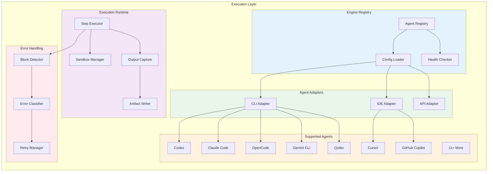

# Execution Layer Architecture

> Multi-agent code execution engine for DevGodzilla

---

## Overview

The Execution Layer manages 18+ AI coding agents through a unified interface, providing agent selection, sandboxed execution, and output capture.



---

## Supported Agents

### Agent Catalog

| Agent | ID | Kind | Command Dir | Format | Status |
|-------|-------|------|-------------|--------|--------|
| **OpenAI Codex** | `codex` | CLI | `.codex/commands/` | Markdown | ✅ |
| **Claude Code** | `claude-code` | CLI | `.claude/commands/` | Markdown | ✅ |
| **OpenCode** | `opencode` | CLI | `.opencode/command/` | Markdown | ✅ |
| **Gemini CLI** | `gemini-cli` | CLI | `.gemini/commands/` | TOML | ✅ |
| **GitHub Copilot** | `copilot` | IDE | `.github/agents/` | Markdown | ✅ |
| **Cursor** | `cursor` | IDE | `.cursor/commands/` | Markdown | ✅ |
| **Windsurf** | `windsurf` | IDE | `.windsurf/workflows/` | Markdown | ✅ |
| **Qoder** | `qoder` | CLI | `.qoder/commands/` | Markdown | ✅ |
| **Qwen Code** | `qwen` | CLI | `.qwen/commands/` | TOML | ✅ |
| **Amazon Q** | `q` | CLI | `.amazonq/prompts/` | Markdown | ✅ |
| **Auggie** | `auggie` | CLI | `.augment/rules/` | Markdown | ✅ |
| **CodeBuddy** | `codebuddy` | CLI | `.codebuddy/commands/` | Markdown | ✅ |
| **Kilo Code** | `kilocode` | IDE | `.kilocode/rules/` | Markdown | ✅ |
| **Roo Code** | `roo` | IDE | `.roo/rules/` | Markdown | ✅ |
| **Amp** | `amp` | CLI | `.agents/commands/` | Markdown | ✅ |
| **SHAI** | `shai` | CLI | `.shai/commands/` | Markdown | ✅ |
| **IBM Bob** | `bob` | IDE | `.bob/commands/` | Markdown | ✅ |
| **Jules** | `jules` | API | N/A | JSON | ✅ |

---

## Engine Registry

### Agent Registration

```python
from dataclasses import dataclass
from typing import Literal, Protocol

@dataclass
class AgentMetadata:
    """Agent identification and capabilities."""
    id: str
    name: str
    kind: Literal["cli", "ide", "api"]
    command_dir: str | None
    format: Literal["markdown", "toml", "json"]
    default_model: str | None
    capabilities: list[str]
    install_url: str | None
    requires_cli: bool

class EngineInterface(Protocol):
    """Unified interface for all AI coding agents."""
    
    @property
    def metadata(self) -> AgentMetadata:
        """Agent identification and capabilities."""
        ...
    
    def execute(self, request: EngineRequest) -> EngineResult:
        """Execute a coding task."""
        ...
    
    def check_availability(self) -> bool:
        """Check if agent is available."""
        ...
    
    def get_health(self) -> HealthStatus:
        """Get detailed health status."""
        ...
```

### Registry Implementation

```python
class AgentRegistry:
    """Central registry for all AI coding agents."""
    
    def __init__(self):
        self._agents: dict[str, EngineInterface] = {}
        self._config = self._load_config()
    
    def register(self, agent: EngineInterface):
        """Register an agent."""
        self._agents[agent.metadata.id] = agent
    
    def get(self, agent_id: str) -> EngineInterface:
        """Get agent by ID."""
        if agent_id not in self._agents:
            raise AgentNotFoundError(agent_id)
        return self._agents[agent_id]
    
    def list_available(self) -> list[AgentMetadata]:
        """List all available agents."""
        return [
            agent.metadata
            for agent in self._agents.values()
            if agent.check_availability()
        ]
    
    def check_all_health(self) -> dict[str, HealthStatus]:
        """Check health of all registered agents."""
        return {
            agent_id: agent.get_health()
            for agent_id, agent in self._agents.items()
        }
    
    def _load_config(self) -> dict:
        """Load agent configuration from file."""
        config_path = Path("config/agents.yaml")
        if config_path.exists():
            return yaml.safe_load(config_path.read_text())
        return {}
```

---

## Agent Adapters

### CLI Adapter

For agents that run as command-line tools:

```python
class CLIAgentAdapter(EngineInterface):
    """Adapter for CLI-based AI agents."""
    
    def __init__(self, config: AgentConfig):
        self.config = config
        self._metadata = AgentMetadata(
            id=config.id,
            name=config.name,
            kind="cli",
            command_dir=config.command_dir,
            format=config.format,
            default_model=config.default_model,
            capabilities=config.capabilities,
            install_url=config.install_url,
            requires_cli=True
        )
    
    @property
    def metadata(self) -> AgentMetadata:
        return self._metadata
    
    def execute(self, request: EngineRequest) -> EngineResult:
        """Execute task via CLI."""
        
        # Build command
        cmd = self._build_command(request)
        
        # Set up environment
        env = self._prepare_environment(request)
        
        # Execute in sandbox
        result = subprocess.run(
            cmd,
            cwd=request.working_dir,
            env=env,
            capture_output=True,
            timeout=request.timeout_seconds,
            text=True
        )
        
        return EngineResult(
            status="completed" if result.returncode == 0 else "failed",
            output=result.stdout,
            error=result.stderr if result.returncode != 0 else None,
            exit_code=result.returncode
        )
    
    def _build_command(self, request: EngineRequest) -> list[str]:
        """Build CLI command for agent."""
        base_cmd = [self.config.cli_tool]
        
        if request.prompt:
            base_cmd.extend(["--prompt", request.prompt])
        
        if request.model:
            base_cmd.extend(["--model", request.model])
        
        if self.config.sandbox:
            base_cmd.extend(["--sandbox", self.config.sandbox])
        
        return base_cmd
    
    def check_availability(self) -> bool:
        """Check if CLI tool is installed."""
        return shutil.which(self.config.cli_tool) is not None
```

### IDE Adapter

For agents that work within IDEs:

```python
class IDEAgentAdapter(EngineInterface):
    """Adapter for IDE-based AI agents."""
    
    def __init__(self, config: AgentConfig):
        self.config = config
        self._metadata = AgentMetadata(
            id=config.id,
            name=config.name,
            kind="ide",
            command_dir=config.command_dir,
            format=config.format,
            default_model=config.default_model,
            capabilities=config.capabilities,
            install_url=None,
            requires_cli=False
        )
    
    def execute(self, request: EngineRequest) -> EngineResult:
        """Execute task via IDE command file."""
        
        # Generate command file in agent's directory
        command_file = self._write_command_file(request)
        
        # IDE agents are typically async - return pending
        return EngineResult(
            status="pending",
            output=None,
            command_file=str(command_file),
            message=f"Command file created at {command_file}. Execute in IDE."
        )
    
    def _write_command_file(self, request: EngineRequest) -> Path:
        """Write command file for IDE agent."""
        command_dir = Path(request.working_dir) / self.config.command_dir
        command_dir.mkdir(parents=True, exist_ok=True)
        
        command_file = command_dir / f"{request.task_id}.md"
        
        content = self._format_command(request)
        command_file.write_text(content)
        
        return command_file
    
    def check_availability(self) -> bool:
        """IDE agents are always 'available' but may not be active."""
        return True
```

### API Adapter

For agents accessed via REST API:

```python
class APIAgentAdapter(EngineInterface):
    """Adapter for API-based AI agents."""
    
    def __init__(self, config: AgentConfig):
        self.config = config
        self.client = httpx.AsyncClient(
            base_url=config.api_base_url,
            headers={"Authorization": f"Bearer {config.api_key}"}
        )
    
    async def execute(self, request: EngineRequest) -> EngineResult:
        """Execute task via API."""
        
        response = await self.client.post(
            "/execute",
            json={
                "prompt": request.prompt,
                "model": request.model,
                "context": request.context,
                "max_tokens": request.max_tokens
            },
            timeout=request.timeout_seconds
        )
        
        if response.status_code == 200:
            data = response.json()
            return EngineResult(
                status="completed",
                output=data["output"],
                tokens_used=data.get("tokens_used")
            )
        else:
            return EngineResult(
                status="failed",
                error=response.text
            )
    
    def check_availability(self) -> bool:
        """Check API health endpoint."""
        try:
            response = httpx.get(f"{self.config.api_base_url}/health")
            return response.status_code == 200
        except:
            return False
```

---

## Agent Configuration

### Configuration File

```yaml
# config/agents.yaml
agents:
  codex:
    name: "OpenAI Codex"
    kind: cli
    cli_tool: codex
    command_dir: .codex/commands/
    format: markdown
    default_model: gpt-4.1
    sandbox: workspace-write
    capabilities:
      - code_generation
      - code_review
      - refactoring
      - debugging
    timeout_seconds: 300
    max_retries: 3
    
  claude-code:
    name: "Claude Code"
    kind: cli
    cli_tool: claude
    command_dir: .claude/commands/
    format: markdown
    default_model: claude-sonnet-4-20250514
    sandbox: workspace-write
    capabilities:
      - code_generation
      - code_review
      - refactoring
      - testing
      - documentation
    timeout_seconds: 300
    max_retries: 3
    
  opencode:
    name: "OpenCode"
    kind: cli
    cli_tool: opencode
    command_dir: .opencode/command/
    format: markdown
    default_model: zai-coding-plan/glm-4.6
    sandbox: workspace-write
    capabilities:
      - code_generation
      - code_review
    timeout_seconds: 300
    
  gemini-cli:
    name: "Gemini CLI"
    kind: cli
    cli_tool: gemini
    command_dir: .gemini/commands/
    format: toml
    capabilities:
      - code_generation
      - code_review

  cursor:
    name: "Cursor"
    kind: ide
    command_dir: .cursor/commands/
    format: markdown
    capabilities:
      - code_generation
    
  copilot:
    name: "GitHub Copilot"
    kind: ide
    command_dir: .github/agents/
    format: markdown
    capabilities:
      - code_generation
      - code_completion
```

---

## Execution Service

### Step Execution

```python
class ExecutionService:
    """Service for executing protocol steps."""
    
    def __init__(self, db: Database):
        self.db = db
        self.registry = AgentRegistry()
        self.sandbox_manager = SandboxManager()
    
    def execute_step(
        self,
        step_id: str,
        agent_id: str,
        protocol_run_id: int,
        config_override: dict | None = None
    ) -> StepResult:
        """Execute a single step using specified agent."""
        
        # Get step and protocol
        step = self.db.get_step(step_id)
        protocol = self.db.get_protocol_run(protocol_run_id)
        project = self.db.get_project(protocol.project_id)
        
        # Get agent
        agent = self.registry.get(agent_id)
        
        # Check availability
        if not agent.check_availability():
            raise AgentUnavailableError(agent_id)
        
        # Build request
        request = EngineRequest(
            task_id=step_id,
            prompt=self._build_prompt(step, protocol),
            working_dir=project.local_path,
            model=config_override.get("model") if config_override else None,
            context=self._gather_context(step, project),
            timeout_seconds=agent.metadata.timeout or 300
        )
        
        # Execute in sandbox
        with self.sandbox_manager.sandbox(project.local_path) as sandbox:
            try:
                result = agent.execute(request)
                
                # Capture artifacts
                artifacts = self._capture_artifacts(sandbox, step_id)
                
                # Update step status
                self.db.update_step(
                    step_id,
                    status="needs_qa" if result.status == "completed" else "failed",
                    output=result.output,
                    error=result.error
                )
                
                return StepResult(
                    step_id=step_id,
                    status=result.status,
                    output=result.output,
                    artifacts=artifacts,
                    agent_id=agent_id
                )
                
            except ExecutionBlockedError as e:
                # Trigger feedback loop
                return self._handle_blocked(step_id, e)
    
    def _build_prompt(self, step: Step, protocol: ProtocolRun) -> str:
        """Build prompt for agent from step and context."""
        return f"""
## Task: {step.description}

### Context
- Protocol: {protocol.protocol_name}
- Branch: {protocol.branch_name}
- Step ID: {step.id}

### Dependencies
{self._format_dependencies(step)}

### Instructions
{step.detailed_instructions or "Complete the task as described."}
"""
    
    def _gather_context(self, step: Step, project: Project) -> dict:
        """Gather context for agent execution."""
        return {
            "project_root": project.local_path,
            "spec_path": f"specs/{step.branch_name}/spec.md",
            "plan_path": f"specs/{step.branch_name}/plan.md",
            "constitution_path": ".specify/memory/constitution.md",
            "dependencies": step.depends_on
        }
```

---

## Sandbox Management

### Sandbox Types

| Sandbox | Capabilities | Use Case |
|---------|--------------|----------|
| `workspace-read` | Read project files | Code analysis, review |
| `workspace-write` | Read + write project files | Code generation |
| `network-restricted` | No network access | Secure execution |
| `full-access` | All capabilities | Trusted agents |

### Sandbox Implementation

```python
class SandboxManager:
    """Manages sandboxed execution environments."""
    
    def __init__(self):
        self.nsjail_path = shutil.which("nsjail")
    
    @contextmanager
    def sandbox(
        self,
        working_dir: str,
        mode: str = "workspace-write"
    ) -> SandboxContext:
        """Create sandboxed execution context."""
        
        if self.nsjail_path and mode != "full-access":
            # Use nsjail for sandboxing (like Windmill)
            yield NsjailSandbox(working_dir, mode)
        else:
            # Fallback to simple chdir isolation
            yield SimpleSandbox(working_dir)

class NsjailSandbox:
    """Sandbox using Google's nsjail."""
    
    def __init__(self, working_dir: str, mode: str):
        self.working_dir = working_dir
        self.mode = mode
    
    def run(self, cmd: list[str], **kwargs) -> subprocess.CompletedProcess:
        """Run command in nsjail sandbox."""
        
        nsjail_cmd = [
            "nsjail",
            "--mode", "o",
            "--chroot", "/",
            "--user", "65534",
            "--group", "65534",
        ]
        
        if self.mode == "workspace-read":
            nsjail_cmd.extend(["--bindmount_ro", self.working_dir])
        elif self.mode == "workspace-write":
            nsjail_cmd.extend(["--bindmount", self.working_dir])
        
        if "network-restricted" in self.mode:
            nsjail_cmd.append("--disable_clone_newnet")
        
        nsjail_cmd.extend(["--", *cmd])
        
        return subprocess.run(nsjail_cmd, **kwargs)

### Hybrid Sandboxing Strategy

To support dependency installation while maintaining security, we use a two-phase approach:

1.  **Setup Phase** (`workspace-write` + Network):
    *   Allowed to run `pip install`, `npm install`.
    *   Network access enabled.
    *   Artifacts: `package-lock.json`, `venv/`.

2.  **Execution Phase** (`workspace-write` + Network Restricted):
    *   Agent generates code.
    *   No general internet access (whitelisted API calls only).
    *   Prevents data exfiltration.

```yaml
# config/execution.yaml
phases:
  setup:
    sandbox: workspace-write
    network: true
    timeout: 600
  execution:
    sandbox: network-restricted
    network: false
    timeout: 300
```
```

---

## Output Capture

### Artifact Types

| Type | Extension | Description |
|------|-----------|-------------|
| `code` | `.py`, `.ts`, etc. | Generated code files |
| `test` | `test_*.py` | Test files |
| `log` | `.log`, `.txt` | Execution logs |
| `diff` | `.patch`, `.diff` | Code changes |
| `report` | `.md`, `.json` | Analysis reports |

### Artifact Writer

```python
class ArtifactWriter:
    """Captures and stores execution artifacts."""
    
    def __init__(self, db: Database, run_id: str):
        self.db = db
        self.run_id = run_id
        self.artifacts_dir = Path(f"runs/{run_id}/artifacts")
        self.artifacts_dir.mkdir(parents=True, exist_ok=True)
    
    def capture_changes(self, working_dir: Path) -> list[Artifact]:
        """Capture all file changes since execution start."""
        
        # Get git diff
        result = subprocess.run(
            ["git", "diff", "--name-only"],
            cwd=working_dir,
            capture_output=True,
            text=True
        )
        
        changed_files = result.stdout.strip().split("\n")
        artifacts = []
        
        for file_path in changed_files:
            if not file_path:
                continue
                
            full_path = working_dir / file_path
            if full_path.exists():
                artifact = self._save_artifact(
                    full_path,
                    kind=self._classify_file(file_path)
                )
                artifacts.append(artifact)
        
        return artifacts
    
    def _save_artifact(self, path: Path, kind: str) -> Artifact:
        """Save artifact to storage."""
        
        content = path.read_bytes()
        sha256 = hashlib.sha256(content).hexdigest()
        
        dest = self.artifacts_dir / path.name
        dest.write_bytes(content)
        
        artifact = Artifact(
            run_id=self.run_id,
            name=path.name,
            kind=kind,
            path=str(dest),
            sha256=sha256,
            bytes=len(content)
        )
        
        self.db.create_artifact(artifact)
        return artifact
    
    def _classify_file(self, file_path: str) -> str:
        """Classify file type for artifact."""
        if file_path.startswith("test") or "/test" in file_path:
            return "test"
        elif file_path.endswith((".py", ".ts", ".js", ".go")):
            return "code"
        elif file_path.endswith((".md", ".rst")):
            return "doc"
        else:
            return "other"
```

---

## Error Handling

### Block Detection

```python
class BlockDetector:
    """Detects when agent execution is blocked."""
    
    BLOCK_PATTERNS = [
        r"cannot proceed without",
        r"need clarification",
        r"ambiguous requirement",
        r"missing information",
        r"conflicting instructions",
        r"impossible to implement",
    ]
    
    def detect(self, output: str) -> BlockInfo | None:
        """Detect if output indicates blocked execution."""
        
        for pattern in self.BLOCK_PATTERNS:
            match = re.search(pattern, output, re.IGNORECASE)
            if match:
                return BlockInfo(
                    reason=match.group(0),
                    context=self._extract_context(output, match)
                )
        
        return None
    
    def classify(self, block_info: BlockInfo) -> FeedbackAction:
        """Classify block and suggest action."""
        
        if "clarification" in block_info.reason.lower():
            return FeedbackAction.CLARIFY
        elif "impossible" in block_info.reason.lower():
            return FeedbackAction.RE_SPECIFY
        elif "ambiguous" in block_info.reason.lower():
            return FeedbackAction.CLARIFY
        else:
            return FeedbackAction.RE_PLAN
```

---

## Configuration

```yaml
# config/execution.yaml
execution:
  default_agent: opencode
  
  sandbox:
    enabled: true
    default_mode: workspace-write
    nsjail_path: /usr/bin/nsjail
    
  timeouts:
    default: 300
    max: 3600
    
  retries:
    max_attempts: 3
    backoff_seconds: 30
    
  artifacts:
    max_size_mb: 100
    retention_days: 30
    
  logging:
    capture_stdout: true
    capture_stderr: true
    max_log_size_mb: 10
```

---

## Summary

The Execution Layer provides:

1. **Unified agent interface** for 18+ AI coding agents
2. **Pluggable adapters** for CLI, IDE, and API agents
3. **Sandboxed execution** using nsjail for security
4. **Artifact capture** for all generated files
5. **Block detection** to trigger feedback loops

All agents are registered in the central registry and selected per-step by the user.
