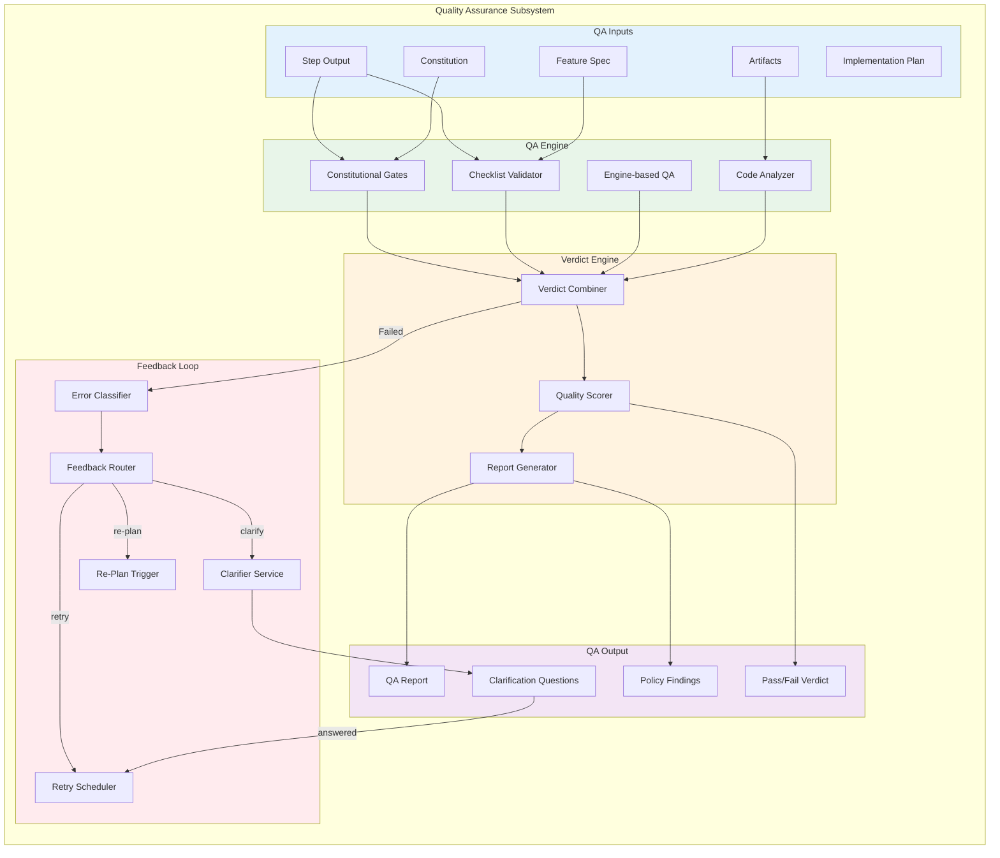
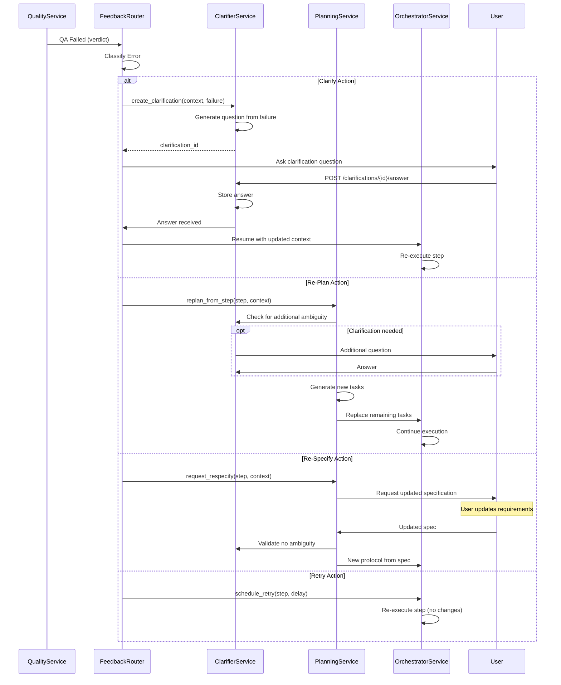

# Quality Assurance Architecture

> Constitutional QA and feedback loops for DevGodzilla

---

## Overview

The Quality Assurance subsystem enforces constitutional quality gates, runs checklist validation, and manages feedback loops for self-healing development workflows.



---

## Constitutional Gates

### Constitution Structure

The constitution defines project governance through articles:

```markdown
# Project Constitution

## Article I: Library-First Development
Prefer existing, well-tested libraries over custom implementations.
Write less code. Leverage the ecosystem.

## Article II: Documentation-Driven
Document intent before implementation. README-first approach.

## Article III: Test-First Development
Write failing tests before implementation code.
No feature is complete without tests.

## Article IV: Security by Default
Never commit secrets. Validate all inputs. Use parameterized queries.

## Article V: Accessibility
All user interfaces must be accessible (WCAG 2.1 AA minimum).

## Article VI: Performance Budgets
Define and enforce performance budgets for all features.

## Article VII: Simplicity
Prefer simple solutions over complex ones.
When in doubt, choose the simpler approach.

## Article VIII: Anti-Abstraction
Duplicate code 3 times before abstracting.
Avoid premature abstraction.

## Article IX: Integration Testing
Every feature must have integration tests.
Unit tests are not sufficient for feature completeness.

## Article X: Incremental Delivery
Ship small, complete increments. Each commit should be deployable.
```

### Gate Implementation

```python
from dataclasses import dataclass
from enum import Enum

class GateStatus(Enum):
    PASSED = "passed"
    WARNING = "warning"
    FAILED = "failed"
    SKIPPED = "skipped"

@dataclass
class GateFinding:
    code: str
    article: str
    severity: str  # info, warning, error, critical
    message: str
    file_path: str | None
    line_number: int | None
    suggested_fix: str | None

@dataclass
class GateResult:
    article: str
    name: str
    status: GateStatus
    findings: list[GateFinding]

class ConstitutionalGate:
    """Base class for constitutional gates."""
    
    def __init__(self, article: str, name: str, blocking: bool = True):
        self.article = article
        self.name = name
        self.blocking = blocking
    
    def evaluate(self, context: QAContext) -> GateResult:
        """Evaluate gate against step output."""
        raise NotImplementedError
```

### Gate Registry

```python
class GateRegistry:
    """Registry of all constitutional gates."""
    
    def __init__(self):
        self._gates: list[ConstitutionalGate] = []
        self._register_default_gates()
    
    def _register_default_gates(self):
        self._gates = [
            LibraryFirstGate(),      # Article I
            TestFirstGate(),          # Article III
            SecurityGate(),           # Article IV
            SimplicityGate(),         # Article VII
            AntiAbstractionGate(),    # Article VIII
            IntegrationTestGate(),    # Article IX
        ]
    
    def evaluate_all(self, context: QAContext) -> list[GateResult]:
        """Evaluate all gates."""
        return [gate.evaluate(context) for gate in self._gates]
```

### Example Gates

```python
class TestFirstGate(ConstitutionalGate):
    """Article III: Test-First Development."""
    
    def __init__(self):
        super().__init__(
            article="III",
            name="Test-First Development",
            blocking=True
        )
    
    def evaluate(self, context: QAContext) -> GateResult:
        findings = []
        
        # Check if test files exist
        test_files = [a for a in context.artifacts if a.kind == "test"]
        impl_files = [a for a in context.artifacts if a.kind == "code"]
        
        if impl_files and not test_files:
            findings.append(GateFinding(
                code="CONST_III_001",
                article=self.article,
                severity="error",
                message="Implementation created without corresponding tests",
                file_path=impl_files[0].path,
                line_number=None,
                suggested_fix="Create test file before implementation"
            ))
        
        # Check test creation order (via git history)
        for impl_file in impl_files:
            test_file = self._find_test_file(impl_file, test_files)
            if test_file and not self._test_created_first(test_file, impl_file, context):
                findings.append(GateFinding(
                    code="CONST_III_002",
                    article=self.article,
                    severity="warning",
                    message=f"Test file created after implementation: {test_file.name}",
                    file_path=test_file.path,
                    line_number=None,
                    suggested_fix="Write tests before implementing feature"
                ))
        
        status = GateStatus.PASSED
        if any(f.severity == "error" for f in findings):
            status = GateStatus.FAILED
        elif any(f.severity == "warning" for f in findings):
            status = GateStatus.WARNING
        
        return GateResult(
            article=self.article,
            name=self.name,
            status=status,
            findings=findings
        )


class LibraryFirstGate(ConstitutionalGate):
    """Article I: Library-First Development."""
    
    LIBRARY_PATTERNS = {
        "http_client": ["requests", "httpx", "aiohttp"],
        "json_parsing": ["pydantic", "marshmallow", "cattrs"],
        "date_handling": ["pendulum", "arrow", "dateutil"],
        "validation": ["pydantic", "cerberus", "voluptuous"],
        "password_hashing": ["bcrypt", "argon2", "passlib"],
    }
    
    REINVENTION_PATTERNS = [
        (r"def\s+parse_json\s*\(", "Use pydantic or stdlib json"),
        (r"class\s+\w*Validator\s*\(", "Consider pydantic for validation"),
        (r"def\s+hash_password\s*\(", "Use bcrypt or argon2"),
        (r"datetime\.strptime", "Consider pendulum or dateutil"),
    ]
    
    def evaluate(self, context: QAContext) -> GateResult:
        findings = []
        
        for artifact in context.artifacts:
            if artifact.kind != "code":
                continue
            
            content = artifact.read_text()
            
            for pattern, suggestion in self.REINVENTION_PATTERNS:
                matches = re.finditer(pattern, content)
                for match in matches:
                    line_num = content[:match.start()].count("\n") + 1
                    findings.append(GateFinding(
                        code="CONST_I_001",
                        article=self.article,
                        severity="warning",
                        message=f"Possible reinvention: {match.group(0)}",
                        file_path=artifact.path,
                        line_number=line_num,
                        suggested_fix=suggestion
                    ))
        
        status = GateStatus.PASSED if not findings else GateStatus.WARNING
        return GateResult(
            article=self.article,
            name=self.name,
            status=status,
            findings=findings
        )
```

---

## Checklist Validation

### Checklist Structure

```yaml
# From /speckit.checklist
checklist:
  id: "chk-auth-feature"
  name: "Authentication Feature Checklist"
  feature_spec_id: "spec-123"
  
  categories:
    - name: "Security"
      items:
        - id: CHK001
          description: "Passwords are hashed using bcrypt/argon2"
          required: true
          
        - id: CHK002
          description: "JWT tokens have appropriate expiration"
          required: true
          
        - id: CHK003
          description: "Rate limiting on auth endpoints"
          required: true
          
    - name: "Testing"
      items:
        - id: CHK010
          description: "Unit tests for auth service"
          required: true
          
        - id: CHK011
          description: "Integration tests for login flow"
          required: true
          
    - name: "Documentation"
      items:
        - id: CHK020
          description: "API documentation updated"
          required: false
```

### Checklist Validator

```python
class ChecklistValidator:
    """Validates step output against checklist items."""
    
    def __init__(self, llm_client: LLMClient):
        self.llm = llm_client
    
    def validate(
        self,
        checklist: Checklist,
        artifacts: list[Artifact],
        step_output: str
    ) -> ChecklistResult:
        """Validate all checklist items."""
        
        results = []
        
        for category in checklist.categories:
            for item in category.items:
                result = self._validate_item(item, artifacts, step_output)
                results.append(result)
        
        passed = sum(1 for r in results if r.passed)
        total = len(results)
        required_passed = all(
            r.passed for r in results if r.required
        )
        
        return ChecklistResult(
            checklist_id=checklist.id,
            items=results,
            passed=passed,
            total=total,
            overall_passed=required_passed
        )
    
    def _validate_item(
        self,
        item: ChecklistItem,
        artifacts: list[Artifact],
        step_output: str
    ) -> ItemResult:
        """Validate single checklist item using LLM."""
        
        prompt = f"""
Evaluate if the following checklist item is satisfied:

## Checklist Item
{item.description}

## Code Artifacts
{self._format_artifacts(artifacts)}

## Step Output
{step_output}

Respond with:
- PASSED: if the requirement is clearly met
- FAILED: if the requirement is not met
- UNCLEAR: if cannot determine from available information

Provide a brief explanation.
"""
        
        response = self.llm.complete(prompt)
        status = self._parse_status(response)
        
        return ItemResult(
            item_id=item.id,
            description=item.description,
            passed=status == "PASSED",
            required=item.required,
            explanation=response
        )

### "Smart Context" Strategy (RAG)

To prevent context window overflow when validating large files or projects:

1.  **Chunking**: Large files are split into overlapping chunks (e.g., 500 tokens).
2.  **Indexing**: Chunks are embedded and stored in a vector index (e.g., ChromaDB).
3.  **Retrieval**: For each checklist item, we retrieve the Top-K (e.g., K=3) chunks semantically related to the *item description*.
4.  **Verification**: The LLM validates the item using only the retrieved chunks + Step Output.

```python
def _format_artifacts(self, artifacts: list[Artifact], query: str) -> str:
    """Retrieve relevant chunks for the query."""
    if self._total_tokens(artifacts) < 8000:
        return self._format_all(artifacts)
        
    # Use RAG for large context
    relevant_chunks = self.vector_store.query(
        query_text=query,
        n_results=3
    )
    return "\n".join(relevant_chunks)
```
```

---

## Quality Service

```python
class QualityService:
    """Main service for quality assurance."""
    
    def __init__(self, db: Database):
        self.db = db
        self.gate_registry = GateRegistry()
        self.checklist_validator = ChecklistValidator(get_llm_client())
        self.code_analyzer = CodeAnalyzer()
    
    def run_for_step(self, step_run_id: int) -> QAResult:
        """Run full QA for a step."""
        
        step = self.db.get_step_run(step_run_id)
        protocol = self.db.get_protocol_run(step.protocol_run_id)
        project = self.db.get_project(protocol.project_id)
        
        # Gather context
        context = QAContext(
            step=step,
            protocol=protocol,
            project=project,
            artifacts=self.db.get_artifacts_for_step(step_run_id),
            constitution=self._load_constitution(project),
            spec=self._load_spec(protocol),
            checklist=self._load_checklist(protocol)
        )
        
        # Run all QA checks
        gate_results = self.gate_registry.evaluate_all(context)
        checklist_result = self.checklist_validator.validate(
            context.checklist,
            context.artifacts,
            step.output
        )
        code_analysis = self.code_analyzer.analyze(context.artifacts)
        
        # Combine verdicts
        verdict = self._compute_verdict(
            gate_results,
            checklist_result,
            code_analysis
        )
        
        # Generate report
        report = self._generate_report(
            gate_results,
            checklist_result,
            code_analysis,
            verdict
        )
        
        # Store results
        self.db.create_qa_result(
            step_run_id=step_run_id,
            verdict=verdict,
            gate_results=gate_results,
            checklist_result=checklist_result,
            report=report
        )
        
        # Update step status
        if verdict.passed:
            self.db.update_step_run(step_run_id, status="completed")
        else:
            self.db.update_step_run(step_run_id, status="blocked")
            
            # Trigger feedback loop
            self._trigger_feedback(step, verdict)
        
        return QAResult(
            step_run_id=step_run_id,
            verdict=verdict,
            gate_results=gate_results,
            checklist_result=checklist_result,
            report=report
        )
    
    def _compute_verdict(
        self,
        gate_results: list[GateResult],
        checklist_result: ChecklistResult,
        code_analysis: CodeAnalysisResult
    ) -> QAVerdict:
        """Compute overall QA verdict."""
        
        # Check blocking gates
        blocking_failures = [
            g for g in gate_results
            if g.status == GateStatus.FAILED
        ]
        
        if blocking_failures:
            return QAVerdict(
                passed=False,
                reason="Constitutional gate(s) failed",
                blocking_issues=blocking_failures,
                score=0.0
            )
        
        # Check required checklist items
        if not checklist_result.overall_passed:
            return QAVerdict(
                passed=False,
                reason="Required checklist items not satisfied",
                blocking_issues=[checklist_result],
                score=checklist_result.passed / checklist_result.total
            )
        
        # Calculate score
        gate_score = sum(
            1.0 if g.status == GateStatus.PASSED else 0.5
            for g in gate_results
        ) / len(gate_results)
        
        checklist_score = checklist_result.passed / checklist_result.total
        code_score = code_analysis.quality_score
        
        overall_score = (gate_score + checklist_score + code_score) / 3
        
        return QAVerdict(
            passed=True,
            reason="All checks passed",
            blocking_issues=[],
            score=overall_score
        )
```

---

## Feedback Loop

### Feedback Flow



### Feedback Router

The FeedbackRouter integrates with the **ClarifierService** from the Specification Engine subsystem to generate structured clarification questions when QA fails.

```python
from devgodzilla.services import ClarifierService

class FeedbackRouter:
    """Routes QA failures to appropriate feedback action."""
    
    def __init__(self, db: Database):
        self.db = db
        self.classifier = ErrorClassifier()
        self.clarifier = ClarifierService(db)  # Cross-cutting service
    
    def route(
        self,
        step: StepRun,
        verdict: QAVerdict
    ) -> FeedbackAction:
        """Determine feedback action for failed QA."""
        
        # Classify the failure
        classification = self.classifier.classify(verdict)
        
        if classification.action == "clarify":
            return self._create_clarification(step, verdict, classification)
        
        elif classification.action == "re_plan":
            return self._trigger_replan(step, classification)
        
        elif classification.action == "re_specify":
            return self._request_respecify(step, classification)
        
        elif classification.action == "retry":
            return self._schedule_retry(step, classification)
        
        else:
            # Manual intervention required
            return self._mark_blocked(step, classification)
    
    def _create_clarification(
        self,
        step: StepRun,
        verdict: QAVerdict,
        classification: ErrorClassification
    ) -> FeedbackAction:
        """Create clarification question using ClarifierService."""
        
        # Build context from QA failure
        failure_context = {
            "step_id": step.id,
            "step_description": step.step_name,
            "failure_reason": verdict.reason,
            "findings": [f.message for f in verdict.blocking_issues],
            "suggested_question": classification.suggested_question
        }
        
        # Use ClarifierService to generate and store clarification
        clarification = self.clarifier.detect_and_create(
            context=failure_context,
            stage="qa",
            protocol_run_id=step.protocol_run_id
        )
        
        if not clarification:
            # If clarifier doesn't detect ambiguity, use classification's suggestion
            clarification = self.db.create_clarification(
                scope="step",
                step_run_id=step.id,
                protocol_run_id=step.protocol_run_id,
                key=f"qa_feedback_{step.id}",
                question=classification.suggested_question,
                options=classification.options,
                recommended=classification.recommended,
                blocking=True
            )
        
        return FeedbackAction(
            action="clarify",
            clarification_id=clarification.id,
            step_status="blocked"
        )


class ErrorClassifier:
    """Classifies QA failures into feedback actions."""
    
    ACTION_PATTERNS = {
        "clarify": [
            r"ambiguous",
            r"unclear",
            r"missing information",
            r"need.*clarification",
            r"which.*should",
        ],
        "re_plan": [
            r"wrong approach",
            r"architecture.*issue",
            r"dependency.*conflict",
            r"incompatible",
        ],
        "re_specify": [
            r"impossible",
            r"contradictory",
            r"invalid requirement",
            r"cannot.*satisfy",
        ],
        "retry": [
            r"timeout",
            r"transient",
            r"network.*error",
            r"rate.*limit",
        ],
    }
    
    def classify(self, verdict: QAVerdict) -> ErrorClassification:
        """Classify error and suggest action."""
        
        error_text = " ".join(
            f.message for result in verdict.blocking_issues
            for f in getattr(result, "findings", [])
        )
        
        for action, patterns in self.ACTION_PATTERNS.items():
            for pattern in patterns:
                if re.search(pattern, error_text, re.IGNORECASE):
                    return ErrorClassification(
                        action=action,
                        confidence=0.8,
                        reason=f"Matched pattern: {pattern}"
                    )
        
        # Default to clarify
        return ErrorClassification(
            action="clarify",
            confidence=0.5,
            reason="No specific pattern matched"
        )
```

---

## QA Report Generation

```python
class ReportGenerator:
    """Generates QA reports in markdown format."""
    
    def generate(
        self,
        step: StepRun,
        gate_results: list[GateResult],
        checklist_result: ChecklistResult,
        verdict: QAVerdict
    ) -> str:
        """Generate full QA report."""
        
        return f"""
# QA Report: {step.step_name}

**Step ID**: {step.id}
**Status**: {"✅ PASSED" if verdict.passed else "❌ FAILED"}
**Quality Score**: {verdict.score:.0%}

---

## Constitutional Gates

{self._format_gates(gate_results)}

---

## Checklist Validation

**Passed**: {checklist_result.passed}/{checklist_result.total}

{self._format_checklist(checklist_result)}

---

## Findings

{self._format_findings(gate_results)}

---

## Recommendation

{self._generate_recommendation(verdict)}
"""
    
    def _format_gates(self, results: list[GateResult]) -> str:
        lines = []
        for result in results:
            icon = {
                GateStatus.PASSED: "✅",
                GateStatus.WARNING: "⚠️",
                GateStatus.FAILED: "❌",
                GateStatus.SKIPPED: "⏭️",
            }[result.status]
            lines.append(f"- {icon} **Article {result.article}**: {result.name}")
        return "\n".join(lines)
```

---

## Configuration

```yaml
# config/quality.yaml
quality:
  gates:
    enabled: true
    blocking_articles: [III, IV, IX]  # Blocking gates
    warning_articles: [I, VII, VIII]  # Warning only
    
  checklist:
    enabled: true
    auto_generate: true
    require_completion: true
    
  code_analysis:
    enabled: true
    tools:
      - ruff
      - mypy
      - bandit
      
  feedback:
    max_clarification_loops: 3
    max_replan_attempts: 2
    auto_retry_transient: true
    
  scoring:
    gate_weight: 0.4
    checklist_weight: 0.35
    code_weight: 0.25
    passing_threshold: 0.7
```

---

## Summary

The Quality Assurance subsystem provides:

1. **Constitutional gates** enforcing project governance
2. **Checklist validation** for feature-specific requirements
3. **Automated code analysis** with static analysis tools
4. **Quality scoring** combining multiple factors
5. **Feedback loop integration** for self-healing workflows

All QA results are stored and linked to step runs for traceability.
