# Platform Services Architecture

> Core infrastructure services for DevGodzilla

---

## Overview

Platform Services provide the foundational infrastructure for DevGodzilla, including database access, Git operations, CI/CD integration, event management, and observability.

```mermaid
graph TB
    subgraph PlatformServices["Platform Services"]
        direction TB

        subgraph Storage["Storage Layer"]
            PostgreSQL[(PostgreSQL)]
            FileSystem[File System]
            ArtifactStore[Artifact Store]
            RunRegistry[Run Registry]
        end

        subgraph Git["Git Integration"]
            GitService[Git Service]
            WorktreeManager[Worktree Manager]
            BranchManager[Branch Manager]
            PRService[PR Service]
        end

        subgraph CI["CI/CD Integration"]
            WebhookHandler[Webhook Handler]
            CIReporter[CI Reporter]
            AutoQATrigger[Auto-QA Trigger]
        end

        subgraph Events["Event System"]
            EventBus[Event Bus]
            EventStore[Event Store]
            Subscribers[Subscribers]
            SSEStream[SSE Stream]
        end

        subgraph Observability["Observability"]
            Metrics[Prometheus Metrics]
            Logging[Structured Logging]
            Tracing[Distributed Tracing]
            HealthChecks[Health Checks]
        end
    end

    PostgreSQL --> FileSystem
    FileSystem --> ArtifactStore
    ArtifactStore --> RunRegistry

    GitService --> WorktreeManager
    GitService --> BranchManager
    BranchManager --> PRService

    WebhookHandler --> CIReporter
    CIReporter --> AutoQATrigger

    EventBus --> EventStore
    EventBus --> Subscribers
    EventBus --> SSEStream

    style Storage fill:#e3f2fd
    style Git fill:#e8f5e9
    style CI fill:#fff3e0
    style Events fill:#f3e5f5
    style Observability fill:#fce4ec
```



---

## Storage Layer

### Database Schema

```sql
-- Core entities
CREATE TABLE projects (
    id SERIAL PRIMARY KEY,
    name VARCHAR(255) NOT NULL,
    git_url TEXT NOT NULL,
    local_path TEXT,
    base_branch VARCHAR(100) DEFAULT 'main',
    
    -- Constitution tracking
    constitution_version VARCHAR(50),
    constitution_hash VARCHAR(64),
    
    -- Policy
    policy_pack_key VARCHAR(100),
    policy_pack_version VARCHAR(50),
    policy_overrides JSONB,
    policy_effective_hash VARCHAR(64),
    
    -- Metadata
    ci_provider VARCHAR(50),
    project_classification VARCHAR(50),
    default_models JSONB,
    -- Secrets managed via Windmill (no local storage)
    -- secrets JSONB,  -- REMOVED: Use Windmill Variables & Secrets
    
    created_at TIMESTAMP DEFAULT NOW(),
    updated_at TIMESTAMP DEFAULT NOW()
);

CREATE TABLE protocol_runs (
    id SERIAL PRIMARY KEY,
    project_id INTEGER REFERENCES projects(id) ON DELETE CASCADE,
    protocol_name VARCHAR(255) NOT NULL,
    status VARCHAR(50) NOT NULL DEFAULT 'pending',
    base_branch VARCHAR(100) DEFAULT 'main',
    
    -- Windmill integration
    windmill_flow_id VARCHAR(255),
    windmill_job_id VARCHAR(255),
    
    -- SpecKit metadata
    speckit_metadata JSONB,
    protocol_root TEXT,
    worktree_path TEXT,
    
    -- Policy snapshot
    policy_pack_key VARCHAR(100),
    policy_pack_version VARCHAR(50),
    policy_effective_hash VARCHAR(64),
    policy_effective_json JSONB,
    
    description TEXT,
    template_config JSONB,
    template_source JSONB,
    
    created_at TIMESTAMP DEFAULT NOW(),
    updated_at TIMESTAMP DEFAULT NOW()
);

CREATE TABLE step_runs (
    id SERIAL PRIMARY KEY,
    protocol_run_id INTEGER REFERENCES protocol_runs(id) ON DELETE CASCADE,
    step_id VARCHAR(50) NOT NULL,
    step_index INTEGER NOT NULL,
    step_name VARCHAR(255) NOT NULL,
    step_type VARCHAR(50) NOT NULL,
    status VARCHAR(50) NOT NULL DEFAULT 'pending',
    
    -- Agent assignment
    agent_id VARCHAR(50),
    model VARCHAR(100),
    
    -- DAG fields
    depends_on JSONB DEFAULT '[]',
    parallel_group VARCHAR(100),
    
    -- Execution
    windmill_job_id VARCHAR(255),
    retries INTEGER DEFAULT 0,
    runtime_state JSONB,
    output TEXT,
    error TEXT,
    
    -- Policy
    policy JSONB,
    
    created_at TIMESTAMP DEFAULT NOW(),
    updated_at TIMESTAMP DEFAULT NOW()
);

CREATE TABLE events (
    id SERIAL PRIMARY KEY,
    project_id INTEGER REFERENCES projects(id),
    protocol_run_id INTEGER REFERENCES protocol_runs(id),
    step_run_id INTEGER REFERENCES step_runs(id),
    event_type VARCHAR(100) NOT NULL,
    message TEXT NOT NULL,
    metadata JSONB,
    created_at TIMESTAMP DEFAULT NOW()
);

CREATE TABLE clarifications (
    id SERIAL PRIMARY KEY,
    scope VARCHAR(50) NOT NULL,  -- project, protocol, step
    project_id INTEGER REFERENCES projects(id),
    protocol_run_id INTEGER REFERENCES protocol_runs(id),
    step_run_id INTEGER REFERENCES step_runs(id),
    key VARCHAR(255) NOT NULL,
    question TEXT NOT NULL,
    recommended JSONB,
    options JSONB,
    applies_to VARCHAR(100),
    blocking BOOLEAN DEFAULT FALSE,
    answer JSONB,
    status VARCHAR(50) DEFAULT 'open',
    answered_at TIMESTAMP,
    answered_by VARCHAR(255),
    created_at TIMESTAMP DEFAULT NOW(),
    updated_at TIMESTAMP DEFAULT NOW()
);

CREATE TABLE codex_runs (
    run_id VARCHAR(100) PRIMARY KEY,
    job_type VARCHAR(50) NOT NULL,
    run_kind VARCHAR(50),
    status VARCHAR(50) NOT NULL DEFAULT 'pending',
    
    project_id INTEGER REFERENCES projects(id),
    protocol_run_id INTEGER REFERENCES protocol_runs(id),
    step_run_id INTEGER REFERENCES step_runs(id),
    
    queue VARCHAR(100),
    attempt INTEGER DEFAULT 1,
    worker_id VARCHAR(100),
    
    prompt_version VARCHAR(50),
    params JSONB,
    result JSONB,
    error TEXT,
    log_path TEXT,
    
    cost_tokens INTEGER,
    cost_cents INTEGER,
    
    started_at TIMESTAMP,
    finished_at TIMESTAMP,
    created_at TIMESTAMP DEFAULT NOW(),
    updated_at TIMESTAMP DEFAULT NOW()
);

CREATE TABLE run_artifacts (
    id SERIAL PRIMARY KEY,
    run_id VARCHAR(100) REFERENCES codex_runs(run_id),
    name VARCHAR(255) NOT NULL,
    kind VARCHAR(50) NOT NULL,
    path TEXT NOT NULL,
    sha256 VARCHAR(64),
    bytes INTEGER,
    created_at TIMESTAMP DEFAULT NOW()
);

CREATE TABLE feedback_events (
    id SERIAL PRIMARY KEY,
    protocol_run_id INTEGER REFERENCES protocol_runs(id),
    step_run_id INTEGER REFERENCES step_runs(id),
    error_type VARCHAR(50),
    action_taken VARCHAR(50),
    attempt_number INTEGER,
    context JSONB,
    created_at TIMESTAMP DEFAULT NOW()
);

-- Indexes
CREATE INDEX idx_protocol_runs_project ON protocol_runs(project_id);
CREATE INDEX idx_protocol_runs_status ON protocol_runs(status);
CREATE INDEX idx_step_runs_protocol ON step_runs(protocol_run_id);
CREATE INDEX idx_step_runs_status ON step_runs(status);
CREATE INDEX idx_events_protocol ON events(protocol_run_id);
CREATE INDEX idx_events_type ON events(event_type);
CREATE INDEX idx_clarifications_status ON clarifications(status);
CREATE INDEX idx_codex_runs_status ON codex_runs(status);
```

### Database Service

```python
from sqlalchemy import create_engine
from sqlalchemy.orm import sessionmaker

class Database:
    """Database access layer."""
    
    def __init__(self, connection_string: str = None):
        self.connection_string = connection_string or os.environ.get(
            "DATABASE_URL",
            "postgresql://localhost/devgodzilla"
        )
        self.engine = create_engine(self.connection_string)
        self.Session = sessionmaker(bind=self.engine)
    
    def get_session(self):
        return self.Session()
    
    # Project methods
    def create_project(self, project: ProjectCreate) -> Project:
        ...
    
    def get_project(self, project_id: int) -> Project:
        ...
    
    # Protocol methods
    def create_protocol_run(self, protocol: ProtocolRunCreate) -> ProtocolRun:
        ...
    
    def update_protocol_run(self, protocol_id: int, **updates) -> ProtocolRun:
        ...
    
    # Step methods
    def create_step_run(self, step: StepRunCreate) -> StepRun:
        ...
    
    def get_steps_for_protocol(self, protocol_id: int) -> list[StepRun]:
        ...
```

### File System Structure

```
devgodzilla/
├── projects/
│   └── {project_id}/
│       └── {repo_name}/          # Cloned repository
│           └── .specify/         # SpecKit artifacts
│
├── runs/
│   └── {run_id}/
│       ├── logs.txt              # Execution logs
│       └── artifacts/            # Generated artifacts
│
└── temp/
    └── worktrees/                # Git worktrees for parallel work
```

---

## Git Integration

### Git Service

```python
import subprocess
from pathlib import Path

class GitService:
    """Git operations service."""
    
    def __init__(self, db: Database):
        self.db = db
    
    def clone_repository(
        self,
        git_url: str,
        local_path: Path,
        branch: str = "main"
    ) -> Path:
        """Clone a repository."""
        
        subprocess.run(
            ["git", "clone", "--branch", branch, git_url, str(local_path)],
            check=True,
            capture_output=True
        )
        
        return local_path
    
    def create_worktree(
        self,
        repo_path: Path,
        branch_name: str,
        worktree_path: Path
    ) -> Path:
        """Create a git worktree for parallel development."""
        
        # Create branch if it doesn't exist
        subprocess.run(
            ["git", "-C", str(repo_path), "branch", branch_name],
            capture_output=True
        )
        
        # Create worktree
        subprocess.run(
            ["git", "-C", str(repo_path), "worktree", "add",
             str(worktree_path), branch_name],
            check=True,
            capture_output=True
        )
        
        return worktree_path
    
    def get_status(self, repo_path: Path) -> GitStatus:
        """Get repository status."""
        
        # Get current branch
        branch = subprocess.run(
            ["git", "-C", str(repo_path), "rev-parse", "--abbrev-ref", "HEAD"],
            capture_output=True,
            text=True
        ).stdout.strip()
        
        # Get HEAD SHA
        head_sha = subprocess.run(
            ["git", "-C", str(repo_path), "rev-parse", "HEAD"],
            capture_output=True,
            text=True
        ).stdout.strip()
        
        # Check if dirty
        status = subprocess.run(
            ["git", "-C", str(repo_path), "status", "--porcelain"],
            capture_output=True,
            text=True
        )
        dirty = bool(status.stdout.strip())
        
        # Get changed files
        changed_files = [
            line.split()[-1]
            for line in status.stdout.strip().split("\n")
            if line
        ]
        
        return GitStatus(
            branch=branch,
            head_sha=head_sha,
            dirty=dirty,
            changed_files=changed_files
        )
    
    def commit_changes(
        self,
        repo_path: Path,
        message: str,
        author: str = "DevGodzilla <devgodzilla@example.com>"
    ) -> str:
        """Commit all changes."""
        
        subprocess.run(
            ["git", "-C", str(repo_path), "add", "-A"],
            check=True
        )
        
        result = subprocess.run(
            ["git", "-C", str(repo_path), "commit",
             "-m", message,
             "--author", author],
            capture_output=True,
            text=True
        )
        
        return self.get_status(repo_path).head_sha
    
    def push(self, repo_path: Path, branch: str) -> None:
        """Push changes to remote."""
        
        subprocess.run(
            ["git", "-C", str(repo_path), "push", "-u", "origin", branch],
            check=True
        )
```

### PR Service

```python
class PRService:
    """Pull/Merge Request service."""
    
    def __init__(self, db: Database):
        self.db = db
    
    def open_pr(
        self,
        project_id: int,
        protocol_run_id: int,
        title: str,
        body: str
    ) -> PRResult:
        """Open a pull/merge request."""
        
        project = self.db.get_project(project_id)
        protocol = self.db.get_protocol_run(protocol_run_id)
        
        if project.ci_provider == "github":
            return self._open_github_pr(project, protocol, title, body)
        elif project.ci_provider == "gitlab":
            return self._open_gitlab_mr(project, protocol, title, body)
        else:
            raise UnsupportedProviderError(project.ci_provider)
    
    def _open_github_pr(
        self,
        project: Project,
        protocol: ProtocolRun,
        title: str,
        body: str
    ) -> PRResult:
        """Open GitHub Pull Request."""
        
        import requests
        
        token = project.secrets.get("github_token")
        owner, repo = self._parse_github_url(project.git_url)
        
        response = requests.post(
            f"https://api.github.com/repos/{owner}/{repo}/pulls",
            headers={
                "Authorization": f"Bearer {token}",
                "Accept": "application/vnd.github.v3+json"
            },
            json={
                "title": title,
                "body": body,
                "head": protocol.branch_name,
                "base": protocol.base_branch
            }
        )
        
        data = response.json()
        
        return PRResult(
            provider="github",
            pr_number=data["number"],
            pr_url=data["html_url"],
            status="open"
        )
```

---

## CI/CD Integration

### Webhook Handler

```python
from fastapi import Request, HTTPException

class WebhookHandler:
    """Handles CI/CD webhooks."""
    
    def __init__(self, db: Database):
        self.db = db
        self.qa_service = QualityService(db)
    
    async def handle_github_webhook(
        self,
        request: Request,
        protocol_run_id: int | None = None
    ) -> dict:
        """Handle GitHub webhook."""
        
        # Verify signature
        signature = request.headers.get("X-Hub-Signature-256")
        body = await request.body()
        
        if not self._verify_github_signature(body, signature):
            raise HTTPException(401, "Invalid signature")
        
        # Parse event
        event_type = request.headers.get("X-GitHub-Event")
        payload = await request.json()
        
        if event_type == "check_run":
            return await self._handle_check_run(payload, protocol_run_id)
        elif event_type == "pull_request":
            return await self._handle_pull_request(payload, protocol_run_id)
        elif event_type == "push":
            return await self._handle_push(payload, protocol_run_id)
        
        return {"status": "ignored", "event": event_type}
    
    async def _handle_check_run(
        self,
        payload: dict,
        protocol_run_id: int | None
    ) -> dict:
        """Handle check_run event."""
        
        action = payload.get("action")
        check_run = payload.get("check_run", {})
        conclusion = check_run.get("conclusion")
        
        # Find protocol by branch if not provided
        if not protocol_run_id:
            branch = check_run.get("check_suite", {}).get("head_branch")
            protocol_run_id = self._find_protocol_by_branch(branch)
        
        if not protocol_run_id:
            return {"status": "no_matching_protocol"}
        
        # Update protocol with CI status
        self.db.update_protocol_run(
            protocol_run_id,
            ci_status=check_run.get("status"),
            ci_conclusion=conclusion
        )
        
        # Record event
        self.db.create_event(
            protocol_run_id=protocol_run_id,
            event_type=f"ci_{action}",
            message=f"Check run {action}: {conclusion or 'pending'}",
            metadata={"check_run_id": check_run.get("id")}
        )
        
        # Auto-trigger QA on success if enabled
        if conclusion == "success" and os.environ.get("DEVGODZILLA_AUTO_QA_ON_CI"):
            await self._trigger_auto_qa(protocol_run_id)
        
        return {"status": "processed", "protocol_run_id": protocol_run_id}
```

---

## Event System

### Event Bus

```python
from dataclasses import dataclass
from typing import Callable
import asyncio

@dataclass
class Event:
    event_type: str
    payload: dict
    timestamp: datetime = None
    
    def __post_init__(self):
        if self.timestamp is None:
            self.timestamp = datetime.utcnow()

class EventBus:
    """In-memory event bus with persistence."""
    
    def __init__(self, db: Database):
        self.db = db
        self._subscribers: dict[str, list[Callable]] = {}
        self._sse_queues: list[asyncio.Queue] = []
    
    def subscribe(self, event_type: str, handler: Callable):
        """Subscribe to event type."""
        if event_type not in self._subscribers:
            self._subscribers[event_type] = []
        self._subscribers[event_type].append(handler)
    
    async def publish(
        self,
        event_type: str,
        payload: dict,
        *,
        project_id: int | None = None,
        protocol_run_id: int | None = None,
        step_run_id: int | None = None,
        persist: bool = True
    ) -> Event:
        """Publish event to subscribers."""
        
        event = Event(event_type=event_type, payload=payload)
        
        # Persist to database
        if persist:
            self.db.create_event(
                project_id=project_id,
                protocol_run_id=protocol_run_id,
                step_run_id=step_run_id,
                event_type=event_type,
                message=payload.get("message", ""),
                metadata=payload
            )
        
        # Notify subscribers
        handlers = self._subscribers.get(event_type, [])
        handlers.extend(self._subscribers.get("*", []))  # Wildcard subscribers
        
        for handler in handlers:
            try:
                if asyncio.iscoroutinefunction(handler):
                    await handler(event)
                else:
                    handler(event)
            except Exception as e:
                logger.error(f"Event handler error: {e}")
        
        # Push to SSE queues
        for queue in self._sse_queues:
            await queue.put(event)
        
        return event
    
    async def stream_events(self) -> AsyncIterator[Event]:
        """Stream events via SSE."""
        queue = asyncio.Queue()
        self._sse_queues.append(queue)
        
        try:
            while True:
                event = await queue.get()
                yield event
        finally:
            self._sse_queues.remove(queue)
```

### Event Types

| Event Type | Description | Payload |
|------------|-------------|---------|
| `protocol.created` | Protocol created | `{protocol_run_id}` |
| `protocol.started` | Planning started | `{protocol_run_id, windmill_job_id}` |
| `protocol.planned` | Tasks generated | `{protocol_run_id, task_count}` |
| `protocol.completed` | All steps done | `{protocol_run_id, duration}` |
| `protocol.failed` | Protocol failed | `{protocol_run_id, error}` |
| `step.started` | Step execution started | `{step_run_id, agent_id}` |
| `step.completed` | Step completed | `{step_run_id, artifacts}` |
| `step.failed` | Step failed | `{step_run_id, error}` |
| `step.blocked` | Step blocked | `{step_run_id, reason}` |
| `qa.started` | QA check started | `{step_run_id}` |
| `qa.passed` | QA passed | `{step_run_id, score}` |
| `qa.failed` | QA failed | `{step_run_id, findings}` |
| `feedback.created` | Feedback loop started | `{step_run_id, action}` |
| `clarification.created` | Clarification needed | `{clarification_id}` |
| `clarification.answered` | Clarification answered | `{clarification_id}` |
| `ci.check_run` | CI check run update | `{status, conclusion}` |
| `ci.pr_opened` | PR/MR opened | `{pr_url, pr_number}` |

---

## Observability

### Metrics

```python
from prometheus_client import Counter, Histogram, Gauge

# Counters
protocol_runs_total = Counter(
    "devgodzilla_protocol_runs_total",
    "Total protocol runs",
    ["status"]
)

step_runs_total = Counter(
    "devgodzilla_step_runs_total",
    "Total step runs",
    ["status", "agent_id"]
)

qa_checks_total = Counter(
    "devgodzilla_qa_checks_total",
    "Total QA checks",
    ["verdict"]
)

feedback_loops_total = Counter(
    "devgodzilla_feedback_loops_total",
    "Total feedback loops",
    ["action"]
)

# Histograms
step_duration_seconds = Histogram(
    "devgodzilla_step_duration_seconds",
    "Step execution duration",
    ["agent_id"],
    buckets=[10, 30, 60, 120, 300, 600, 1800]
)

qa_duration_seconds = Histogram(
    "devgodzilla_qa_duration_seconds",
    "QA check duration",
    buckets=[5, 10, 30, 60, 120]
)

# Gauges
active_protocols = Gauge(
    "devgodzilla_active_protocols",
    "Currently active protocols"
)

queue_depth = Gauge(
    "devgodzilla_queue_depth",
    "Current queue depth",
    ["queue_name"]
)

agent_availability = Gauge(
    "devgodzilla_agent_availability",
    "Agent availability status",
    ["agent_id"]
)
```

### Structured Logging

```python
import structlog

structlog.configure(
    processors=[
        structlog.contextvars.merge_contextvars,
        structlog.processors.add_log_level,
        structlog.processors.TimeStamper(fmt="iso"),
        structlog.processors.JSONRenderer()
    ]
)

logger = structlog.get_logger()

# Usage
logger.info(
    "step_execution_started",
    step_id="T001",
    agent_id="codex",
    event="started"
)

### Distributed Tracing

```python
from opentelemetry import trace
from opentelemetry.exporter.otlp.proto.http.trace_exporter import OTLPSpanExporter
from opentelemetry.sdk.trace import TracerProvider
from opentelemetry.sdk.trace.export import BatchSpanProcessor

class TelemetryService:
    """OpenTelemetry integration."""
    
    def __init__(self, service_name: str):
        provider = TracerProvider()
        processor = BatchSpanProcessor(OTLPSpanExporter())
        provider.add_span_processor(processor)
        trace.set_tracer_provider(provider)
        self.tracer = trace.get_tracer(service_name)
        
    def instrument_fastapi(self, app):
        from opentelemetry.instrumentation.fastapi import FastAPIInstrumentor
        FastAPIInstrumentor.instrument_app(app)
        
    def instrument_sqlalchemy(self, engine):
        from opentelemetry.instrumentation.sqlalchemy import SQLAlchemyInstrumentor
        SQLAlchemyInstrumentor().instrument(engine=engine)
```

## State Reconciliation

### Reconciliation Service

```python
class ReconciliationService:
    """Ensures DevGodzilla DB is in sync with Windmill."""
    
    def __init__(self, db: Database, windmill: WindmillClient):
        self.db = db
        self.windmill = windmill
        
    async def reconcile_runs(self):
        """Compare active runs and fix inconsistencies."""
        active_steps = self.db.get_active_step_runs()
        
        for step in active_steps:
            job_status = await self.windmill.get_job_status(step.windmill_job_id)
            
            if job_status != step.status:
                logger.warning("state_mismatch", 
                             step_id=step.id, 
                             db_status=step.status, 
                             wm_status=job_status)
                
                # Auto-heal: update DB to match Windmill
                self.db.update_step_run(step.id, status=job_status)
```
    protocol_run_id=123
)
```

### Health Checks

```python
class HealthChecker:
    """Health check service."""
    
    def __init__(self, db: Database, windmill_client, agent_registry):
        self.db = db
        self.windmill = windmill_client
        self.agents = agent_registry
    
    async def check_all(self) -> HealthStatus:
        """Run all health checks."""
        
        components = {}
        
        # Database
        try:
            self.db.execute("SELECT 1")
            components["database"] = "ok"
        except Exception as e:
            components["database"] = f"error: {e}"
        
        # Windmill
        try:
            await self.windmill.health_check()
            components["windmill"] = "ok"
        except Exception as e:
            components["windmill"] = f"error: {e}"
        
        # Agents
        agent_status = {}
        for agent_id, agent in self.agents._agents.items():
            agent_status[agent_id] = (
                "available" if agent.check_availability() else "unavailable"
            )
        components["agents"] = agent_status
        
        # Overall status
        all_ok = all(
            v == "ok" for v in components.values()
            if isinstance(v, str)
        )
        
        return HealthStatus(
            status="ok" if all_ok else "degraded",
            version=__version__,
            components=components
        )
```

---

## Configuration

```yaml
# config/platform.yaml
platform:
  database:
    url: "${DATABASE_URL}"
    pool_size: 10
    max_overflow: 20
    
  storage:
    projects_root: "${DEVGODZILLA_PROJECTS_ROOT:-projects/}"
    runs_root: "${DEVGODZILLA_RUNS_ROOT:-runs/}"
    temp_root: "${DEVGODZILLA_TEMP_ROOT:-temp/}"
    
  git:
    default_author: "DevGodzilla <devgodzilla@example.com>"
    clone_timeout: 300
    
  ci:
    auto_qa_on_success: true
    webhook_secret: "${DEVGODZILLA_WEBHOOK_TOKEN}"
    
  events:
    persist: true
    sse_enabled: true
    retention_days: 90
    
  metrics:
    enabled: true
    port: 9090
    
  logging:
    level: INFO
    format: json
```

---

## Summary

Platform Services provides:

1. **Database layer** with PostgreSQL for all persistent data
2. **File system management** for projects, runs, and artifacts
3. **Git integration** for repository operations and worktrees
4. **CI/CD webhooks** for GitHub and GitLab integration
5. **Event bus** for async communication and SSE streaming
6. **Observability** with Prometheus metrics, structured logging, and health checks

All services are dependency-injected and testable.
