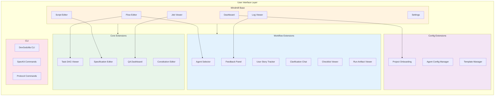

# User Interface Architecture

> Windmill-based frontend with DevGodzilla extensions

---

## Overview

The User Interface layer extends Windmill's existing Svelte frontend with DevGodzilla-specific features, providing a unified experience for spec-driven development, multi-agent execution, and quality assurance.



---

## Windmill Base Integration

### Windmill Architecture

Windmill provides the foundational UI built with:
- **SvelteKit** for the frontend framework
- **TailwindCSS** for styling
- **Svelte 5** with runes for reactivity

### Integration Strategy

DevGodzilla extends Windmill through:

1. **New Routes** - `/devgodzilla/*` routes for DevGodzilla-specific pages
2. **Component Extensions** - Svelte components added to `lib/devgodzilla/`
3. **Store Integration** - DevGodzilla state management via Svelte stores
4. **API Integration** - Calls to DevGodzilla API alongside Windmill API

### Directory Structure

```
windmill/frontend/src/
├── lib/
│   ├── components/              # Windmill components
│   │   ├── flows/
│   │   ├── scripts/
│   │   └── jobs/
│   │
│   └── devgodzilla/             # DevGodzilla extensions
│       ├── components/
│       │   ├── SpecificationEditor.svelte
│       │   ├── ConstitutionEditor.svelte
│       │   ├── AgentSelector.svelte
│       │   ├── TaskDAGViewer.svelte
│       │   ├── QADashboard.svelte
│       │   ├── FeedbackPanel.svelte
│       │   ├── UserStoryTracker.svelte
│       │   ├── ClarificationChat.svelte
│       │   ├── ChecklistViewer.svelte
│       │   ├── RunArtifactViewer.svelte
│       │   ├── ProjectOnboarding.svelte
│       │   ├── AgentConfigManager.svelte
│       │   └── TemplateManager.svelte
│       │
│       ├── stores/
│       │   ├── projects.ts
│       │   ├── protocols.ts
│       │   ├── agents.ts
│       │   └── quality.ts
│       │
│       └── api/
│           └── client.ts
│
├── routes/
│   ├── (root)/                  # Windmill routes
│   │
│   └── devgodzilla/             # DevGodzilla routes
│       ├── +layout.svelte
│       ├── +page.svelte         # Dashboard
│       ├── projects/
│       │   ├── +page.svelte     # Project list
│       │   ├── [id]/
│       │   │   ├── +page.svelte
│       │   │   └── onboarding/
│       │   └── new/
│       ├── protocols/
│       │   ├── +page.svelte
│       │   └── [id]/
│       ├── specifications/
│       ├── quality/
│       ├── agents/
│       └── settings/
│
└── stores/
    └── devgodzilla.ts           # Main state store
```

---

## Core Extensions

### 1. Specification Editor

A rich markdown editor for `.specify/` artifacts.

```svelte
<!-- lib/devgodzilla/components/SpecificationEditor.svelte -->
<script lang="ts">
  import { createEventDispatcher } from 'svelte';
  import { Editor } from '@tiptap/core';
  import StarterKit from '@tiptap/starter-kit';
  import Markdown from '@tiptap/extension-markdown';
  
  export let content: string = '';
  export let filePath: string;
  export let readonly: boolean = false;
  
  const dispatch = createEventDispatcher();
  
  let editor: Editor;
  
  $effect(() => {
    editor = new Editor({
      extensions: [StarterKit, Markdown],
      content,
      editable: !readonly,
      onUpdate: ({ editor }) => {
        dispatch('change', editor.getMarkdown());
      }
    });
    
    return () => editor.destroy();
  });
  
  async function save() {
    const markdown = editor.getMarkdown();
    await fetch(`/api/devgodzilla/files`, {
      method: 'PUT',
      body: JSON.stringify({ path: filePath, content: markdown })
    });
    dispatch('save', markdown);
  }
</script>

<div class="spec-editor">
  <div class="toolbar">
    <span class="file-path">{filePath}</span>
    {#if !readonly}
      <button onclick={save}>Save</button>
    {/if}
  </div>
  
  <div class="editor-container" bind:this={editorElement}></div>
</div>

<style>
  .spec-editor {
    display: flex;
    flex-direction: column;
    height: 100%;
  }
  
  .toolbar {
    display: flex;
    justify-content: space-between;
    padding: 0.5rem;
    border-bottom: 1px solid var(--border-color);
  }
  
  .file-path {
    font-family: monospace;
    color: var(--text-secondary);
  }
</style>
```

### 2. Constitution Editor

Editor for project governance rules with article preview.

```svelte
<!-- lib/devgodzilla/components/ConstitutionEditor.svelte -->
<script lang="ts">
  import { constitutionStore } from '../stores/projects';
  import MarkdownPreview from './MarkdownPreview.svelte';
  
  export let projectId: number;
  
  let constitution = $derived(constitutionStore.get(projectId));
  let editMode = $state(false);
  let content = $state('');
  
  const articles = $derived(parseArticles(constitution?.content || ''));
  
  function parseArticles(content: string) {
    const articleRegex = /^## Article ([IVX]+): (.+)$/gm;
    const articles = [];
    let match;
    
    while ((match = articleRegex.exec(content)) !== null) {
      articles.push({
        number: match[1],
        title: match[2],
        blocking: ['III', 'IV', 'IX'].includes(match[1])
      });
    }
    
    return articles;
  }
  
  async function save() {
    await constitutionStore.update(projectId, content);
    editMode = false;
  }
</script>

<div class="constitution-editor">
  <header>
    <h2>Project Constitution</h2>
    <button onclick={() => editMode = !editMode}>
      {editMode ? 'Preview' : 'Edit'}
    </button>
  </header>
  
  {#if editMode}
    <textarea bind:value={content}></textarea>
  {:else}
    <div class="articles">
      {#each articles as article}
        <div class="article" class:blocking={article.blocking}>
          <span class="number">Article {article.number}</span>
          <span class="title">{article.title}</span>
          {#if article.blocking}
            <span class="badge">Blocking</span>
          {/if}
        </div>
      {/each}
    </div>
    
    <MarkdownPreview content={constitution?.content} />
  {/if}
</div>
```

### 3. Task DAG Viewer

Interactive DAG visualization using D3.js.

```svelte
<!-- lib/devgodzilla/components/TaskDAGViewer.svelte -->
<script lang="ts">
  import * as d3 from 'd3';
  import { onMount } from 'svelte';
  
  export let tasks: Task[];
  export let dag: DAGDefinition;
  export let onTaskClick: (taskId: string) => void = () => {};
  
  let svgElement: SVGElement;
  
  const statusColors = {
    pending: '#6b7280',
    running: '#3b82f6',
    completed: '#22c55e',
    failed: '#ef4444',
    blocked: '#f59e0b'
  };
  
  onMount(() => {
    renderDAG();
  });
  
  function renderDAG() {
    const svg = d3.select(svgElement);
    const width = svgElement.clientWidth;
    const height = svgElement.clientHeight;
    
    // Create hierarchical layout
    const hierarchy = d3.stratify()
      .id(d => d.id)
      .parentId(d => dag.edges.find(e => e[1] === d.id)?.[0])
      (tasks);
    
    const treeLayout = d3.tree()
      .size([width - 100, height - 100]);
    
    const root = treeLayout(hierarchy);
    
    // Draw edges
    svg.selectAll('.edge')
      .data(root.links())
      .join('path')
      .attr('class', 'edge')
      .attr('d', d3.linkVertical()
        .x(d => d.x + 50)
        .y(d => d.y + 50))
      .attr('fill', 'none')
      .attr('stroke', '#9ca3af')
      .attr('stroke-width', 2);
    
    // Draw nodes
    const nodes = svg.selectAll('.node')
      .data(root.descendants())
      .join('g')
      .attr('class', 'node')
      .attr('transform', d => `translate(${d.x + 50}, ${d.y + 50})`)
      .on('click', (event, d) => onTaskClick(d.data.id));
    
    nodes.append('rect')
      .attr('width', 120)
      .attr('height', 40)
      .attr('x', -60)
      .attr('y', -20)
      .attr('rx', 8)
      .attr('fill', d => statusColors[d.data.status]);
    
    nodes.append('text')
      .attr('text-anchor', 'middle')
      .attr('dy', '0.35em')
      .attr('fill', 'white')
      .text(d => d.data.id);
  }
</script>

<div class="dag-viewer">
  <svg bind:this={svgElement}></svg>
  
  <div class="legend">
    {#each Object.entries(statusColors) as [status, color]}
      <div class="legend-item">
        <span class="dot" style="background: {color}"></span>
        {status}
      </div>
    {/each}
  </div>
</div>

<style>
  .dag-viewer {
    width: 100%;
    height: 100%;
    position: relative;
  }
  
  svg {
    width: 100%;
    height: calc(100% - 40px);
  }
  
  .legend {
    display: flex;
    gap: 1rem;
    padding: 0.5rem;
  }
  
  .dot {
    width: 12px;
    height: 12px;
    border-radius: 50%;
    display: inline-block;
    margin-right: 4px;
  }
</style>
```

### 4. QA Dashboard

Overview of quality gates and findings.

```svelte
<!-- lib/devgodzilla/components/QADashboard.svelte -->
<script lang="ts">
  import { qualityStore } from '../stores/quality';
  
  export let protocolRunId: number;
  
  let qaResults = $derived(qualityStore.getForProtocol(protocolRunId));
  
  const gateIcons = {
    passed: '✅',
    warning: '⚠️',
    failed: '❌',
    skipped: '⏭️'
  };
</script>

<div class="qa-dashboard">
  <header>
    <h2>Quality Assurance</h2>
    <div class="score">
      Score: {(qaResults?.score ?? 0) * 100}%
    </div>
  </header>
  
  <section class="gates">
    <h3>Constitutional Gates</h3>
    {#each qaResults?.gateResults ?? [] as gate}
      <div class="gate" class:failed={gate.status === 'failed'}>
        <span class="icon">{gateIcons[gate.status]}</span>
        <span class="article">Article {gate.article}</span>
        <span class="name">{gate.name}</span>
        
        {#if gate.findings.length > 0}
          <div class="findings">
            {#each gate.findings as finding}
              <div class="finding {finding.severity}">
                <code>{finding.code}</code>
                {finding.message}
              </div>
            {/each}
          </div>
        {/if}
      </div>
    {/each}
  </section>
  
  <section class="checklist">
    <h3>Checklist</h3>
    <div class="progress">
      {qaResults?.checklistResult?.passed ?? 0} / 
      {qaResults?.checklistResult?.total ?? 0}
    </div>
    
    {#each qaResults?.checklistResult?.items ?? [] as item}
      <div class="checklist-item" class:passed={item.passed}>
        <input type="checkbox" checked={item.passed} disabled />
        <span>{item.description}</span>
        {#if item.required}
          <span class="badge">Required</span>
        {/if}
      </div>
    {/each}
  </section>
</div>
```

---

## Workflow Extensions

### 5. Agent Selector

Per-step agent assignment UI.

```svelte
<!-- lib/devgodzilla/components/AgentSelector.svelte -->
<script lang="ts">
  import { agentStore } from '../stores/agents';
  
  export let stepId: string;
  export let currentAgent: string | null = null;
  export let onChange: (agentId: string) => void;
  
  let agents = $derived(agentStore.available);
  let selectedAgent = $state(currentAgent);
  
  function selectAgent(agentId: string) {
    selectedAgent = agentId;
    onChange(agentId);
  }
</script>

<div class="agent-selector">
  <label>Agent for {stepId}</label>
  
  <div class="agents-grid">
    {#each agents as agent}
      <button
        class="agent-card"
        class:selected={selectedAgent === agent.id}
        class:unavailable={agent.status !== 'available'}
        onclick={() => selectAgent(agent.id)}
        disabled={agent.status !== 'available'}
      >
        <div class="agent-name">{agent.name}</div>
        <div class="agent-kind">{agent.kind}</div>
        <div class="agent-status">
          {#if agent.status === 'available'}
            🟢 Available
          {:else}
            🔴 Unavailable
          {/if}
        </div>
      </button>
    {/each}
  </div>
</div>

<style>
  .agents-grid {
    display: grid;
    grid-template-columns: repeat(auto-fill, minmax(150px, 1fr));
    gap: 0.5rem;
  }
  
  .agent-card {
    padding: 0.75rem;
    border: 2px solid var(--border-color);
    border-radius: 8px;
    text-align: left;
    cursor: pointer;
    transition: border-color 0.2s;
  }
  
  .agent-card.selected {
    border-color: var(--primary-color);
    background: var(--primary-bg);
  }
  
  .agent-card.unavailable {
    opacity: 0.5;
    cursor: not-allowed;
  }
</style>
```

### 6. Feedback Panel

Shows feedback loop status and actions.

```svelte
<!-- lib/devgodzilla/components/FeedbackPanel.svelte -->
<script lang="ts">
  import { feedbackStore } from '../stores/protocols';
  
  export let protocolRunId: number;
  
  let feedbackEvents = $derived(feedbackStore.getForProtocol(protocolRunId));
  
  async function handleClarification(clarificationId: number, answer: any) {
    await feedbackStore.answerClarification(clarificationId, answer);
  }
</script>

<div class="feedback-panel">
  <h3>Feedback Loop</h3>
  
  {#if feedbackEvents.length === 0}
    <div class="empty">No feedback events</div>
  {:else}
    {#each feedbackEvents as event}
      <div class="feedback-event {event.action_taken}">
        <div class="header">
          <span class="action">{event.action_taken}</span>
          <span class="time">{formatTime(event.created_at)}</span>
        </div>
        
        {#if event.clarification}
          <div class="clarification">
            <div class="question">{event.clarification.question}</div>
            
            {#if event.clarification.status === 'open'}
              <div class="options">
                {#each event.clarification.options ?? [] as option}
                  <button 
                    onclick={() => handleClarification(event.clarification.id, option)}
                  >
                    {option}
                  </button>
                {/each}
              </div>
            {:else}
              <div class="answer">
                Answer: {JSON.stringify(event.clarification.answer)}
              </div>
            {/if}
          </div>
        {/if}
      </div>
    {/each}
  {/if}
</div>
```

### 7. User Story Tracker

Tracks progress through user story phases.

```svelte
<!-- lib/devgodzilla/components/UserStoryTracker.svelte -->
<script lang="ts">
  export let protocol: ProtocolRun;
  export let tasks: Task[];
  
  const phases = $derived(groupTasksByPhase(tasks));
  
  function groupTasksByPhase(tasks: Task[]) {
    const groups: Record<string, Phase> = {};
    
    for (const task of tasks) {
      const story = task.story || 'Setup';
      if (!groups[story]) {
        groups[story] = {
          name: story,
          tasks: [],
          completed: 0,
          total: 0,
          mvp: story === 'US1'
        };
      }
      groups[story].tasks.push(task);
      groups[story].total++;
      if (task.status === 'completed') {
        groups[story].completed++;
      }
    }
    
    return Object.values(groups);
  }
</script>

<div class="user-story-tracker">
  <h3>User Stories Progress</h3>
  
  {#each phases as phase}
    <div class="phase" class:mvp={phase.mvp}>
      <div class="phase-header">
        <span class="name">{phase.name}</span>
        {#if phase.mvp}
          <span class="badge mvp">MVP</span>
        {/if}
        <span class="progress">
          {phase.completed}/{phase.total}
        </span>
      </div>
      
      <div class="progress-bar">
        <div 
          class="fill" 
          style="width: {(phase.completed / phase.total) * 100}%"
        ></div>
      </div>
      
      <div class="tasks">
        {#each phase.tasks as task}
          <div class="task {task.status}">
            <span class="id">{task.id}</span>
            <span class="desc">{task.description}</span>
          </div>
        {/each}
      </div>
    </div>
  {/each}
</div>
```

---

## Config Extensions

### 8. Project Onboarding

Wizard for new project setup.

```svelte
<!-- lib/devgodzilla/components/ProjectOnboarding.svelte -->
<script lang="ts">
  import { projectsStore } from '../stores/projects';
  import { goto } from '$app/navigation';
  
  let step = $state(1);
  let projectData = $state({
    name: '',
    gitUrl: '',
    baseBranch: 'main',
    classification: 'default'
  });
  
  const classifications = [
    { key: 'default', name: 'Default', description: 'Standard settings' },
    { key: 'startup-fast', name: 'Startup Fast', description: 'Speed over formality' },
    { key: 'team-standard', name: 'Team Standard', description: 'Balanced approach' },
    { key: 'enterprise-compliance', name: 'Enterprise', description: 'Maximum compliance' }
  ];
  
  async function createProject() {
    const project = await projectsStore.create(projectData);
    goto(`/devgodzilla/projects/${project.id}`);
  }
</script>

<div class="onboarding-wizard">
  <div class="steps-indicator">
    {#each [1, 2, 3] as s}
      <div class="step-dot" class:active={step >= s}></div>
    {/each}
  </div>
  
  {#if step === 1}
    <div class="step">
      <h2>Repository</h2>
      <label>
        Project Name
        <input bind:value={projectData.name} placeholder="my-project" />
      </label>
      <label>
        Git URL
        <input bind:value={projectData.gitUrl} placeholder="https://github.com/..." />
      </label>
      <label>
        Base Branch
        <input bind:value={projectData.baseBranch} placeholder="main" />
      </label>
      <button onclick={() => step = 2}>Next</button>
    </div>
    
  {:else if step === 2}
    <div class="step">
      <h2>Project Classification</h2>
      <p>Choose a classification to set initial policies:</p>
      
      <div class="classification-grid">
        {#each classifications as c}
          <button 
            class="classification-card"
            class:selected={projectData.classification === c.key}
            onclick={() => projectData.classification = c.key}
          >
            <div class="name">{c.name}</div>
            <div class="desc">{c.description}</div>
          </button>
        {/each}
      </div>
      
      <div class="actions">
        <button onclick={() => step = 1}>Back</button>
        <button onclick={() => step = 3}>Next</button>
      </div>
    </div>
    
  {:else if step === 3}
    <div class="step">
      <h2>Review</h2>
      <dl>
        <dt>Name</dt><dd>{projectData.name}</dd>
        <dt>Git URL</dt><dd>{projectData.gitUrl}</dd>
        <dt>Branch</dt><dd>{projectData.baseBranch}</dd>
        <dt>Classification</dt><dd>{projectData.classification}</dd>
      </dl>
      
      <div class="actions">
        <button onclick={() => step = 2}>Back</button>
        <button class="primary" onclick={createProject}>Create Project</button>
      </div>
    </div>
  {/if}
</div>
```

### 9. Agent Config Manager

Configure agent settings.

```svelte
<!-- lib/devgodzilla/components/AgentConfigManager.svelte -->
<script lang="ts">
  import { agentStore } from '../stores/agents';
  
  let agents = $derived(agentStore.all);
  let selectedAgent = $state<string | null>(null);
  let config = $state<AgentConfig | null>(null);
  
  async function loadConfig(agentId: string) {
    selectedAgent = agentId;
    config = await agentStore.getConfig(agentId);
  }
  
  async function saveConfig() {
    if (selectedAgent && config) {
      await agentStore.updateConfig(selectedAgent, config);
    }
  }
</script>

<div class="agent-config-manager">
  <aside class="agent-list">
    {#each agents as agent}
      <button
        class:selected={selectedAgent === agent.id}
        onclick={() => loadConfig(agent.id)}
      >
        <span class="name">{agent.name}</span>
        <span class="status {agent.status}"></span>
      </button>
    {/each}
  </aside>
  
  <main class="config-editor">
    {#if config}
      <h2>{agents.find(a => a.id === selectedAgent)?.name}</h2>
      
      <label>
        Default Model
        <input bind:value={config.default_model} />
      </label>
      
      <label>
        Timeout (seconds)
        <input type="number" bind:value={config.timeout_seconds} />
      </label>
      
      <label>
        Max Retries
        <input type="number" bind:value={config.max_retries} />
      </label>
      
      <label>
        Sandbox Mode
        <select bind:value={config.sandbox}>
          <option value="workspace-read">Read Only</option>
          <option value="workspace-write">Read/Write</option>
          <option value="full-access">Full Access</option>
        </select>
      </label>
      
      <button onclick={saveConfig}>Save Configuration</button>
    {:else}
      <div class="placeholder">
        Select an agent to configure
      </div>
    {/if}
  </main>
</div>
```

---

## CLI Interface

### CLI Commands

```bash
# Project management
devgodzilla project create --name my-app --git-url https://github.com/...
devgodzilla project list
devgodzilla project show <id>

# SpecKit workflow  
devgodzilla speckit init                    # Initialize .specify/
devgodzilla speckit specify "Add auth"      # Generate spec
devgodzilla speckit plan                    # Generate plan
devgodzilla speckit tasks                   # Generate tasks

# Protocol execution
devgodzilla protocol create <project-id> --tasks-path specs/.../tasks.md
devgodzilla protocol start <protocol-id>
devgodzilla protocol status <protocol-id>
devgodzilla protocol watch <protocol-id>    # Stream logs
devgodzilla protocol pause <protocol-id>
devgodzilla protocol resume <protocol-id>

# Step management
devgodzilla step list <protocol-id>
devgodzilla step run <step-id>
devgodzilla step assign <step-id> --agent claude-code
devgodzilla step qa <step-id>

# Agent management
devgodzilla agent list
devgodzilla agent check                     # Health check all agents
devgodzilla agent config <agent-id>

# Quality
devgodzilla qa status <protocol-id>
devgodzilla qa report <step-id>
```

### CLI Implementation

```python
# devgodzilla/cli/main.py

import click
from rich.console import Console
from rich.table import Table

console = Console()

@click.group()
def cli():
    """DevGodzilla - AI-Driven Development Platform"""
    pass

@cli.group()
def project():
    """Project management commands."""
    pass

@project.command("create")
@click.option("--name", required=True)
@click.option("--git-url", required=True)
@click.option("--base-branch", default="main")
def project_create(name: str, git_url: str, base_branch: str):
    """Create a new project."""
    from devgodzilla.api.client import DevGodzillaClient
    
    client = DevGodzillaClient()
    project = client.projects.create(
        name=name,
        git_url=git_url,
        base_branch=base_branch
    )
    
    console.print(f"[green]Project created: {project.id}[/green]")

@cli.group()
def speckit():
    """SpecKit specification commands."""
    pass

@speckit.command("specify")
@click.argument("description")
@click.option("--branch", default=None)
def speckit_specify(description: str, branch: str):
    """Generate feature specification."""
    from devgodzilla.services import PlanningService
    
    service = PlanningService()
    spec = service.generate_spec(
        description=description,
        branch_name=branch or f"feature/{description.lower().replace(' ', '-')[:30]}"
    )
    
    console.print(f"[green]Specification created: {spec.spec_path}[/green]")

@cli.group()
def protocol():
    """Protocol execution commands."""
    pass

@protocol.command("watch")
@click.argument("protocol_id", type=int)
def protocol_watch(protocol_id: int):
    """Stream protocol execution logs."""
    from devgodzilla.api.client import DevGodzillaClient
    
    client = DevGodzillaClient()
    
    with console.status("Watching protocol..."):
        for event in client.protocols.stream_events(protocol_id):
            if event.event_type.startswith("step."):
                console.print(f"[blue]{event.event_type}[/blue]: {event.message}")
            elif event.event_type.startswith("qa."):
                console.print(f"[yellow]{event.event_type}[/yellow]: {event.message}")
            elif event.event_type == "protocol.completed":
                console.print(f"[green]Protocol completed![/green]")
                break
            elif event.event_type == "protocol.failed":
                console.print(f"[red]Protocol failed: {event.message}[/red]")
                break

if __name__ == "__main__":
    cli()
```

---

## State Management

### Svelte Stores

```typescript
// lib/devgodzilla/stores/protocols.ts

import { writable, derived } from 'svelte/store';
import { api } from '../api/client';

interface ProtocolState {
  protocols: Map<number, ProtocolRun>;
  loading: boolean;
  error: string | null;
}

function createProtocolStore() {
  const { subscribe, set, update } = writable<ProtocolState>({
    protocols: new Map(),
    loading: false,
    error: null
  });
  
  return {
    subscribe,
    
    async load(projectId: number) {
      update(s => ({ ...s, loading: true }));
      
      try {
        const protocols = await api.get(`/projects/${projectId}/protocols`);
        update(s => ({
          ...s,
          protocols: new Map(protocols.map(p => [p.id, p])),
          loading: false
        }));
      } catch (error) {
        update(s => ({ ...s, error: error.message, loading: false }));
      }
    },
    
    async start(protocolId: number) {
      const result = await api.post(`/protocols/${protocolId}/actions/start`);
      update(s => {
        const protocol = s.protocols.get(protocolId);
        if (protocol) {
          s.protocols.set(protocolId, { ...protocol, status: 'planning' });
        }
        return s;
      });
      return result;
    },
    
    get(id: number) {
      let protocol: ProtocolRun | undefined;
      subscribe(s => protocol = s.protocols.get(id))();
      return protocol;
    }
  };
}

export const protocolStore = createProtocolStore();
```

---

## Configuration

```yaml
# config/ui.yaml
ui:
  windmill:
    base_url: "http://localhost:3000"
    
  devgodzilla:
    routes_prefix: "/devgodzilla"
    api_base_url: "http://localhost:8011"
    
  features:
    specification_editor: true
    constitution_editor: true
    dag_viewer: true
    qa_dashboard: true
    agent_selector: true
    feedback_panel: true
    user_story_tracker: true
    clarification_chat: true
    
  theme:
    primary_color: "#3b82f6"
    dark_mode: true
```

---

## Summary

The User Interface layer provides:

1. **Windmill base** leveraging existing Svelte frontend
2. **13 DevGodzilla extensions** for spec-driven development
3. **Interactive DAG visualization** for task dependencies
4. **Real-time QA dashboard** with constitutional gates
5. **CLI interface** for terminal-based workflows

All components integrate with the DevGodzilla API and share state via Svelte stores.
