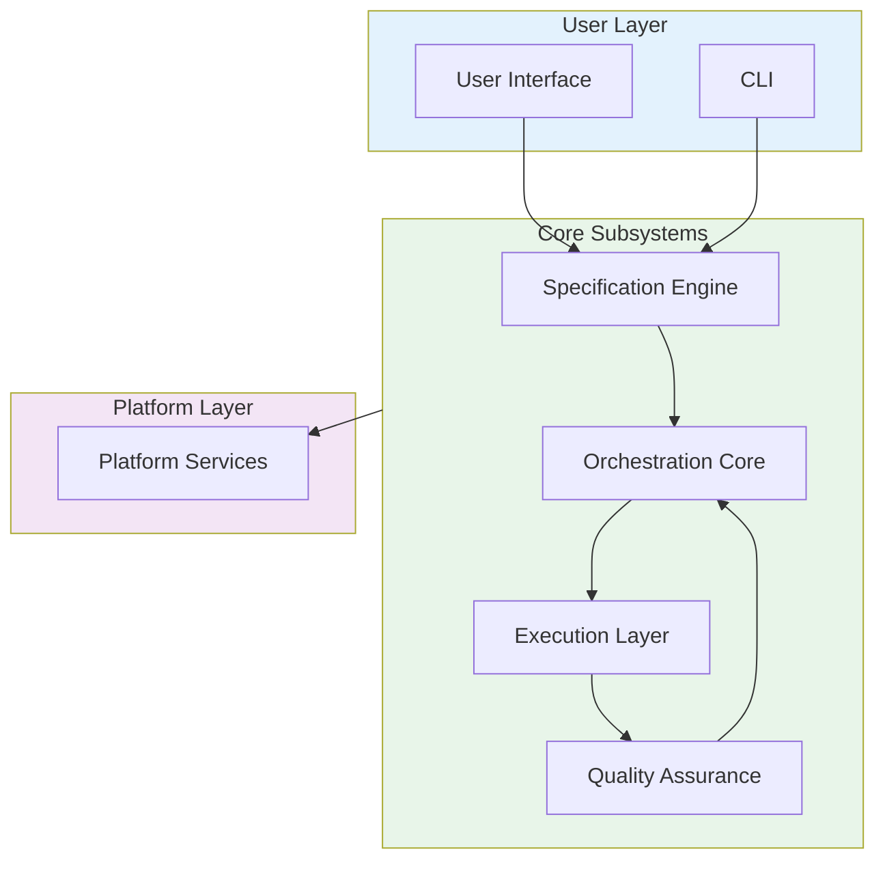
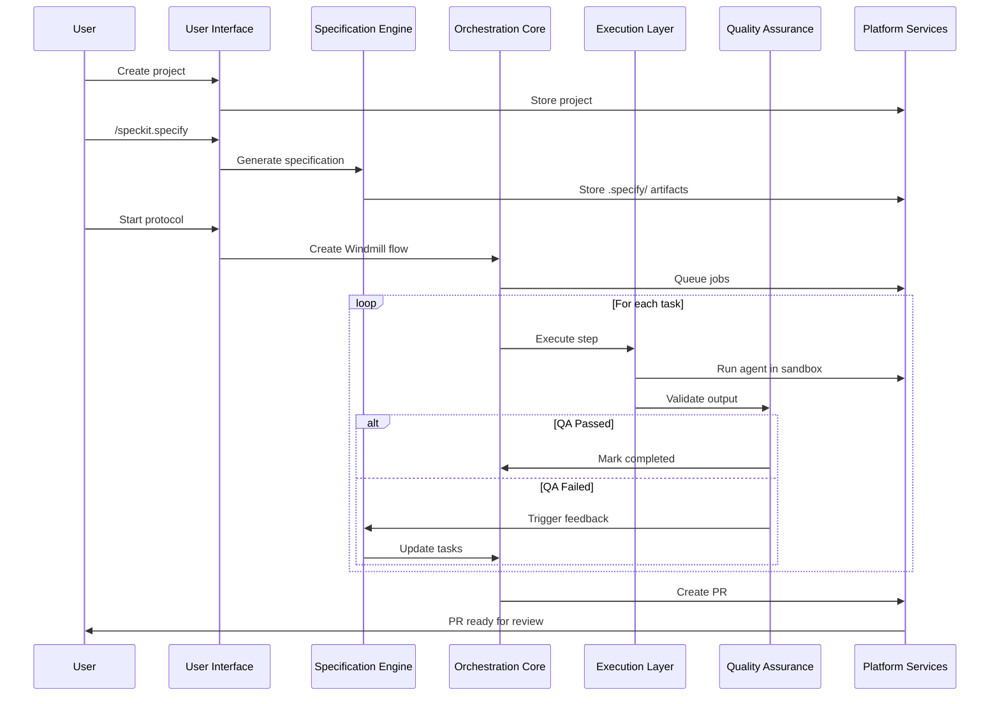

# DevGodzilla Subsystem Architecture Index

> Detailed architecture documentation for each DevGodzilla subsystem

---

## Overview

DevGodzilla is composed of 6 core subsystems that work together to provide AI-driven software development:



---

## Subsystem Documentation

| # | Subsystem | Description | Size |
|---|-----------|-------------|------|
| 1 | [Specification Engine](./01-SPECIFICATION-ENGINE.md) | SpecKit integration for spec-driven development | ~12KB |
| 2 | [Orchestration Core](./02-ORCHESTRATION-CORE.md) | Windmill-based workflow engine and DAG execution | ~18KB |
| 3 | [Execution Layer](./03-EXECUTION-LAYER.md) | Multi-agent execution with 18+ AI coding agents | ~23KB |
| 4 | [Quality Assurance](./04-QUALITY-ASSURANCE.md) | Constitutional QA gates and feedback loops | ~23KB |
| 5 | [Platform Services](./05-PLATFORM-SERVICES.md) | Database, Git, CI/CD, events, observability | ~24KB |
| 6 | [User Interface](./06-USER-INTERFACE.md) | Windmill Svelte extensions and CLI | ~29KB |

---

## Quick Reference

### Subsystem Responsibilities

| Subsystem | Primary Responsibility | Key Components |
|-----------|----------------------|----------------|
| **Specification Engine** | Transform requirements → specs → tasks | `SpecifyEngine`, `PlanGenerator`, `TaskBreakdown` |
| **Orchestration Core** | Execute task DAGs with Windmill | `DAGBuilder`, `JobScheduler`, `StateManager` |
| **Execution Layer** | Run AI agents for code generation | `AgentRegistry`, `CLIAdapter`, `SandboxManager` |
| **Quality Assurance** | Validate output against constitution | `ConstitutionalGates`, `ChecklistValidator`, `FeedbackRouter` |
| **Platform Services** | Infrastructure and integrations | `Database`, `GitService`, `EventBus`, `Metrics` |
| **User Interface** | User interaction via web and CLI | 13 Svelte extensions, Click CLI |

### Data Flow



---

## Cross-Cutting Concerns

### Configuration

Each subsystem has its own configuration section in `config/`:

```yaml
# config/devgodzilla.yaml
speckit:
  templates_dir: ".specify/templates"
  # See 01-SPECIFICATION-ENGINE.md

orchestration:
  windmill_url: "http://localhost:8000"
  # See 02-ORCHESTRATION-CORE.md

execution:
  default_agent: codex
  # See 03-EXECUTION-LAYER.md

quality:
  blocking_articles: [III, IV, IX]
  # See 04-QUALITY-ASSURANCE.md

platform:
  database_url: "${DATABASE_URL}"
  # See 05-PLATFORM-SERVICES.md

ui:
  routes_prefix: "/devgodzilla"
  # See 06-USER-INTERFACE.md
```

### Error Handling

All subsystems use a common error hierarchy:

```python
class DevGodzillaError(Exception):
    """Base exception for all DevGodzilla errors."""
    pass

class SpecificationError(DevGodzillaError):
    """Error during specification generation."""
    action: Literal["clarify", "re_plan", "re_specify"]

class OrchestrationError(DevGodzillaError):
    """Error during workflow orchestration."""
    pass

class ExecutionError(DevGodzillaError):
    """Error during agent execution."""
    pass

class QualityError(DevGodzillaError):
    """Error during quality assurance."""
    pass
```

### Observability

All subsystems export metrics to Prometheus:

| Prefix | Subsystem |
|--------|-----------|
| `devgodzilla_spec_*` | Specification Engine |
| `devgodzilla_orch_*` | Orchestration Core |
| `devgodzilla_exec_*` | Execution Layer |
| `devgodzilla_qa_*` | Quality Assurance |
| `devgodzilla_*` | Platform Services |

---

## Related Documentation

- [Main Architecture](../ARCHITECTURE.md) - High-level system design
- [API Architecture](../API-ARCHITECTURE.md) - REST API specification
- [API Reference](../../api-reference.md) - Detailed endpoint documentation

---

## Version History

| Version | Date | Changes |
|---------|------|---------|
| 1.0.0 | 2024-12-15 | Initial subsystem documentation |
