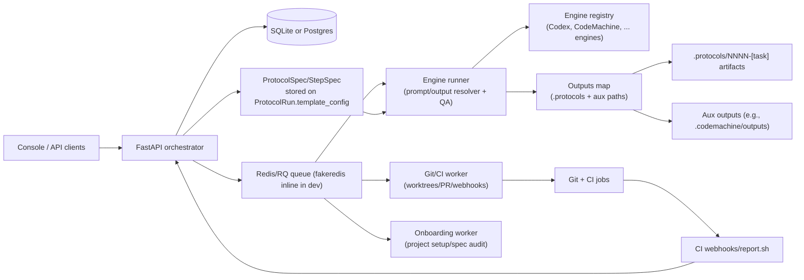
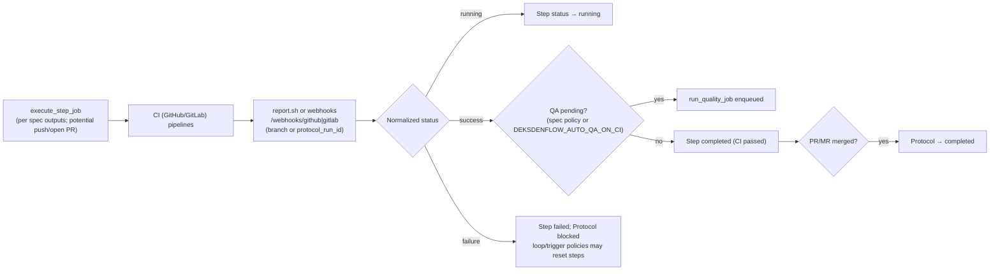

# Architecture and Workflow Overview

This repository is a starter kit for DeksdenFlow_Ilyas_Edition_1.0: a protocol-driven way to ship work in parallel streams. The codebase is mostly orchestration around the Codex CLI, Git worktrees, and shared CI stubs for GitHub and GitLab.

For deeper design and delivery detail, see:
- `docs/solution-design.md` — current-state review and target orchestrator architecture.
- `docs/implementation-plan.md` — phased plan from refactors to console/CI integration.
- `Makefile` — convenience targets: `orchestrator-setup` (venv + deps + migrations) using Alembic and the Postgres/SQLite adapters.

## Repository layout (current state)
- `README.md`: quickstart and high-level Mermaid diagrams.
- `docs/`: deep dive on DeksdenFlow (`deksdenflow.md`), CI notes (`ci.md`), TerraformManager demo workflow plan, and this architecture doc.
- `prompts/`: operational prompt library (new/resume/review protocols, project/init/bootstrap, CI discovery, QA, Java testing).
- `scripts/`: orchestration utilities (protocol pipeline, project setup, CI discovery, QA orchestrator, dataset report generator) plus `scripts/ci/*` stubs.
- `.github/workflows/ci.yml` and `.gitlab-ci.yml`: dual CI entrypoints that call the same `scripts/ci/*.sh` hooks.
- `schemas/`: JSON schema for planning agent output.
- `tests/`: harnesses covering orchestration code paths; optional Codex integration test gated by `RUN_REAL_CODEX`.
- `deksdenflow/`: reusable library for protocol pipeline, QA, project setup, and the new orchestrator (API + storage + domain).

## Control plane (orchestrator)
- FastAPI API (`deksdenflow/api/app.py`) with bearer/project-token auth, queue stats, metrics, events feed, and webhook listeners.
- Storage via SQLite (default) or Postgres (`DEKSDENFLOW_DB_URL`), initialized with Alembic migrations.
- Redis/RQ queue (`deksdenflow/jobs.py`, `worker_runtime.py`) with fakeredis support for local dev; workers process planning/execution/QA/PR jobs.
- ProtocolSpec/StepSpec lives on `ProtocolRun.template_config` and drives step creation, engine selection, prompt/output resolution, and QA policy via a shared resolver + engine registry.
- Thin web console (`/console`) backed by the API for projects, protocol runs, steps, recent events, and queue visibility.



## Orchestrator pipelines (detailed)

### Protocol lifecycle (jobs, policies, QA)

```mermaid
flowchart TD
  A[/POST /projects/] --> B["project_setup_job\nensure starter assets"]
  A --> C["optional codemachine_import_job\npersist ProtocolSpec + steps"]
  B --> D[/POST /projects/{id}/protocols + start/]
  D --> E["plan_protocol_job\nemit ProtocolSpec\nsync StepRuns from spec"]
  E --> F{"Step pending/blocked?"}
  F -->|run| G[/steps/{id}/actions/run → execute_step_job/]
  G --> H["Resolve prompt + outputs via spec\nengine registry dispatch"]
  H --> I{"QA policy (spec)"}
  I -->|full/light| J["run_quality_job\nQA prompt → verdict"]
  I -->|skip| K["Step marked per policy\n(needs_qa or completed)"]
  J --> L{"QA verdict"}
  L -->|PASS| M["Step completed\ntrigger policies may enqueue other steps"]
  L -->|FAIL| N{"Loop policy?"}
  N -->|apply| F
  N -->|none| O["Protocol blocked; retry_latest/run_next_step"]
  K --> F
```

### CI feedback and completion



## Runtime configuration (env vars)
- `DEKSDENFLOW_DB_URL` / `DEKSDENFLOW_DB_PATH` — Postgres URL or SQLite path (SQLite default).
- `DEKSDENFLOW_REDIS_URL` — required Redis/RQ URL; use `fakeredis://` for local inline dev.
- `DEKSDENFLOW_API_TOKEN` / `DEKSDENFLOW_WEBHOOK_TOKEN` — bearer auth + webhook HMAC/token validation.
- `DEKSDENFLOW_AUTO_QA_AFTER_EXEC` / `DEKSDENFLOW_AUTO_QA_ON_CI` — enqueue QA after exec or on CI success.
- `DEKSDENFLOW_MAX_TOKENS_PER_STEP` / `DEKSDENFLOW_MAX_TOKENS_PER_PROTOCOL` + `DEKSDENFLOW_TOKEN_BUDGET_MODE=strict|warn|off` — guardrails for Codex calls.
- Logging: `DEKSDENFLOW_LOG_JSON=true` for structured logs; `DEKSDENFLOW_LOG_LEVEL=info|debug`.
- Models: project `default_models` override per phase; fallbacks in `deksdenflow.config`.

## Job types and workers
- `project_setup_job` — ensure starter assets exist; emits setup events (no git mutation).
- `plan_protocol_job` — create worktree, run planning + step decomposition via Codex, emit `ProtocolSpec`/`StepSpec`, write `.protocols/`, and sync StepRuns from the spec.
- `execute_step_job` — resolve prompt and outputs from the StepSpec, dispatch via the engine registry (Codex/CodeMachine today), write outputs map, and mark status according to spec QA policy.
- `run_quality_job` — use StepSpec QA config (engine/model/prompt/policy) to build QA, then mark completed/failed/blocked or loop per policy.
- `open_pr_job` — push branch and open PR/MR via `gh`/`glab` if available.
- `codemachine_import_job` — parse `.codemachine` config, emit `ProtocolSpec`/`StepSpec` (engines, QA, policies), persist template, and create steps from the spec.
- Workers: RQ workers (`scripts/rq_worker.py`) for Redis; API auto-starts a background RQ worker thread when `fakeredis://` is used.

## Data model (core fields)
- Project: `id`, `name`, `git_url`, `base_branch`, `ci_provider`, `default_models`, `secrets` (optional `api_token`).
- ProtocolRun: `id`, `project_id`, `protocol_name`, `status`, `base_branch`, `worktree_path`, `protocol_root`, `description`, `template_config`/`template_source`, timestamps.
- StepRun: `id`, `protocol_run_id`, `step_index`, `step_name`, `step_type`, `status`, `retries`, `model`, `engine_id`, `policy`, `runtime_state`, `summary`.
- Event: `id`, `protocol_run_id`, `step_run_id`, `event_type`, `message`, `metadata`, `created_at` (+ joined protocol/project names in list views).

## Failure, retries, and policies
- RQ retries: default `max_attempts=3` with exponential backoff (capped 60s) for enqueued jobs.
- State guards: API uses optimistic checks; conflicting status transitions return 409.
- Loop policies (from StepSpec; often from CodeMachine modules): can reset steps to `pending` and increment `loop_counts` in `runtime_state`; bounded by `max_iterations` and skip lists.
- Trigger policies: can re-queue/inline other steps; inline depth capped (`MAX_INLINE_TRIGGER_DEPTH`) to avoid recursion.
- CI failures: webhook/report.sh set step to `failed` and protocol to `blocked`; manual retry resumes.
- Codex/Repo unavailable: workers stub execution/QA, set `needs_qa` or `completed` with events and avoid crashing pipelines.

## Git, CI, and webhooks
- Worktrees: created under `../worktrees/<protocol_name>` from `origin/<base_branch>`; branch name matches protocol.
- Push/PR: best-effort push + `gh`/`glab` draft creation after planning/exec and in `open_pr_job`.
- CI flows: `.github/workflows/ci.yml` and `.gitlab-ci.yml` call `scripts/ci/*.sh` hooks; failures are mirrored via webhooks or `scripts/ci/report.sh`.
- Webhook mapping: branch name (or explicit `protocol_run_id` param) maps CI events to runs; success can auto-enqueue QA, merge events complete the protocol.

## Deployment modes
- Local dev: `make orchestrator-setup && DEKSDENFLOW_REDIS_URL=fakeredis:// .venv/bin/python scripts/api_server.py`; background worker thread handles jobs inline.
- Docker Compose: `docker-compose up --build` for API + worker + Redis + Postgres; use `scripts/rq_worker.py` for dedicated workers.
- Production: prefer external Redis + Postgres; run API separately from RQ workers; lock down `DEKSDENFLOW_API_TOKEN`/`DEKSDENFLOW_WEBHOOK_TOKEN`.

## Security and tenancy
- Auth: bearer token on all non-health endpoints; optional per-project token via `X-Project-Token`.
- Webhooks: HMAC (`X-Hub-Signature-256` or `X-Gitlab-Signature-256`) or shared token (`X-Gitlab-Token`/`X-Deksdenflow-Webhook-Token`) when configured.
- Secrets: stored in `projects.secrets` (JSON) for project-level API token; avoid storing CI/git tokens in DB when possible.

## Observability
- Metrics: `/metrics` exposes Prometheus counters/histograms for requests, jobs, tokens, webhooks.
- Logging: structured logs via `deksdenflow.logging` with request/job/project/protocol/step IDs; JSON toggle via env. API runs uvicorn with `log_config=None` so the central formatter/filter stays active; workers/QA/CI helpers pass job IDs through.
- Events: persisted timeline per protocol/step; surfaced in console and `/events` API.

## Core building blocks
- **Protocol assets and schema**  
  - Protocols live under `.protocols/NNNN-[task]/` inside each worktree; numbered via `next_protocol_number()` scanning existing `.protocols/` and `../worktrees/`.  
  - `schemas/protocol-planning.schema.json` enforces the planning agent’s JSON (plan/context/log + step files).  
  - `schemas/protocol-spec.schema.json` + `deksdenflow/spec.py` define/validate the unified ProtocolSpec/StepSpec stored on runs; spec audit/backfill is available via `spec_worker`.
- **Protocol pipeline (`scripts/protocol_pipeline.py`)**  
  - Interactive CLI that: detects repo root, prompts for base branch/short name/description; creates a Git worktree/branch `NNNN-[task]` from `origin/<base>`; and builds protocol artifacts.  
  - Uses Codex CLI twice: (1) planning (`run_codex_exec` with `planning_prompt`, validated against the JSON schema) to produce `plan.md`, `context.md`, `log.md`, `00-setup.md`, and step files; (2) step decomposition (`decompose_step_prompt`) for each non-setup step.  
  - Optional flags: `--pr-platform github|gitlab` to auto-commit/push and open Draft PR/MR (requires `gh`/`glab`); `--run-step` to auto-execute a step via Codex using `execute_step_prompt`.  
  - Model defaults come from env (`PROTOCOL_PLANNING_MODEL`, `PROTOCOL_DECOMPOSE_MODEL`, `PROTOCOL_EXEC_MODEL`) with fallbacks (`gpt-5.1-high`, etc.). Temporary artifacts live in `.protocols/<name>/.tmp/`.
- **QA orchestrator (`scripts/quality_orchestrator.py`)**  
  - Builds a QA prompt from `plan.md`, `context.md`, `log.md`, the current step file, git status, and last commit, then calls Codex with `prompts/quality-validator.prompt.md`.  
  - Writes `quality-report.md`; exits non-zero on Codex failure or `VERDICT: FAIL` to gate CI/pipelines.
- **Project setup (`scripts/project_setup.py`)**  
  - Ensures a repo exists (optionally `git init -b <base>`), warns if `origin` or base branch is missing, and materializes starter assets from `BASE_FILES`. Copies from this starter repo when available; otherwise writes placeholders.  
  - Marks CI scripts executable and can optionally run Codex discovery via `--run-discovery`/`PROTOCOL_DISCOVERY_MODEL`.
- **Codex CI bootstrap (`scripts/codex_ci_bootstrap.py`)**  
  - Thin wrapper around Codex CLI using `prompts/repo-discovery.prompt.md` to auto-fill `scripts/ci/*` for the detected stack (default model `gpt-5.1-codex-max`).
- **CI surfaces**  
  - GitHub Actions job `checks` and GitLab stages `bootstrap → lint → typecheck → test → build` each call the matching `scripts/ci/*.sh` if executable; otherwise emit “skip” messages. The scripts are placeholders today and must be filled per stack.
- **Prompts library**  
  - `protocol-new` defines the contract for opening a protocol (worktree creation, planning, first commit/PR, step structure, commit messaging).  
  - `protocol-resume` and `protocol-review-merge*` handle continuation and QA/merge flows with context reconciliation.  
  - `project-init` guides scaffolding a repo; `protocol-pipeline` guides running `protocol_pipeline.py`; `java-testing` and `quality-validator` provide specialized guidance.
- **CodeMachine import/runtime**  
  - `.codemachine` workspaces are parsed via `deksdenflow.codemachine.load_codemachine_config`, normalizing main/sub agents, module policies, placeholders, and templates into a `ProtocolSpec`.  
  - `codemachine_worker.import_codemachine_workspace` persists the spec to the protocol run and creates steps for main agents with engines, QA config, and loop/trigger policies.  
  - Execution uses the shared prompt/output resolver plus engine registry; CodeMachine outputs land in `.protocols/<protocol>/` and aux `codemachine` paths, and QA follows the StepSpec `qa_policy` (skip/light/full).
- **Dataset helper (`scripts/generate_dataset_report.py`)**  
  - Small utility that reads `dataset.csv` (category/value), aggregates metrics, and renders a PDF via reportlab. Current inputs are toy data; output path defaults to `docs/dataset_report.pdf`.
- **TerraformManager workflow plan (`docs/terraformmanager-workflow-plan.md`)**  
  - Checklists for cloning/running the TerraformManager demo under `Projects/`, covering API/CLI/UI validation and optional infra tooling; serves as an example end-to-end ops workflow.
- **Orchestrator (alpha)**  
  - `deksdenflow/storage.py` supports SQLite and Postgres; `alembic/` carries migrations for both. `deksdenflow/api/app.py` exposes projects/protocols/steps/events, queue inspection, metrics, webhook listeners, CodeMachine import, and actions (start/pause/resume/run/rerun/run_qa/approve/open_pr). Redis/RQ is the queue backend with fakeredis fallback; the API spins up a background RQ worker thread when fakeredis is used. `scripts/api_server.py` runs the API, `scripts/rq_worker.py` runs dedicated workers, and `deksdenflow/api/frontend` hosts the console UI assets.
  - Worker jobs cover planning, execution, QA, project setup, PR open, and CodeMachine import. Execution/QA paths share the spec-driven resolver + engine registry; loop/trigger policies from StepSpecs (often CodeMachine modules) drive retries or inline triggers with runtime_state updates and events.

## Operational workflows
1. **Run the orchestrator + console**  
   - `make orchestrator-setup && DEKSDENFLOW_REDIS_URL=fakeredis:// .venv/bin/python scripts/api_server.py` (SQLite/fakeredis) or `docker-compose up --build` (Postgres/Redis). Visit `/console` for projects/protocols/steps/events; queue and metrics available at `/queues*` and `/metrics`. With fakeredis, the API auto-starts a background RQ worker thread for inline processing.
2. **Bootstrap a repo**  
   - Run `python3 scripts/project_setup.py --base-branch <branch> [--init-if-needed] [--run-discovery]` or follow `prompts/project-init.prompt.md`. Creates docs/prompts/CI/scripts/schema, ensures git state, and optionally runs Codex discovery to prefill CI hooks.
   - Optional: import an existing CodeMachine workspace via `POST /projects/{id}/codemachine/import` to materialize steps and template metadata before planning/exec flows.
3. **Open a new protocol stream**  
   - From repo root, run `python3 scripts/protocol_pipeline.py ...`. It creates `../worktrees/NNNN-[task]/`, generates `.protocols/NNNN-[task]/` with plan + step files, optionally commits/pushes + Draft PR/MR, and can auto-run a step. Work happens in the new worktree; plan/step files are the execution contract.
4. **Execute steps manually (outside auto-run)**  
   - Work from the protocol’s worktree. For each step: follow the step file, run stack checks (`lint/typecheck/test/build`), update `log.md` and `context.md`, commit with `type(scope): subject [protocol-NNNN/XX]`, push, and report per the contract in `prompts/protocol-new.prompt.md`.
5. **QA gate a step**  
   - Run `python3 scripts/quality_orchestrator.py --protocol-root <.protocols/...> --step-file XX-*.md [--model ...] [--sandbox ...]`. On FAIL, fix issues before continuing; reports land in `quality-report.md`. Or trigger QA via `/steps/{id}/actions/run_qa` (or auto via `DEKSDENFLOW_AUTO_QA_*` flags).
6. **CI pipelines**  
   - Both GitHub Actions and GitLab CI invoke the same `scripts/ci/*.sh` hooks. Real work requires filling those scripts; missing scripts simply print skip messages to keep empty repos green. CI results can be mirrored back via `scripts/ci/report.sh` posting to orchestrator webhooks.
7. **Optional: CI discovery**  
   - Use `python3 scripts/codex_ci_bootstrap.py` to run the discovery prompt that suggests/fills CI commands based on the detected stack.
8. **Sample data/report workflow**  
   - `scripts/generate_dataset_report.py --csv dataset.csv --out docs/dataset_report.pdf` converts the sample CSV into a PDF report; demonstrates the pattern for simple analytic tooling.
9. **TerraformManager demo**  
   - `docs/terraformmanager-workflow-plan.md` documents a full validation flow for the TerraformManager app (clone, configure env vars, run services, exercise CLI/API/UI, optional container smoke tests).

## State, conventions, and dependencies
- **Worktrees/branches:** Each protocol lives in its own Git worktree under `../worktrees/NNNN-[task]/` with a same-named branch from `origin/<base>`. `.protocols/` sits inside the worktree; numbering scans both `.protocols/` and `../worktrees/`.
- **Commit format:** `feat(protocol): add plan for ... [protocol-NNNN/00]` for initial plan; subsequent commits use `type(scope): subject [protocol-NNNN/XX]` as defined in `protocol-new.prompt.md`.
- **Models/env vars:** Planning/decompose/exec/QA models configurable via `PROTOCOL_PLANNING_MODEL`, `PROTOCOL_DECOMPOSE_MODEL`, `PROTOCOL_EXEC_MODEL`, `PROTOCOL_QA_MODEL`, `PROTOCOL_DISCOVERY_MODEL`; defaults favor `gpt-5.1-high`/`codex-5.1-max` families. Token budgets enforced via `DEKSDENFLOW_MAX_TOKENS_*` with `strict|warn|off` modes.
- **Queue/runtime:** Redis/RQ is the canonical backend; fakeredis keeps local/dev hermetic and triggers a background RQ worker thread from the API to process jobs inline. Trigger policies are bounded by `MAX_INLINE_TRIGGER_DEPTH` to avoid unbounded recursion.
- **External tooling:** Codex CLI (mandatory for orchestrators), optional `gh`/`glab` for PR/MR automation. The dataset helper requires `reportlab`. Redis/RQ is required for the orchestrator queue; fakeredis works for local/dev.
- **Git hygiene:** Scripts avoid destructive commands; `project_setup` warns if `origin` missing or base branch absent. `.gitignore` excludes local assets (`Projects/`, dataset files, generated reports).
- **Statuses:** ProtocolRun `pending → planning → planned → running → (paused|blocked|failed|cancelled|completed)`; StepRun `pending → running → needs_qa → (completed|failed|cancelled|blocked)` with events recorded per transition.

## Quality and tests
- Unit tests cover orchestration helpers (`run_codex_exec`, QA prompt assembly, project setup discovery wiring).  
- Integration test `tests/test_readme_workflow_integration.py` can exercise the full protocol pipeline against real Codex when `RUN_REAL_CODEX=1`.  
- No stack-specific lint/type/test wired yet—`scripts/ci/*` are placeholders to be customized per project.
