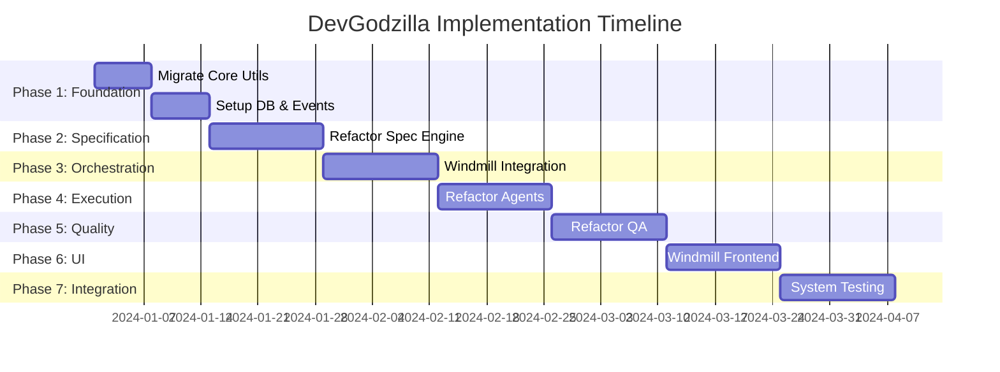
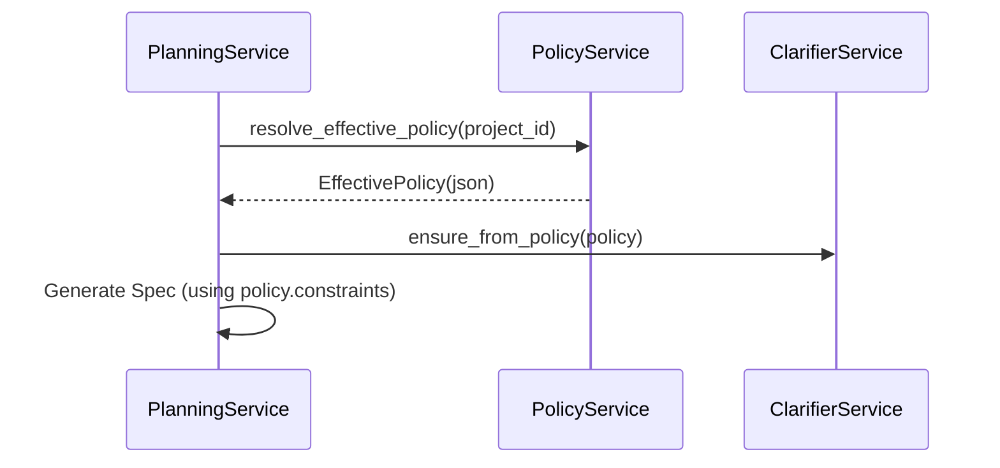
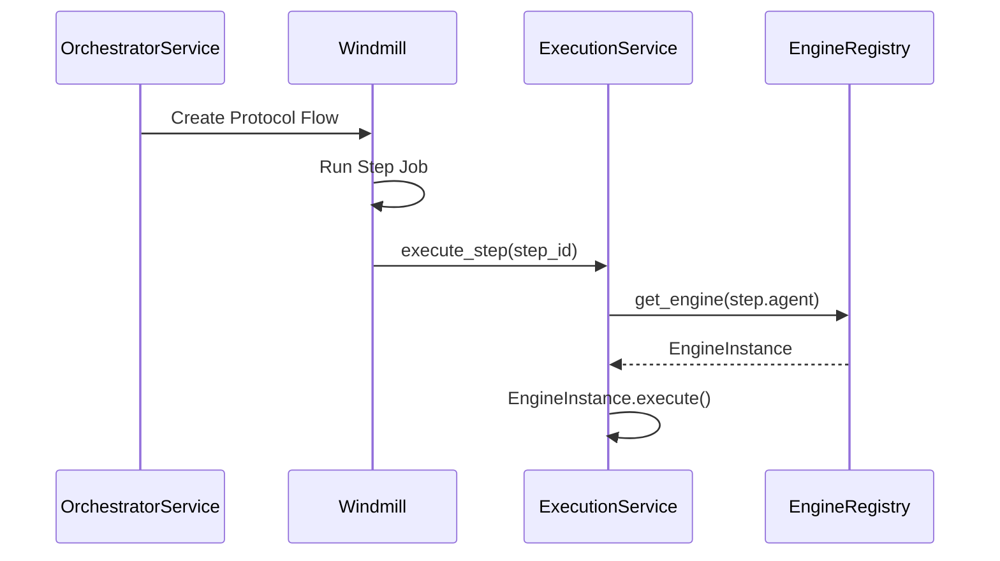

# DevGodzilla Implementation Plan (Refactor & Migrate)

> Detailed implementation plan for transitioning `tasksgodzilla` into the unified `devgodzilla` platform

---

## Overview

This plan outlines the **migration and refactoring** of the existing `tasksgodzilla` codebase into the new `devgodzilla` architecture. It focuses on granular migration steps, specific class refactorings, and the integration of new interactions (Windmill, Constitution/Policy).

**Strategy:** Refactor & Migrate
**Estimated Effort:** 12-16 weeks



---

## Phase 1: Foundation & Core Migration (Weeks 1-2)

> **Goal**: Establish `devgodzilla` package structure and migrate core core utilities from `tasksgodzilla`.

### 1.1 Package Structure & Core Utils

| Task | Description | Source in `tasksgodzilla` |
|------|-------------|---------------------------|
| T1.1.1 | Initialize `devgodzilla` package structure | N/A |
| T1.1.2 | specific `ConfigService` implementation | `config.py` |
| T1.1.3 | Migrate structured logging setup | `logging.py` |
| T1.1.4 | Define `Service` base class | New (Architecture Requirement) |
| T1.1.5 | Migrate Error hierarchy | `errors.py` |

**Detailed Actions:**
- Create `devgodzilla/__init__.py`.
- Copy `tasksgodzilla/config.py` to `devgodzilla/config.py`. Refactor `Config` class to allow loading from `DEVGODZILLA_CONFIG` env var.
- Copy `tasksgodzilla/logging.py` to `devgodzilla/logging.py`. Ensure `structlog` configuration is reusable.
- Create `devgodzilla/services/base.py` defining:
    ```python
    class Service:
        def __init__(self, context: ServiceContext): ...
    ```
- Copy `tasksgodzilla/errors.py` to `devgodzilla/errors.py`.

### 1.2 Database & Storage

| Task | Description | Source in `tasksgodzilla` |
|------|-------------|---------------------------|
| T1.2.1 | Migrate SQLAlchemy models to `db/models.py` | `storage.py`.DB models |
| T1.2.2 | Setup Alembic migrations | `alembic/` |
| T1.2.3 | Implement `DatabaseService` | `storage.py` logic |

**Detailed Actions:**
- Extract SQLAlchmey models (`Project`, `ProtocolRun`, `StepRun`, `Clarification`, `PolicyPack`) from `tasksgodzilla/storage.py` into `devgodzilla/db/models.py`.
- Initialize new alembic config in `devgodzilla/alembic`.
- Create `devgodzilla/db/database.py` containing session management logic from `tasksgodzilla/storage.py` (`get_session`, `transaction`).

### 1.3 Events & Git

| Task | Description | Source in `tasksgodzilla` |
|------|-------------|---------------------------|
| T1.3.1 | Implement `EventBus` | `services/events.py` (if exists) or new |
| T1.3.2 | Migrate Git operations | `services/git.py` / `git_utils.py` |

**Detailed Actions:**
- Refactor `tasksgodzilla/git_utils.py` into `devgodzilla/services/git.py`. encapsulate functions like `clone_repo`, `ensure_worktree` into `GitService` class methods.

---

## Phase 2: Specification Engine (Weeks 3-4)

> **Goal**: Refactor `PlanningService`, `ClarifierService` and `PolicyService`.

### 2.1 Planning & SpecKit

| Task | Description | Source in `tasksgodzilla` |
|------|-------------|---------------------------|
| T2.1.1 | Refactor `PlanningService` | `services/planning.py` |
| T2.1.2 | Port SpecKit models | `services/spec.py`, `domain.py` |
| T2.1.3 | Port `prompt_utils.py` | `prompt_utils.py`, `services/prompts.py` |

**Detailed Actions:**
- Move `tasksgodzilla/services/spec.py` and `domain.py` logic to `devgodzilla/models/speckit.py`. Ensure strict Pydantic typing for `FeatureSpec`, `ImplementationPlan`.
- Refactor `PlanningService` from `tasksgodzilla/services/planning.py` to:
    - Use `devgodzilla.models.speckit` types.
    - Accept `ClarifierService` as dependency.
    - Extract LLM calls to use a specific `PlanningAgent` (or keep using direct Engine usage if simpler, but abstract it).

### 2.2 Clarifications & Policies Integration

| Task | Description | Source in `tasksgodzilla` |
|------|-------------|---------------------------|
| T2.2.1 | Refactor `ClarifierService` | `services/clarifications.py` |
| T2.2.2 | Refactor `PolicyService` | `services/policy.py` |
| T2.2.3 | Implement Constitution loading | `services/policy.py` |

**Detailed Actions:**
- **Refactor `PolicyService`**:
    - Move `tasksgodzilla/services/policy.py` to `devgodzilla/services/policy.py`.
    - Preserve `validate_policy_pack_definition` logic.
    - Ensure `resolve_effective_policy(project_id)` correctly merges Central + Project + Repo-local policies.
- **Refactor `ClarificationService`**:
    - Move `tasksgodzilla/services/clarifications.py` to `devgodzilla/services/clarifier.py`.
    - Ensure `ensure_from_policy` method remains compatible with `EffectivePolicy` dict structure.
- **Integration Point**:
    - `PlanningService` must call `PolicyService.resolve_effective_policy()` before generation.
    - `PlanningService` calls `ClarificationsService.ensure_from_policy()` to hydrate DB with policy-derived questions.

---

## Phase 3: Orchestration Core (Weeks 5-6)

> **Goal**: Replace current `OrchestratorService` with Windmill-based orchestration.

### 3.1 Windmill Client Integration

| Task | Description | Status |
|------|-------------|--------|
| T3.1.1 | Create Windmill Client | New |
| T3.1.2 | Implement Flow Generator | New |
| T3.1.3 | Create `devgodzilla-worker` script for Windmill | New |

**Detailed Actions:**
- Create `devgodzilla/windmill/client.py`: Wrapper for Windmill API (Job submission, Status check).
- Create `devgodzilla/windmill/flows.py`: Logic to convert a `TaskList` (from Planning) into a Windmill `Flow` JSON definition.
    - Map `Task` dependencies to Windmill Flow dependencies.
- Create `scripts/worker.py`: Entrypoint for Windmill python scripts.

### 3.2 Logic Migration from Orchestrator

| Task | Description | Source in `tasksgodzilla` |
|------|-------------|---------------------------|
| T3.2.1 | Extract State Machine logic | `services/orchestrator.py` |
| T3.2.2 | Extract Dependency/DAG logic | `pipeline.py` / `services/orchestrator.py` |
| T3.2.3 | New `OrchestratorService` Facade | `services/orchestrator.py` |

**Detailed Actions:**
- **DEPRECATE**: The loop in `tasksgodzilla/services/orchestrator.py` (methods `run_protocol`, `_process_queue`) will be removed.
- **NEW**: `DevGodzillaOrchestrator` service that:
    - `start_protocol()`: Calls `PlanningService`, then `WindmillClient.create_flow()`, then `WindmillClient.run_flow()`.
    - `get_status()`: Queries Windmill API for flow status.

---

## Phase 4: Execution Layer (Weeks 7-8)

> **Goal**: Normalize agent engines into a unified Registry.

### 4.1 Engine Registry

| Task | Description | Source in `tasksgodzilla` |
|------|-------------|---------------------------|
| T4.1.1 | Define `EngineInterface` | New |
| T4.1.2 | Implement `EngineRegistry` | `run_registry.py` / `engine_resolver.py` |
| T4.1.3 | Refactor `CodexEngine` | `engines_codex.py` / `engines/` |
| T4.1.4 | Refactor `OpenCodeEngine` | `engines_opencode.py` |

**Detailed Actions:**
- Define `EngineInterface` in `devgodzilla/engines/interface.py`:
    ```python
    class EngineInterface(Protocol):
        def execute_step(self, step: Step, context: Context) -> StepResult: ...
    ```
- Refactor `tasksgodzilla/engines_codex.py` to implement `EngineInterface`.
- Refactor `tasksgodzilla/engines_opencode.py` to implement `EngineInterface`.
- Create `devgodzilla/engines/registry.py` to map strings ("codex", "opencode") to instances.

### 4.2 Execution Service

| Task | Description | Source in `tasksgodzilla` |
|------|-------------|---------------------------|
| T4.2.1 | Refactor `ExecutionService` | `services/execution.py` |
| T4.2.2 | Port Sandbox logic | `worker_runtime.py` |
| T4.2.3 | Port ArtifactWriter | `services/execution.py` |

**Detailed Actions:**
- Use `ExecutionService` as the logic invoked by Windmill Workers.
- It receives a `Step` + `Context`.
- It calls `EngineRegistry.get_engine(step.agent).execute_step(...)`.
- It calls `ArtifactWriter` to save logs/output.

---

## Phase 5: Quality Assurance (Weeks 9-10)

> **Goal**: Refactor QA logic into composable Gates.

### 5.1 QA Service Refactoring

| Task | Description | Source in `tasksgodzilla` |
|------|-------------|---------------------------|
| T5.1.1 | Refactor `QualityService` | `services/quality.py` |
| T5.1.2 | Split monolithic QA logic into `Gates` | `qa.py` |
| T5.1.3 | Port Feedback Loop logic | `services/quality.py` |

**Detailed Actions:**
- Analyze `tasksgodzilla/services/quality.py`.
- Break down monolithic `assess_quality` methods into individual Gate classes in `devgodzilla/qa/gates/`:
    - `TestGate` (runs pytest)
    - `LintGate` (runs ruff/mypy)
    - `ChecklistGate` (uses LLM to verify checklist)
- `QualityService` executes a list of Gates configurated by `PolicyService` (via `required_checks` etc).

---

## Phase 6: User Interface (Weeks 11-12)

> **Goal**: New Development (Windmill Extensions & CLI).

### 6.1 CLI

| Task | Description | Source in `tasksgodzilla` |
|------|-------------|---------------------------|
| T6.1.1 | Implement new `click` CLI | `cli/` (migrate existing commands) |
| T6.1.2 | Add new orchestration commands | New |

### 6.2 Windmill UI

| Task | Description | Status |
|------|-------------|--------|
| T6.2.1 | Develop Svelte Components | New |

---

## Phase 7: Integration (Weeks 13-14)

### 7.1 API & Tests

| Task | Description | Source in `tasksgodzilla` |
|------|-------------|---------------------------|
| T7.1.1 | Refactor API endpoints | `api/` |
| T7.1.2 | Migrate Tests | `tests/` |

---

## Critical Path Migration Steps

1.  **Codebase Freeze**: Stop development on `tasksgodzilla` root.
2.  **Namespace Creation**: Create `devgodzilla/` and start moving core services.
3.  **Database Migration**: Adjust Alembic scripts to point to new models.
4.  **Service Migration**: Move services one by one (Database -> Git -> Config -> Planning...).
5.  **Orchestration Swap**: Implement Windmill integration, effectively retiring the old `orchestrator.py` loop.

## Integration Architectures

### Policy & Specification Integration


### Orchestration & Execution Integration

