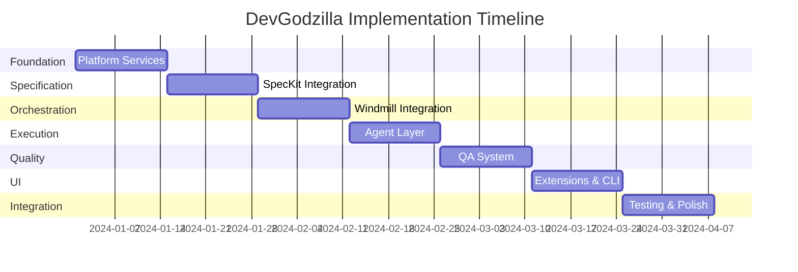
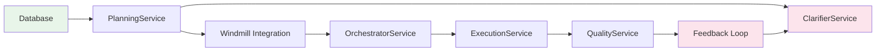

# DevGodzilla Implementation Plan

> Detailed implementation plan for building the DevGodzilla AI-driven development platform

---

## Overview

This plan outlines the implementation of DevGodzilla in **7 phases**, with each phase broken into specific tasks. The estimated total effort is **12-16 weeks** for a small team (2-3 developers).

---

## Phase 1: Foundation & Platform Services (Weeks 1-2)

> **Goal**: Establish core infrastructure, database, and shared services

### 1.1 Database Schema & Migrations

| Task | Description | Est. | Priority |
|------|-------------|------|----------|
| T1.1.1 | Create Alembic migration setup | 2h | P1 |
| T1.1.2 | Implement `projects` table migration | 2h | P1 |
| T1.1.3 | Implement `protocol_runs` table migration | 2h | P1 |
| T1.1.4 | Implement `step_runs` table migration | 2h | P1 |
| T1.1.5 | Implement `clarifications` table migration | 2h | P1 |
| T1.1.6 | Implement `codex_runs` and `run_artifacts` tables | 2h | P1 |
| T1.1.7 | Implement `events` and `feedback_events` tables | 2h | P1 |
| T1.1.8 | Create SQLAlchemy ORM models | 4h | P1 |

**Files to create:**
- `devgodzilla/db/migrations/` - Alembic migrations
- `devgodzilla/db/models.py` - SQLAlchemy models
- `devgodzilla/db/database.py` - Database connection

### 1.2 Core Service Infrastructure

| Task | Description | Est. | Priority |
|------|-------------|------|----------|
| T1.2.1 | Create service base class with dependency injection | 3h | P1 |
| T1.2.2 | Implement `Database` service with session management | 3h | P1 |
| T1.2.3 | Implement `ConfigService` for loading YAML configs | 2h | P1 |
| T1.2.4 | Implement structured logging with `structlog` | 2h | P2 |
| T1.2.5 | Create error hierarchy (base exceptions) | 2h | P1 |

**Files to create:**
- `devgodzilla/services/base.py` - Service base class
- `devgodzilla/db/database.py` - Database service
- `devgodzilla/config/` - Configuration loading
- `devgodzilla/errors.py` - Exception hierarchy

### 1.3 Event Bus & Platform Services

| Task | Description | Est. | Priority |
|------|-------------|------|----------|
| T1.3.1 | Implement `EventBus` with publish/subscribe | 3h | P1 |
| T1.3.2 | Implement event persistence to database | 2h | P2 |
| T1.3.3 | Implement SSE streaming endpoint | 3h | P2 |
| T1.3.4 | Implement `GitService` for repository operations | 4h | P1 |
| T1.3.5 | Implement worktree management in GitService | 3h | P2 |
| T1.3.6 | Implement health check endpoint | 2h | P2 |

**Files to create:**
- `devgodzilla/services/events.py` - Event bus
- `devgodzilla/services/git.py` - Git operations
- `devgodzilla/api/health.py` - Health checks

---

## Phase 2: Specification Engine (Weeks 3-4)

> **Goal**: Integrate SpecKit library and implement clarification workflow

### 2.1 SpecKit Library Integration

| Task | Description | Est. | Priority |
|------|-------------|------|----------|
| T2.1.1 | Create SpecKit wrapper in `PlanningService` | 4h | P1 |
| T2.1.2 | Implement `generate_spec()` method | 3h | P1 |
| T2.1.3 | Implement `generate_plan()` method | 3h | P1 |
| T2.1.4 | Implement `generate_tasks()` method | 3h | P1 |
| T2.1.5 | Create typed Pydantic models for SpecKit output | 3h | P1 |
| T2.1.6 | Create `.specify/` directory initialization | 2h | P1 |
| T2.1.7 | Implement template management | 2h | P2 |

**Files to create:**
- `devgodzilla/services/planning.py` - PlanningService
- `devgodzilla/models/speckit.py` - FeatureSpec, ImplementationPlan, TaskList
- `devgodzilla/speckit/` - SpecKit integration layer

### 2.2 ClarifierService Implementation

| Task | Description | Est. | Priority |
|------|-------------|------|----------|
| T2.2.1 | Implement `ClarifierService` class | 4h | P1 |
| T2.2.2 | Implement ambiguity detection using LLM | 3h | P1 |
| T2.2.3 | Implement question generation | 3h | P1 |
| T2.2.4 | Implement clarification storage (CRUD) | 2h | P1 |
| T2.2.5 | Implement answer injection into context | 2h | P1 |
| T2.2.6 | Create clarifications API endpoints | 3h | P1 |

**Files to create:**
- `devgodzilla/services/clarifier.py` - ClarifierService
- `devgodzilla/api/clarifications.py` - API routes

### 2.3 Constitution Management

| Task | Description | Est. | Priority |
|------|-------------|------|----------|
| T2.3.1 | Implement constitution file loading | 2h | P1 |
| T2.3.2 | Implement article parsing | 2h | P1 |
| T2.3.3 | Implement `PolicyService` for policy packs | 3h | P2 |
| T2.3.4 | Create default constitution template | 2h | P1 |
| T2.3.5 | Create constitution API endpoints | 2h | P2 |

**Files to create:**
- `devgodzilla/services/policy.py` - PolicyService
- `devgodzilla/templates/constitution.md` - Default template

---

## Phase 3: Orchestration Core (Weeks 5-6)

> **Goal**: Integrate Windmill and implement DAG-based execution

### 3.1 Windmill Integration

| Task | Description | Est. | Priority |
|------|-------------|------|----------|
| T3.1.1 | Create Windmill Python client wrapper | 4h | P1 |
| T3.1.2 | Implement flow creation from TaskList | 4h | P1 |
| T3.1.3 | Implement job submission and tracking | 3h | P1 |
| T3.1.4 | Implement flow status polling | 2h | P1 |
| T3.1.5 | Create Windmill script templates | 3h | P1 |
| T3.1.6 | Implement Windmill resource configuration | 2h | P2 |

**Files to create:**
- `devgodzilla/windmill/client.py` - Windmill client
- `devgodzilla/windmill/flows.py` - Flow management
- `windmill/scripts/devgodzilla/` - Windmill scripts

### 3.2 DAG Builder & Scheduler

| Task | Description | Est. | Priority |
|------|-------------|------|----------|
| T3.2.1 | Implement `DAGBuilder` class | 3h | P1 |
| T3.2.2 | Implement cycle detection (Tarjan's algorithm) | 3h | P1 |
| T3.2.3 | Implement parallel group computation | 3h | P1 |
| T3.2.4 | Implement `ParallelScheduler` | 3h | P1 |
| T3.2.5 | Implement priority queue integration | 2h | P2 |

**Files to create:**
- `devgodzilla/orchestration/dag.py` - DAG building
- `devgodzilla/orchestration/scheduler.py` - Scheduling

### 3.3 State Machine & OrchestratorService

| Task | Description | Est. | Priority |
|------|-------------|------|----------|
| T3.3.1 | Implement protocol state machine | 3h | P1 |
| T3.3.2 | Implement step state machine | 3h | P1 |
| T3.3.3 | Implement `OrchestratorService` | 4h | P1 |
| T3.3.4 | Implement error handling and retry logic | 3h | P1 |
| T3.3.5 | Implement feedback loop triggering | 3h | P1 |
| T3.3.6 | Create protocol API endpoints | 4h | P1 |

**Files to create:**
- `devgodzilla/orchestration/states.py` - State machines
- `devgodzilla/services/orchestrator.py` - OrchestratorService
- `devgodzilla/api/protocols.py` - API routes

---

## Phase 4: Execution Layer (Weeks 7-8)

> **Goal**: Implement multi-agent execution with sandboxing

### 4.1 Agent Registry & Adapters

| Task | Description | Est. | Priority |
|------|-------------|------|----------|
| T4.1.1 | Define `EngineInterface` protocol | 2h | P1 |
| T4.1.2 | Implement `AgentRegistry` | 3h | P1 |
| T4.1.3 | Implement `CLIAgentAdapter` (base) | 4h | P1 |
| T4.1.4 | Implement Codex adapter | 3h | P1 |
| T4.1.5 | Implement Claude Code adapter | 3h | P1 |
| T4.1.6 | Implement OpenCode adapter | 2h | P1 |
| T4.1.7 | Implement Gemini CLI adapter | 2h | P2 |
| T4.1.8 | Implement `IDEAgentAdapter` | 3h | P2 |
| T4.1.9 | Implement agent configuration loading | 2h | P1 |

**Files to create:**
- `devgodzilla/engines/interface.py` - EngineInterface
- `devgodzilla/engines/registry.py` - AgentRegistry
- `devgodzilla/engines/adapters/cli.py` - CLI adapter
- `devgodzilla/engines/adapters/ide.py` - IDE adapter
- `devgodzilla/engines/codex.py`, `claude.py`, etc. - Agent implementations

### 4.2 Sandbox Management

| Task | Description | Est. | Priority |
|------|-------------|------|----------|
| T4.2.1 | Implement `SandboxManager` | 3h | P1 |
| T4.2.2 | Implement simple chdir sandbox | 2h | P1 |
| T4.2.3 | Implement nsjail integration (optional) | 4h | P3 |
| T4.2.4 | Implement sandbox mode configuration | 2h | P2 |

**Files to create:**
- `devgodzilla/execution/sandbox.py` - SandboxManager

### 4.3 ExecutionService & Artifacts

| Task | Description | Est. | Priority |
|------|-------------|------|----------|
| T4.3.1 | Implement `ExecutionService` | 4h | P1 |
| T4.3.2 | Implement prompt building for agents | 3h | P1 |
| T4.3.3 | Implement `ArtifactWriter` | 3h | P1 |
| T4.3.4 | Implement output capture (stdout/stderr) | 2h | P1 |
| T4.3.5 | Implement block detection | 3h | P1 |
| T4.3.6 | Create steps API endpoints | 3h | P1 |

**Files to create:**
- `devgodzilla/services/execution.py` - ExecutionService
- `devgodzilla/execution/artifacts.py` - ArtifactWriter
- `devgodzilla/api/steps.py` - API routes

---

## Phase 5: Quality Assurance (Weeks 9-10)

> **Goal**: Implement constitutional QA gates and feedback loops

### 5.1 Constitutional Gates

| Task | Description | Est. | Priority |
|------|-------------|------|----------|
| T5.1.1 | Implement `ConstitutionalGate` base class | 2h | P1 |
| T5.1.2 | Implement `GateRegistry` | 2h | P1 |
| T5.1.3 | Implement `TestFirstGate` (Article III) | 3h | P1 |
| T5.1.4 | Implement `LibraryFirstGate` (Article I) | 3h | P2 |
| T5.1.5 | Implement `SecurityGate` (Article IV) | 3h | P1 |
| T5.1.6 | Implement `IntegrationTestGate` (Article IX) | 3h | P1 |
| T5.1.7 | Implement gate finding model | 2h | P1 |

**Files to create:**
- `devgodzilla/qa/gates/base.py` - Base gate class
- `devgodzilla/qa/gates/registry.py` - Gate registry
- `devgodzilla/qa/gates/test_first.py`, etc. - Gate implementations

### 5.2 Checklist Validation

| Task | Description | Est. | Priority |
|------|-------------|------|----------|
| T5.2.1 | Implement `ChecklistValidator` | 3h | P1 |
| T5.2.2 | Implement LLM-based item validation | 3h | P1 |
| T5.2.3 | Implement checklist YAML parser | 2h | P1 |
| T5.2.4 | Implement checklist generation from spec | 3h | P2 |

**Files to create:**
- `devgodzilla/qa/checklist.py` - ChecklistValidator

### 5.3 QualityService & Feedback Loop

| Task | Description | Est. | Priority |
|------|-------------|------|----------|
| T5.3.1 | Implement `QualityService` | 4h | P1 |
| T5.3.2 | Implement verdict computation | 3h | P1 |
| T5.3.3 | Implement `FeedbackRouter` | 4h | P1 |
| T5.3.4 | Implement `ErrorClassifier` | 3h | P1 |
| T5.3.5 | Implement QA report generation | 2h | P2 |
| T5.3.6 | Create QA API endpoints | 3h | P1 |

**Files to create:**
- `devgodzilla/services/quality.py` - QualityService
- `devgodzilla/qa/feedback.py` - FeedbackRouter
- `devgodzilla/api/quality.py` - API routes

---

## Phase 6: User Interface (Weeks 11-12)

> **Goal**: Extend Windmill UI and implement CLI

### 6.1 Windmill UI Extensions

| Task | Description | Est. | Priority |
|------|-------------|------|----------|
| T6.1.1 | Setup DevGodzilla Svelte extension structure | 3h | P1 |
| T6.1.2 | Implement SpecificationEditor component | 4h | P1 |
| T6.1.3 | Implement ConstitutionEditor component | 3h | P2 |
| T6.1.4 | Implement TaskDAGViewer component | 4h | P1 |
| T6.1.5 | Implement AgentSelector component | 3h | P1 |
| T6.1.6 | Implement QADashboard component | 4h | P1 |
| T6.1.7 | Implement FeedbackPanel component | 3h | P2 |
| T6.1.8 | Implement ClarificationChat component | 3h | P1 |
| T6.1.9 | Implement ProjectOnboarding wizard | 4h | P2 |
| T6.1.10 | Create DevGodzilla routes and navigation | 3h | P1 |
| T6.1.11 | Implement state stores (Svelte stores) | 3h | P1 |

**Files to create:**
- `windmill/frontend/src/lib/devgodzilla/` - All Svelte components
- `windmill/frontend/src/routes/devgodzilla/` - Routes

### 6.2 CLI Implementation

| Task | Description | Est. | Priority |
|------|-------------|------|----------|
| T6.2.1 | Setup Click CLI structure | 2h | P1 |
| T6.2.2 | Implement `project` commands (create, list, show) | 3h | P1 |
| T6.2.3 | Implement `speckit` commands (init, specify, plan, tasks) | 4h | P1 |
| T6.2.4 | Implement `protocol` commands (create, start, status, watch) | 4h | P1 |
| T6.2.5 | Implement `step` commands (list, run, assign, qa) | 3h | P1 |
| T6.2.6 | Implement `agent` commands (list, check, config) | 2h | P2 |
| T6.2.7 | Implement rich console output | 2h | P2 |
| T6.2.8 | Implement config file support | 2h | P2 |

**Files to create:**
- `devgodzilla/cli/main.py` - Main CLI entry point
- `devgodzilla/cli/project.py`, `speckit.py`, etc. - Command groups

---

## Phase 7: Integration & Testing (Weeks 13-14)

> **Goal**: End-to-end integration, testing, and documentation

### 7.1 API Integration

| Task | Description | Est. | Priority |
|------|-------------|------|----------|
| T7.1.1 | Create FastAPI application with all routers | 3h | P1 |
| T7.1.2 | Implement API authentication (token-based) | 3h | P1 |
| T7.1.3 | Implement request validation and error handling | 2h | P1 |
| T7.1.4 | Implement rate limiting | 2h | P3 |
| T7.1.5 | Create OpenAPI documentation | 2h | P2 |

**Files to create:**
- `devgodzilla/api/main.py` - FastAPI app
- `devgodzilla/api/auth.py` - Authentication

### 7.2 Test Suite

| Task | Description | Est. | Priority |
|------|-------------|------|----------|
| T7.2.1 | Setup pytest with fixtures | 2h | P1 |
| T7.2.2 | Write unit tests for PlanningService | 4h | P1 |
| T7.2.3 | Write unit tests for ClarifierService | 3h | P1 |
| T7.2.4 | Write unit tests for OrchestratorService | 4h | P1 |
| T7.2.5 | Write unit tests for ExecutionService | 4h | P1 |
| T7.2.6 | Write unit tests for QualityService | 4h | P1 |
| T7.2.7 | Write integration tests for full workflow | 6h | P1 |
| T7.2.8 | Write API endpoint tests | 4h | P1 |
| T7.2.9 | Setup CI/CD pipeline (GitHub Actions) | 3h | P2 |

**Files to create:**
- `tests/` - Test directory structure
- `.github/workflows/` - CI configuration

### 7.3 Documentation & Polish

| Task | Description | Est. | Priority |
|------|-------------|------|----------|
| T7.3.1 | Write README.md with quick start | 3h | P1 |
| T7.3.2 | Write installation guide | 2h | P1 |
| T7.3.3 | Write CLI usage documentation | 3h | P1 |
| T7.3.4 | Write API reference documentation | 3h | P2 |
| T7.3.5 | Create example project walkthrough | 4h | P2 |
| T7.3.6 | Add Prometheus metrics | 3h | P3 |
| T7.3.7 | Performance optimization | 4h | P3 |

**Files to create:**
- `README.md` - Project README
- `docs/` - Documentation site

---

## Summary

### Task Count by Phase

| Phase | Tasks | Est. Hours |
|-------|-------|------------|
| Phase 1: Foundation | 19 | ~45h |
| Phase 2: Specification | 17 | ~45h |
| Phase 3: Orchestration | 17 | ~50h |
| Phase 4: Execution | 18 | ~50h |
| Phase 5: Quality | 14 | ~45h |
| Phase 6: UI | 19 | ~55h |
| Phase 7: Integration | 16 | ~55h |
| **Total** | **120** | **~345h** |

### Critical Path

### Dependencies

| Component | Depends On |
|-----------|------------|
| PlanningService | Database, SpecKit library |
| ClarifierService | Database, LLM client |
| OrchestratorService | Windmill client, DAGBuilder |
| ExecutionService | AgentRegistry, SandboxManager |
| QualityService | GateRegistry, ChecklistValidator |
| FeedbackRouter | ClarifierService, OrchestratorService |

---

## Next Steps

1. **Setup development environment** - Python 3.11+, PostgreSQL, Windmill
2. **Clone/fork Windmill** - For UI extension development
3. **Start Phase 1** - Database schema and core infrastructure
4. **Parallel work** - UI development can proceed alongside backend (Phase 6 || Phase 4-5)
