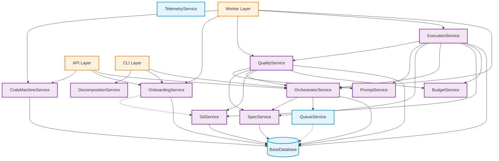

# Service Dependencies

This document describes the dependencies between services in the TasksGodzilla architecture.

## Overview

The services layer is organized into two tiers:

1. **Platform Services**: Low-level infrastructure services with minimal dependencies
2. **Application Services**: Business logic services that depend on platform services and each other

## Dependency Principles

- **Layered Architecture**: Application services depend on platform services, not vice versa
- **Minimal Coupling**: Services should have minimal dependencies on other services
- **Database Access**: All services that need persistence depend on `BaseDatabase`
- **No Circular Dependencies**: The dependency graph is acyclic

## Platform Services

Platform services provide infrastructure capabilities and have minimal dependencies.

### QueueService
**Dependencies**: None (wraps `BaseQueue`)
**Used By**: OrchestratorService, API layer, CLI layer

Provides job queue management for background task processing.

### TelemetryService
**Dependencies**: None (wraps metrics module)
**Used By**: BudgetService, ExecutionService, QualityService

Provides metrics and observability.

## Application Services

Application services implement business logic and orchestrate platform services.

### BudgetService
**Dependencies**:
- None (stateless, uses in-memory tracking)

**Used By**:
- ExecutionService (for execution budget checks)
- QualityService (for QA budget checks)
- OrchestratorService (indirectly via ExecutionService)

**Purpose**: Token budget management and tracking

### GitService
**Dependencies**:
- `BaseDatabase` (for event logging and status updates)

**Used By**:
- ExecutionService (for repo/worktree setup, push/PR/CI)
- OnboardingService (for repo validation)
- OrchestratorService (indirectly via ExecutionService)

**Purpose**: Git operations, worktree management, PR/MR creation, CI triggering

### SpecService
**Dependencies**:
- `BaseDatabase` (for protocol/step spec persistence)

**Used By**:
- ExecutionService (for path resolution, spec validation)
- QualityService (for path resolution, log appending)
- OrchestratorService (for step sync)

**Purpose**: Protocol and step specification management

### PromptService
**Dependencies**:
- None (stateless, operates on filesystem)

**Used By**:
- ExecutionService (for prompt resolution)
- QualityService (for QA prompt resolution and context building)

**Purpose**: Prompt resolution and context building

### OrchestratorService
**Dependencies**:
- `BaseDatabase` (for protocol/step lifecycle management)
- `BaseQueue` (for job enqueueing)
- SpecService (for step sync)
- Indirectly uses: GitService, BudgetService, PromptService, QualityService (via worker delegation)

**Used By**:
- ExecutionService (for policy application, completion handling)
- QualityService (for completion handling)
- API layer (for protocol/step lifecycle operations)
- CLI layer (for protocol/step operations)

**Purpose**: High-level orchestration of protocol and step lifecycles

### ExecutionService
**Dependencies**:
- `BaseDatabase` (for step status updates, event logging)
- BudgetService (for budget checks)
- GitService (for repo/worktree setup, push/PR/CI)
- OrchestratorService (for policy application, completion handling)
- SpecService (for path resolution, spec validation)
- PromptService (for prompt resolution)
- QualityService (for inline QA)

**Used By**:
- OrchestratorService (via worker delegation)
- Worker layer (codex_worker)

**Purpose**: Step execution orchestration

### QualityService
**Dependencies**:
- `BaseDatabase` (for step status updates, event logging)
- BudgetService (for budget checks)
- GitService (for repo/worktree setup)
- OrchestratorService (for completion handling)
- SpecService (for path resolution, log appending)
- PromptService (for QA prompt resolution, context building)

**Used By**:
- ExecutionService (for inline QA)
- OrchestratorService (via worker delegation)
- Worker layer (codex_worker)

**Purpose**: Quality assurance and validation

### OnboardingService
**Dependencies**:
- `BaseDatabase` (for project registration, event logging)
- GitService (indirectly via git_utils)

**Used By**:
- API layer (for project onboarding)
- CLI layer (for project setup)
- Worker layer (onboarding_worker)

**Purpose**: Project onboarding and workspace setup

### DecompositionService
**Dependencies**:
- None (stateless, operates on filesystem)

**Used By**:
- Protocol pipeline (for step decomposition)
- CLI layer (for manual decomposition)

**Purpose**: Protocol step decomposition

### CodeMachineService
**Dependencies**:
- `BaseDatabase` (for protocol spec persistence)

**Used By**:
- Worker layer (codemachine_worker)
- API layer (for CodeMachine imports)

**Purpose**: CodeMachine workspace import and management

## Dependency Graph

## Dependency Details

### Core Orchestration Flow

The typical execution flow involves these service dependencies:

1. **API/CLI** → **OrchestratorService**: Create protocol, enqueue planning
2. **OrchestratorService** → **QueueService**: Enqueue jobs
3. **Worker** → **ExecutionService**: Execute step
4. **ExecutionService** → **GitService**: Setup repo/worktree
5. **ExecutionService** → **SpecService**: Resolve paths, validate spec
6. **ExecutionService** → **PromptService**: Resolve prompts
7. **ExecutionService** → **BudgetService**: Check budget
8. **ExecutionService** → **GitService**: Push/PR/CI
9. **ExecutionService** → **QualityService**: Run QA (if inline)
10. **ExecutionService** → **OrchestratorService**: Apply policies, handle completion
11. **OrchestratorService** → **QueueService**: Enqueue next steps

### QA Flow

1. **Worker** → **QualityService**: Run QA
2. **QualityService** → **GitService**: Setup repo/worktree
3. **QualityService** → **SpecService**: Resolve paths
4. **QualityService** → **PromptService**: Resolve QA prompt, build context
5. **QualityService** → **BudgetService**: Check budget
6. **QualityService** → **OrchestratorService**: Handle completion

### Onboarding Flow

1. **API/CLI** → **OnboardingService**: Register project
2. **OnboardingService** → **GitService**: Validate/clone repo
3. **OnboardingService** → **BaseDatabase**: Record project details

## Service Initialization Order

When initializing services, follow this order to satisfy dependencies:

1. **Platform Services** (no dependencies):
   - `QueueService`
   - `TelemetryService`

2. **Simple Application Services** (only DB dependency):
   - `BudgetService`
   - `GitService`
   - `SpecService`
   - `PromptService`
   - `DecompositionService`
   - `CodeMachineService`

3. **Orchestrator** (depends on DB, Queue, Spec):
   - `OrchestratorService`

4. **Complex Application Services** (depend on multiple services):
   - `OnboardingService`
   - `ExecutionService`
   - `QualityService`

## Avoiding Circular Dependencies

The architecture avoids circular dependencies through these patterns:

1. **Layered Dependencies**: Application services depend on platform services, not vice versa
2. **Orchestrator as Hub**: OrchestratorService coordinates but doesn't depend on ExecutionService/QualityService
3. **Worker Delegation**: ExecutionService and QualityService call OrchestratorService for policy application, but OrchestratorService delegates back via worker functions (not direct service calls)
4. **Stateless Services**: BudgetService, PromptService, DecompositionService have no service dependencies

## Testing Implications

When testing services, mock dependencies in this order:

1. **Unit Tests**: Mock all dependencies
   - Mock `BaseDatabase` for services that use it
   - Mock other services for integration points

2. **Integration Tests**: Use real database, mock external services
   - Use real `BaseDatabase` (test instance)
   - Mock git operations, Codex CLI, external APIs

3. **End-to-End Tests**: Use real services where possible
   - Use real database, queue, and services
   - Mock only external APIs and slow operations

## Future Considerations

As the architecture evolves, consider:

1. **Service Discovery**: Implement service registry for dynamic dependency resolution
2. **Dependency Injection**: Use DI container for automatic dependency wiring
3. **Service Interfaces**: Define interfaces for easier mocking and testing
4. **Event Bus**: Consider event-driven architecture to reduce direct dependencies
5. **Service Mesh**: For distributed deployments, consider service mesh patterns
